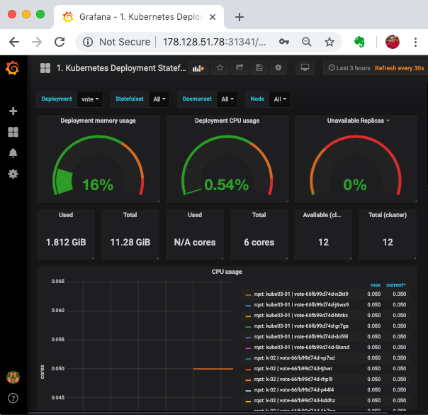

# Kubernetes Horizonntal Pod Autoscaling

With Horizontal Pod Autoscaling, Kubernetes automatically scales the number of pods in a replication controller, deployment or replica set based on observed CPU utilization (or, with alpha support, on some other, application-provided metrics).

The Horizontal Pod Autoscaler is implemented as a Kubernetes API resource and a controller. The resource determines the behavior of the controller. The controller periodically adjusts the number of replicas in a replication controller or deployment to match the observed average CPU utilization to the target specified by user

### Prerequisites

  * [Metrics Server](https://github.com/kubernetes-incubator/metrics-server).
  This needs to be setup if you are using kubeadm etc.  and replaces **heapster** starting with kubernetes version  1.8.
  * Resource Requests and Limits. Defining [CPU](https://kubernetes.io/docs/tasks/configure-pod-container/assign-cpu-resource/#specify-a-cpu-request-and-a-cpu-limit)as well as [Memory](https://kubernetes.io/docs/tasks/configure-pod-container/assign-memory-resource/) requirements for containers in Pod Spec is a must

#### Deploying Metrics Server

Kubernetes Horizontal Pod Autoscaler along with `kubectl top` command depends on the core monitoring data such as cpu and memory utilization which is scraped and provided by kubelet, which comes with in built cadvisor component.  Earlier, you would have to install a additional component called **heapster** in order to collect this data and feed it to the **hpa** controller. Starting with 1.8 version of Kubernetes, this behavior is changed, and now **metrics-server** would provide this data. Metric server  is being included as a essential component for kubernetes cluster, and being incroporated into kubernetes to be included out of box. It stores the core monitoring information using in-memory data store.

If you try to pull monitoring information using the following commands
```
kubectl top pod

kubectl top node
```

it does not show it, rather gives you a error message similar to

[output]
```
Error from server (NotFound): the server could not find the requested resource (get services http:heapster:)
```

Even though the error mentions heapster, its replaced with metrics server by default now.

Deploy  metric server with the following commands,

```
cd ~
git clone https://github.com/schoolofdevops/metrics-server.git 
kubectl apply -k metrics-server/manifests/overlays/release
```

Validate
```
kubectl get deploy,pods -n kube-system --selector='k8s-app=metrics-server'
```


You could validate again with 

```
kubectl top pod

kubectl top node
```


where expected output shoudl be similar to,

```
kubectl top node

NAME     CPU(cores)   CPU%   MEMORY(bytes)   MEMORY%
vis-01   145m         7%     2215Mi          57%
vis-13   36m          1%     1001Mi          26%
vis-14   71m          3%     1047Mi          27%
```
If you see a similar output, monitoring is now been setup.


### Create a HPA

To demonstrate Horizontal Pod Autoscaler we will use a custom docker image based on the php-apache image

`file: vote-hpa.yaml`


```
apiVersion: autoscaling/v2
kind: HorizontalPodAutoscaler
metadata:
  name: vote
spec:
  minReplicas: 2
  maxReplicas: 10
  metrics:
    - type: ContainerResource
      containerResource:
        name: cpu
        container: app
        target:
          type: Utilization
          averageUtilization: 50
  scaleTargetRef:
    apiVersion: apps/v1
    kind: ReplicaSet
    name: vote
  behavior:
    scaleDown:
      policies:
      - type: Pods
        value: 2
        periodSeconds: 120
      - type: Percent
        value: 25
        periodSeconds: 120
      stabilizationWindowSeconds: 300
    scaleUp:
      stabilizationWindowSeconds: 0
      policies:
      - type: Percent
        value: 100
        periodSeconds: 15
      - type: Pods
        value: 2
        periodSeconds: 15
      selectPolicy: Max
```
Source: [You could get this code from here.](https://gist.github.com/initcron/fe34915fd222583e3170f4f88fc1054f)

apply

```
kubectl apply -f vote-hpa.yaml
```

Validate

```
kubectl get hpa

kubectl describe hpa vote

kubectl get pod,deploy


```

If you have a monitoring system such as grafana, you could also view the graphs for **vote** deployment.



You could start watching in a dedicated window using the following command 


###  Launch a Load Test

Create a Service to receive the traffic 

```
cd k8s-code/projects/instavote/dev
kubectl apply -f vote-svc.yaml
```

Prepare to monitor the autoscaling by opening a new window connected to your cluster and by launching,

```
watch 'kubectl get hpa,all ; kubectl describe hpa vote'
```

Create a Load Test Job as, 

`file: loadtest-job.yaml`

```
apiVersion: batch/v1
kind: Job
metadata:
  name: loadtest
spec:
  template:
    spec:
      containers:
      - name: siege
        image: schoolofdevops/loadtest:v1
        command: ["siege",  "--concurrent=1", "--benchmark", "--time=6m", "http://vote"]
      restartPolicy: Never
  backoffLimit: 4
```

and launch it as 

```
kubectl apply -f loadtest-job.yaml
```

This will launch a one off Job which would run for approaximately 6 minutes.  

To get information about the job

```
kubectl get jobs
kubectl describe  job loadtest

```

To check the load test output

```
kubectl logs  -f loadtest-xxxx
```
[replace **loadtest-xxxx** with the actual pod id.]


[Sample Output]

```
** SIEGE 3.0.8
** Preparing 15 concurrent users for battle.
root@kube-01:~# kubectl logs vote-loadtest-tv6r2 -f
** SIEGE 3.0.8
** Preparing 15 concurrent users for battle.

.....


Lifting the server siege...      done.

Transactions:		       41618 hits
Availability:		       99.98 %
Elapsed time:		      299.13 secs
Data transferred:	      127.05 MB
Response time:		        0.11 secs
Transaction rate:	      139.13 trans/sec
Throughput:		        0.42 MB/sec
Concurrency:		       14.98
Successful transactions:       41618
Failed transactions:	           8
Longest transaction:	        3.70
Shortest transaction:	        0.00

FILE: /var/log/siege.log
You can disable this annoying message by editing
the .siegerc file in your home directory; change
the directive 'show-logfile' to false.
```
Now check the job status again,

```
kubectl get jobs
NAME            DESIRED   SUCCESSFUL   AGE
vote-loadtest   1         1            10m

```

While it is running, 


  * Keep monitoring for the load on the pod as the job progresses.
  * You should see hpa in action as it scales out/in the  vote deployment with the increasing/decreasing load.


##### Summary

In this lab, you have successfull configured and demonstrated dynamic scaling ability of kubernetes using horizontalpodautoscalers. You have also learnt about a new **jobs** controller type for running one off or batch jobs.


##### Reading List

  * [Kubernetes Monitoring Architecture](https://github.com/kubernetes/community/blob/master/contributors/design-proposals/instrumentation/monitoring_architecture.md)
  * [Core Metrics Pipeline]( https://kubernetes.io/docs/tasks/debug-application-cluster/core-metrics-pipeline/)
  * [Metrics Server](https://github.com/kubernetes-incubator/metrics-server)
  * [Assigning Resources to Containers and Pods](https://kubernetes.io/docs/tasks/configure-pod-container/assign-cpu-resource/#specify-a-cpu-request-and-a-cpu-limit)
  * [Horizontal Pod Autoscaler](https://kubernetes.io/docs/tasks/run-application/horizontal-pod-autoscale/)
