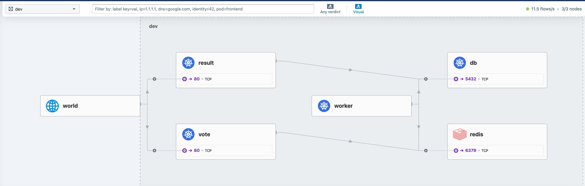
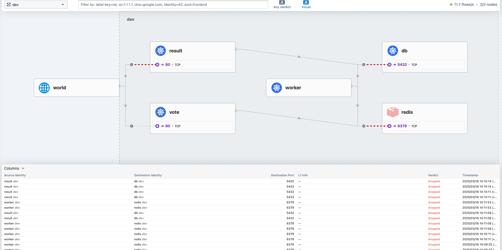
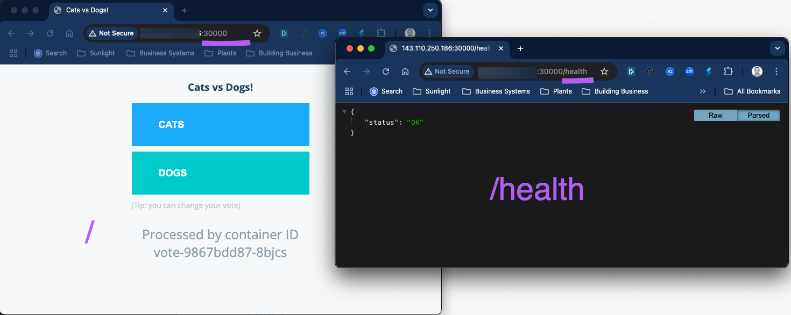
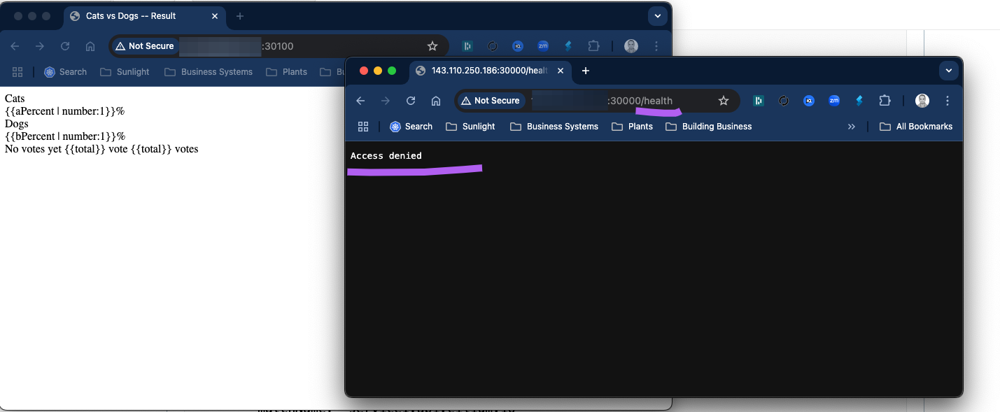

# Lab 4 - Exploring Cilium 

In this lab, you will explore some of the key features of Cilum and how it works. Lets begin by deploying a sample application and then dive into the observability and networking features of Cilium.

## Deploy sample app 

  * Start by examining the deployment code in the   repo [advk8s/instavote-kustomize: Deployment Code with Kustomize](https://github.com/advk8s/instavote-kustomize) 
  * Fork the application repo [advk8s/instavote-kustomize: Deployment Code with Kustomize](https://github.com/advk8s/instavote-kustomize)  to create your own copy. 


Clone the repo 
```
git clone https://github.com/xxxxxx/instavote-kustomize.git
```

where, replace `xxxxxx` with your own account/org name. 

```
kubectl create namespace dev
kubectl get ns 
```


Check and set contenxt to work with the `dev` namespace

```
kubectl config get-contexts
kubectl config set-context --current --namespace=dev
kubectl config get-contexts
```

Examine the code in the `instavote-kustomize` repo that you cloned earlier as 
```
instavote-kustomize
kubectl apply -k base/
```


```
kubectl get all 
```

You could use the observability tool setup earlier i.e.g Hubble  to view the traffic flow as, 



## Examine Service Networking with Cilium 

Cilium used eBPF instead of  iptables to setup networking. If you remember, we had examined the iptables rules setup by the kindnet CNI earlier. If you want to see the equivalent rules setup by Cilium, you can use the following method. 

Find out the ciilim pods running in the cluster. 

```
kubectl get pods -n kube-system -l k8s-app=cilium
```

[Sample Output]

```
NAME           READY   STATUS    RESTARTS   AGE
cilium-2wv8z   1/1     Running   0          155m
cilium-pqzpp   1/1     Running   0          155m
cilium-r4rq4   1/1     Running   0          155m
```


```
kubectl exec -it -n kube-system -c cilium-agent cilium-xxxxx -- bash
```

where, replace `cilium-xxxxx` with the actual pod name.
Instead of using iptables, you could list the service rules setup by cilium as, 


```
cilium service list
```


[sample output]
```
ID   Frontend               Service Type   Backend
1    10.96.0.1:443/TCP      ClusterIP      1 => 172.18.0.2:6443/TCP (active)
2    10.96.115.10:443/TCP   ClusterIP      1 => 172.18.0.4:4244/TCP (active)
3    10.96.0.10:53/UDP      ClusterIP      1 => 10.244.2.78:53/UDP (active)
                                           2 => 10.244.2.177:53/UDP (active)
4    10.96.0.10:53/TCP      ClusterIP      1 => 10.244.2.78:53/TCP (active)
                                           2 => 10.244.2.177:53/TCP (active)
5    10.96.0.10:9153/TCP    ClusterIP      1 => 10.244.2.78:9153/TCP (active)
                                           2 => 10.244.2.177:9153/TCP (active)
8    10.96.159.218:80/TCP   ClusterIP      1 => 10.244.1.209:4245/TCP (active)
9    10.96.98.215:80/TCP    ClusterIP      1 => 10.244.1.218:8081/TCP (active)
10   10.96.5.78:5432/TCP    ClusterIP      1 => 10.244.2.17:5432/TCP (active)
11   10.96.5.106:6379/TCP   ClusterIP      1 => 10.244.1.97:6379/TCP (active)
12   10.96.241.176:80/TCP   ClusterIP      1 => 10.244.2.170:80/TCP (active)
13   10.96.67.227:80/TCP    ClusterIP      1 => 10.244.1.74:80/TCP (active)
                                           2 => 10.244.2.135:80/TCP (active)
```


You could try scaling the `vote` deployment to see these rules being updated.


```
# Run this from outside the pod where kubectl is setup 

kubectl scale deploy vote --replicas=4
kubectl  get pods
```

and validate 

```
cilium service list

```

[sample output with clsuterIP and endpoints for vote service] 
```
13   10.96.67.227:80/TCP    ClusterIP      1 => 10.244.1.74:80/TCP (active)
                                           2 => 10.244.2.135:80/TCP (active)
                                           3 => 10.244.2.104:80/TCP (active)
                                           4 => 10.244.1.238:80/TCP (active)
```

you could get some more information using 

```
cilium bpf lb list  
```


## Configuring Network Policies with Cilium 

Check the cilium policies on  endpoints (Pods ) 

```

# find the cilium pod running on kind-worker node  

CILIUM_POD=$(kubectl get pods -n kube-system -l "k8s-app=cilium" --field-selector spec.nodeName=kind-worker -o jsonpath="{.items[0].metadata.name}")


# show the cilium endpoint configs 
kubectl -n kube-system exec -it $CILIUM_POD -- cilium-dbg endpoint list

```

This find the cilium pod running on `kind-worker` node and show you the output of  `cilium-dbg endpoint list`  command. 

e.g. 

```
ENDPOINT   POLICY (ingress)   POLICY (egress)   IDENTITY   LABELS (source:key[=value])                                          IPv6   IPv4           STATUS
           ENFORCEMENT        ENFORCEMENT
358        Disabled           Disabled          1          reserved:host                                                                              ready
368        Disabled           Disabled          56081      k8s:app=vote                                                                10.244.1.129   ready
                                                           k8s:env=dev
                                                           k8s:io.cilium.k8s.namespace.labels.kubernetes.io/metadata.name=dev
                                                           k8s:io.cilium.k8s.policy.cluster=default
                                                           k8s:io.cilium.k8s.policy.serviceaccount=default
                                                           k8s:io.kubernetes.pod.namespace=dev
                                                           k8s:project=instavote
636        Disabled           Disabled          18582      k8s:app=worker                                                              10.244.1.52    ready
                                                           k8s:env=dev
                                                           k8s:io.cilium.k8s.namespace.labels.kubernetes.io/metadata.name=dev
                                                           k8s:io.cilium.k8s.policy.cluster=default
                                                           k8s:io.cilium.k8s.policy.serviceaccount=default
                                                           k8s:io.kubernetes.pod.namespace=dev
                                                           k8s:project=instavote
1326       Disabled           Disabled          4          reserved:health                                                             10.244.1.10    ready
1674       Disabled           Disabled          9862       k8s:app=db                                                                  10.244.1.154   ready
                                                           k8s:env=dev
                                                           k8s:io.cilium.k8s.namespace.labels.kubernetes.io/metadata.name=dev
                                                           k8s:io.cilium.k8s.policy.cluster=default
                                                           k8s:io.cilium.k8s.policy.serviceaccount=default
                                                           k8s:io.kubernetes.pod.namespace=dev
                                                           k8s:project=instavote
1832       Disabled           Disabled          19784      k8s:app=redis                                                               10.244.1.115   ready
                                                           k8s:env=dev
                                                           k8s:io.cilium.k8s.namespace.labels.kubernetes.io/metadata.name=dev
                                                           k8s:io.cilium.k8s.policy.cluster=default
                                                           k8s:io.cilium.k8s.policy.serviceaccount=default
                                                           k8s:io.kubernetes.pod.namespace=dev
                                                           k8s:project=instavote
1968       Disabled           Disabled          38614      k8s:app=result                                                              10.244.1.135   ready
                                                           k8s:env=dev
                                                           k8s:io.cilium.k8s.namespace.labels.kubernetes.io/metadata.name=dev
                                                           k8s:io.cilium.k8s.policy.cluster=default
                                                           k8s:io.cilium.k8s.policy.serviceaccount=default
                                                           k8s:io.kubernetes.pod.namespace=dev
                                                           k8s:project=instavote
```

You will notice the Cilium policies are disabled on all the endpoints/pods. Lets add a L3/L4 Network Policy. 


### Adding L3/L4 Network Policies

Lets configure a policy to block all traffic for the pods running in the `dev` namespace. This is a extremely restrictive policy. 


```bash

  +-----------------------------------------------------------+
  |                                                           |
  |    +----------+          +-----------+                    |
x |    | result   |          | db        |                    |
  |    |          |          |           |                    |
  |    +----------+          +-----------+                    |
  |                                                           |
  |                                                           |
  |                                        +----+----+--+     |           
  |                                        |   worker   |     |            
  |                                        |            |     |           
  |                                        +----+-------+     |           
  |                                                           |
  |                                                           |
  |    +----------+          +-----------+                    |
  |    | vote     |          | redis     |                    |
x |    |          |          |           |                    |
  |    +----------+          +-----------+                    |
  |                                                           |
  +-----------------------------------------------------------+

```


```
# File : cilium-netpol.yaml
apiVersion: "cilium.io/v2"
kind: CiliumNetworkPolicy
metadata:
  name: "default"
  namespace: dev
spec:
  endpointSelector: {}  # Applies to all pods in the dev namespace
  ingressDeny:          # Explicitly deny all ingress traffic
  - {}
  egressDeny:           # Explicitly deny all egress traffic
  - {}
```


```
kubectl apply -f cilium-netpol.yaml
kubectl  get cnp
```


```
kubectl  describe cnp default
kubectl -n kube-system exec -it $CILIUM_POD -- cilium-dbg endpoint list
```

[sample output ]
```
# kubectl -n kube-system exec -it $CILIUM_POD -- cilium-dbg endpoint list


Defaulted container "cilium-agent" out of: cilium-agent, config (init), mount-cgroup (init), apply-sysctl-overwrites (init), mount-bpf-fs (init), clean-cilium-state (init), install-cni-binaries (init)
ENDPOINT   POLICY (ingress)   POLICY (egress)   IDENTITY   LABELS (source:key[=value])                                          IPv6   IPv4           STATUS
           ENFORCEMENT        ENFORCEMENT
358        Disabled           Disabled          1          reserved:host                                                                              ready
368        Enabled            Enabled           56081      k8s:app=vote                                                                10.244.1.129   ready
                                                           k8s:env=dev
                                                           k8s:io.cilium.k8s.namespace.labels.kubernetes.io/metadata.name=dev
                                                           k8s:io.cilium.k8s.policy.cluster=default
                                                           k8s:io.cilium.k8s.policy.serviceaccount=default
                                                           k8s:io.kubernetes.pod.namespace=dev
                                                           k8s:project=instavote
636        Enabled            Enabled           18582      k8s:app=worker                                                              10.244.1.52    ready
                                                           k8s:env=dev
                                                           k8s:io.cilium.k8s.namespace.labels.kubernetes.io/metadata.name=dev
                                                           k8s:io.cilium.k8s.policy.cluster=default
                                                           k8s:io.cilium.k8s.policy.serviceaccount=default
                                                           k8s:io.kubernetes.pod.namespace=dev
                                                           k8s:project=instavote
1326       Disabled           Disabled          4          reserved:health                                                             10.244.1.10    ready
1674       Enabled            Enabled           9862       k8s:app=db                                                                  10.244.1.154   ready
                                                           k8s:env=dev
                                                           k8s:io.cilium.k8s.namespace.labels.kubernetes.io/metadata.name=dev
                                                           k8s:io.cilium.k8s.policy.cluster=default
                                                           k8s:io.cilium.k8s.policy.serviceaccount=default
                                                           k8s:io.kubernetes.pod.namespace=dev
                                                           k8s:project=instavote
1832       Enabled            Enabled           19784      k8s:app=redis                                                               10.244.1.115   ready
                                                           k8s:env=dev
                                                           k8s:io.cilium.k8s.namespace.labels.kubernetes.io/metadata.name=dev
                                                           k8s:io.cilium.k8s.policy.cluster=default
                                                           k8s:io.cilium.k8s.policy.serviceaccount=default
                                                           k8s:io.kubernetes.pod.namespace=dev
                                                           k8s:project=instavote
1968       Enabled            Enabled           38614      k8s:app=result                                                              10.244.1.135   ready
                                                           k8s:env=dev
                                                           k8s:io.cilium.k8s.namespace.labels.kubernetes.io/metadata.name=dev
                                                           k8s:io.cilium.k8s.policy.cluster=default
                                                           k8s:io.cilium.k8s.policy.serviceaccount=default
                                                           k8s:io.kubernetes.pod.namespace=dev
                                                           k8s:project=instavote
```

You should also see the connections dropped from hubble UI 




Now lets setup some policies with the following goals  

  **1** **Allow cluster wide communication** → Pods within the same cluster should be able to talk to each other.  
 **3** **Allow public access to** vote **and** result **pods** → Pods labeled app: vote and app: result should be accessible from outside the cluster.  


```bash

  +-----------------------------------------------------------+
  |                                                           |
  |    +------------+        +-----------+                    |
=====> | results    | ------>| db        |                    |
  |    |            |        |           | <-------+          |
  |    +------------+        +-----------+         |          |
  |                                                |          |
  |                                                |          |
  |                                        +----+----+---+    |           
  |                                        |   worker    |    |            
  |                                        |             |    |           
  |                                        +----+--------+    |           
  |                                                |          |
  |                                                |          |
  |    +----------+          +-----------+         |          |
  |    | vote     |          | redis     | <-------+          |
=====> |          |  ------> |           |                    |
  |    +----------+          +-----------+                    |
  |                                                           |
  +-----------------------------------------------------------+

```


start by labeling the namespace 

```
kubectl label namespace dev kubernetes.io/metadata.name=dev
kubectl  get ns --show-labels
```

```
# File : cilium-netpol.yaml
apiVersion: "cilium.io/v2"
kind: CiliumNetworkPolicy
metadata:
  name: default
  namespace: dev
spec:
  endpointSelector: {}  # Applies to all pods in the instavote namespace
  ingress:
  - fromEntities:
      - cluster
  egress:
  - toEntities:
      - cluster
---
apiVersion: "cilium.io/v2"
kind: CiliumNetworkPolicy
metadata:
  name: public-ingress
  namespace: dev
spec:
  endpointSelector:
    matchExpressions:
      - {key: app, operator: In, values: [vote, result]}
  ingress:
  - fromEntities:
    - world  # Allow incoming traffic from outside the cluster (internet)
    toPorts:
    - ports:
      - port: "80"
        protocol: TCP
```

Apply and validate 
```
kubectl apply -f cilium-netpol.yaml
kubectl  get cnp

```

## Adding L7 Policies to restrict access to specific API endpoints

Currently, you are able to access both, `/`  as well as `/health` on the frontend vote app. 



Lets add a L7 Policy where we explicitly restrict one of the API Endpoints i.e. `/health` from being accessed from the world. 

Try adding the rules section, or replace the entire file 

```
# File : cilium-netpol.yaml

apiVersion: "cilium.io/v2"
kind: CiliumNetworkPolicy
metadata:
  name: default
  namespace: dev
spec:
  endpointSelector: {}  # Applies to all pods in the instavote namespace
  ingress:
  - fromEntities:
      - cluster
  egress:
  - toEntities:
      - cluster
---
apiVersion: "cilium.io/v2"
kind: CiliumNetworkPolicy
metadata:
  name: public-ingress
  namespace: dev
spec:
  endpointSelector:
    matchExpressions:
      - {key: app, operator: In, values: [vote, result]}
  ingress:
  - fromEntities:
    - world  # Allow incoming traffic from outside the cluster (internet)
    toPorts:
    - ports:
      - port: "80"
        protocol: TCP
      rules:
        http:
        - method: "GET"
          path: "/"  # Allow homepage
```

```
kubectl apply -f cilium-netpol.yaml
```

Now you should see that
* `/health` is completely blocked. 
* frontned apps on `/` are accessible but the java script and css does not get loaded 


Further experimentation: You could further add rules to allow css and static content to show the vote app propertly as  
```
      rules:
        http:
        - method: "GET"
          path: "/"
        - method: "GET"
          path: "/static"
        - method: "GET"
          path: "/static/"
        - method: "GET"
          path: "/static/.*"
        - method: "GET"
          path: "/css"
        - method: "GET"
          path: "/css/"
        - method: "GET"
          path: "/css/.*"
```


Once you are done, you could delete it using 

```
 kubectl delete -f cilium-netpol.yaml
```

## Summary

In this lab, we explored Cilium CNI, whats makes it special, how it configures service networking, the observability features it provides and finally, how to use Cilium Network Policies to control traffic flow.
