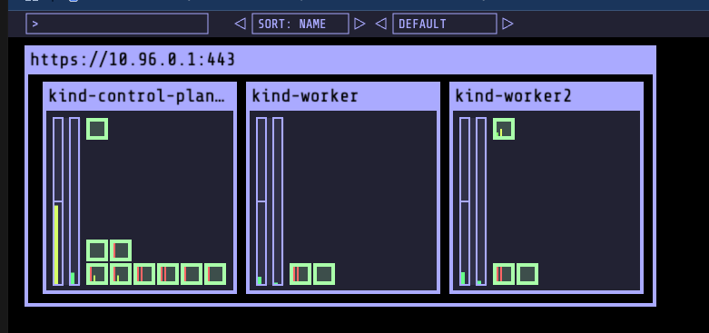

# Lab 801 - Setting up Kubernetes Cluster with KIND 

This lab describes the process of how you could quickly create a multi node Kubernetes Envonment using [KIND](https://kind.sigs.k8s.io/docs/user/ingress/#ingress-nginx), which is a simple and quick way to set up a learning environment. Advantage it offers over minikube or docker desktop based kubernetes setup is its a multi node environment closer to the real world setup.  

## Install Docker 

Download and install Docker on a the Ubuntu machine as , 

```
curl -sSL "https://gist.githubusercontent.com/initcron/cadf5c920e5e7d1cb45803c36b656947/raw/006c02f7714315222f8055381ebb8c5f910c36a5/user-data-docker.sh" | sudo bash

```

validate 

```
docker version
```

## Install KIND and Kubectl

Install KIND on the Ubuntu machine as ,

```
# For AMD64 / x86_64
[ $(uname -m) = x86_64 ] && curl -Lo ./kind https://kind.sigs.k8s.io/dl/v0.27.0/kind-linux-amd64
# For ARM64
[ $(uname -m) = aarch64 ] && curl -Lo ./kind https://kind.sigs.k8s.io/dl/v0.27.0/kind-linux-arm64
chmod +x ./kind
sudo mv ./kind /usr/local/bin/kind
```

validate 

```
kind
kind version
```

Install kubectl in the same environment as ,

```
curl -LO "https://dl.k8s.io/release/$(curl -L -s https://dl.k8s.io/release/stable.txt)/bin/linux/amd64/kubectl"

sudo install -o root -g root -m 0755 kubectl /usr/local/bin/kubectl
```

validate 

```
kubectl 
kubectl version --client
```

## Setup Kubernetes Cluster with KIND

Download  Cluster Configurations and Create  a 3 Node Kubernetes Cluster as

```
git clone https://github.com/initcron/k8s-code.git
cd k8s-code/helper/kind/
kind create cluster --config kind-three-node-cluster.yaml
```


Setup context 
```
kubectl cluster-info --context kind-kind

```

Validate

```
kubectl get nodes
```

[sample output]

```
root@demo:~# kubectl get nodes
NAME                 STATUS   ROLES           AGE   VERSION
kind-control-plane   Ready    control-plane   89s   v1.32.2
kind-worker          Ready    <none>          78s   v1.32.2
kind-worker2         Ready    <none>          78s   v1.32.2
```

Wait till you see all nodes in Ready state and you have a cluster operational.

Wait for a couple of minutes and then validate if the pods are up and running.

```
kubectl get pods -A 
```

[sample output]

```
NAMESPACE            NAME                                         READY   STATUS    RESTARTS   AGE
kube-system          coredns-668d6bf9bc-cp95t                     1/1     Running   0          90s
kube-system          coredns-668d6bf9bc-r2zgr                     1/1     Running   0          90s
kube-system          etcd-kind-control-plane                      1/1     Running   0          97s
kube-system          kindnet-6mpsn                                1/1     Running   0          86s
kube-system          kindnet-d2jmm                                1/1     Running   0          87s
kube-system          kindnet-pz78j                                1/1     Running   0          90s
kube-system          kube-apiserver-kind-control-plane            1/1     Running   0          95s
kube-system          kube-controller-manager-kind-control-plane   1/1     Running   0          95s
kube-system          kube-proxy-7djmx                             1/1     Running   0          86s
kube-system          kube-proxy-chgm2                             1/1     Running   0          90s
kube-system          kube-proxy-x5rxr                             1/1     Running   0          87s
kube-system          kube-scheduler-kind-control-plane            1/1     Running   0          95s
local-path-storage   local-path-provisioner-7dc846544d-dvrdh      1/1     Running   0          90s
```

Setup Visualiser

```
cd ~
git clone  https://github.com/schoolofdevops/kube-ops-view
kubectl apply -f kube-ops-view/deploy/
```

To check whether visualiser has come up, use the following commands,

```
kubectl get pods,services
```

[Expected output ]

```
[root@bbb-01 ~]# kubectl get pods,services
NAME                                 READY   STATUS    RESTARTS   AGE
pod/kube-ops-view-65466fb5c9-7gwnm   1/1     Running   0          61s

NAME                    TYPE        CLUSTER-IP     EXTERNAL-IP   PORT(S)        AGE
service/kube-ops-view   NodePort    10.96.54.166   <none>        80:32000/TCP   61s
service/kubernetes      ClusterIP   10.96.0.1      <none>        443/TCP        4m28s
```

Find out the public ip of your host using the following command,


```
curl ifconfig.me
```


To access the visualiser, visit  http://IPADDRESS:32000 ( where replace IPADDRESS with the actual IP address of the host noted above).

You shall see a visualiser similar to the following loaded on the browser.



You could scale it up by adding scale parameter as  `http://IPADDRESS:32000/#scale=2.0` to the URL.

If you see this page , Congratulations !! You have the cluster setup.

`You are done and can STOP here while doing the first time setup.`

## Restarting and Resetting the Cluster (Skip for now)

`Note: This is a Optional Topic. Skil this during your initial setup lab.`

To stop and start the cluster, you could stop and containers created with docker and then start them back

```
docker ps
docker stop kind-control-plane kind-worker kind-worker2
```

to bring it back again,

```
docker start kind-control-plane kind-worker kind-worker2
```

Even if you restart your system and bring it up using the above command, it should work.

To reset the cluster (note you will be deleting the existing environment and create fresh one)

asusming your cluster name is `k8slab` reset it as :

```
kind get clusters
kind delete cluster --name k8slab
rm -rf  ~/.kube
kind create cluster --name k8slab --config kind-three-node-cluster.yaml
```
