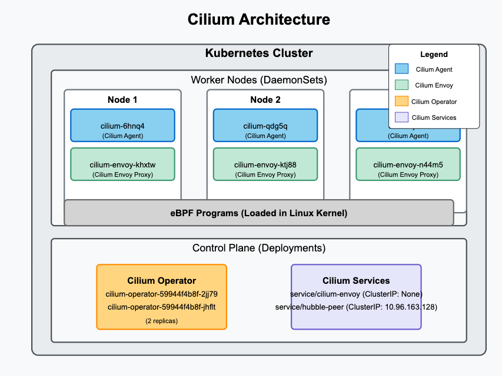
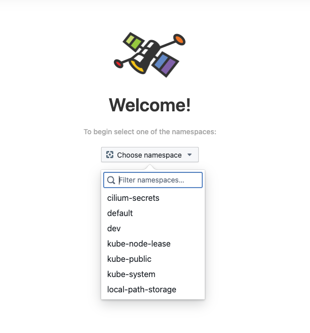

# Lab 3 - Install Cilium with KIND 

In this lab, you will reconfigure the KIND Cluster, this time with Cilium. You will redo the cluster, this time with disabled Kindnet CNI and setup Cilium along with Hubble, the observability layer. 

To start redoing the cluster, switch to the path from where you setup the KIND environment. and delete the exissting cluster.

```
# Switch to kind config path 

cd /root/k8s-code/helper/kind

kind delete cluster --name kind

```


Edit `kind-three-node-cluster.yaml` with the following changes 

```
# three node (two workers) cluster config
kind: Cluster
apiVersion: kind.x-k8s.io/v1alpha4
networking:
  disableDefaultCNI: true
```

Create KIND Cluster 

```
kind create cluster --config kind-three-node-cluster.yaml
```

[Sample Output ]
```
Creating cluster "kind" ...
 ✓ Ensuring node image (kindest/node:v1.32.2) 🖼
 ✓ Preparing nodes 📦 📦 📦
 ✓ Writing configuration 📜
 ✓ Starting control-plane 🕹️
 ✓ Installing StorageClass 💾
 ✓ Joining worker nodes 🚜
Set kubectl context to "kind-kind"
You can now use your cluster with:

kubectl cluster-info --context kind-kind

Not sure what to do next? 😅  Check out https://kind.sigs.k8s.io/docs/user/quick-start/
```

Validate 
```
kubectl cluster-info --context kind-kind
kubectl get nodes
```

[Sample output]
```
# kubectl get nodes

NAME                 STATUS     ROLES           AGE    VERSION
kind-control-plane   NotReady   control-plane   100s   v1.32.2
kind-worker          NotReady   <none>          89s    v1.32.2
kind-worker2         NotReady   <none>          89s    v1.32.2
```

Check pods 
```
kubectl get pod -A 
```

```
# kubectl get pods -A

NAMESPACE            NAME                                         READY   STATUS    RESTARTS   AGE
kube-system          coredns-668d6bf9bc-l6mdb                     0/1     Pending   0          116s
kube-system          coredns-668d6bf9bc-p4fmn                     0/1     Pending   0          116s
kube-system          etcd-kind-control-plane                      1/1     Running   0          2m4s
kube-system          kube-apiserver-kind-control-plane            1/1     Running   0          2m2s
kube-system          kube-controller-manager-kind-control-plane   1/1     Running   0          2m4s
kube-system          kube-proxy-5tsh8                             1/1     Running   0          114s
kube-system          kube-proxy-78jnh                             1/1     Running   0          114s
kube-system          kube-proxy-tzhz2                             1/1     Running   0          116s
kube-system          kube-scheduler-kind-control-plane            1/1     Running   0          2m2s
local-path-storage   local-path-provisioner-7dc846544d-cstmf      0/1     Pending   0          116s
```

You shall see some pods e.g. coredns, storage provisionere in pending state. This is because there is no pod networking setup yet. Lets do that with Cilium. 

## Setup CNI with  Cilium 

You will setup cilium using helm. Install it if its not already available.

```
curl https://raw.githubusercontent.com/helm/helm/main/scripts/get-helm-3 | bash
```

Setup cilium helm repo 
```
helm repo add cilium https://helm.cilium.io/
```

Setup cilium as 

```
helm install cilium cilium/cilium --version 1.17.2 \
   --namespace kube-system \
   --set image.pullPolicy=IfNotPresent \
   --set ipam.mode=kubernetes
```

validate  

```
helm list -A
```

```
kubectl get all -n kube-system  -l "app.kubernetes.io/part-of=cilium"
```

[sample output]
```
NAME                                   READY   STATUS    RESTARTS   AGE
pod/cilium-6hnq4                       1/1     Running   0          97s
pod/cilium-envoy-khxtw                 1/1     Running   0          97s
pod/cilium-envoy-ktj88                 1/1     Running   0          97s
pod/cilium-envoy-n44m5                 1/1     Running   0          97s
pod/cilium-operator-59944f4b8f-2jj79   1/1     Running   0          97s
pod/cilium-operator-59944f4b8f-jhflt   1/1     Running   0          96s
pod/cilium-qdg5q                       0/1     Running   0          96s
pod/cilium-tj2bh                       1/1     Running   0          96s

NAME                   TYPE        CLUSTER-IP      EXTERNAL-IP   PORT(S)    AGE
service/cilium-envoy   ClusterIP   None            <none>        9964/TCP   97s
service/hubble-peer    ClusterIP   10.96.163.128   <none>        443/TCP    97s

NAME                          DESIRED   CURRENT   READY   UP-TO-DATE   AVAILABLE   NODE SELECTOR            AGE
daemonset.apps/cilium         3         3         2       3            2           kubernetes.io/os=linux   97s
daemonset.apps/cilium-envoy   3         3         3       3            3           kubernetes.io/os=linux   97s

NAME                              READY   UP-TO-DATE   AVAILABLE   AGE
deployment.apps/cilium-operator   2/2     2            2           97s

NAME                                         DESIRED   CURRENT   READY   AGE
replicaset.apps/cilium-operator-59944f4b8f   2         2         2       97s
```

#### Understanding the Components

**1** **Pods**:  
	* cilium-xxxxx: These are **Cilium agent pods** running as DaemonSet. They enforce network policies and provide observability.  
	* cilium-envoy-xxxxx: These are **Envoy proxy pods** deployed as DaemonSet, used for L7 policies and load balancing.  
	* cilium-operator-xxxxx: These are **Cilium operator pods** deployed as a Deployment. They manage network policies, IPAM (IP address management), and other Kubernetes interactions.  

**2** **Services**:
	* cilium-envoy: A ClusterIP service used for managing Envoy instances.  
	* hubble-peer: A ClusterIP service facilitating **Hubble**, Cilium’s network observability tool.  

**3** **DaemonSets**:  
	* cilium: Ensures that the Cilium agent runs on every node.  
	* cilium-envoy: Ensures that an Envoy proxy instance runs on each node.  

**4** **Deployment & ReplicaSet**:
	* cilium-operator: Runs in HA mode with **two replicas**, responsible for managing IPAM, policies, and interactions with Kubernetes.  
	* cilium-operator-59944f4b8f: The associated ReplicaSet ensuring the operator maintains the desired state.  





### Smoke Test Cilium 

Install Cilium CLI 

```
CILIUM_CLI_VERSION=$(curl -s https://raw.githubusercontent.com/cilium/cilium-cli/main/stable.txt)
CLI_ARCH=amd64
if [ "$(uname -m)" = "aarch64" ]; then CLI_ARCH=arm64; fi
curl -L --fail --remote-name-all https://github.com/cilium/cilium-cli/releases/download/${CILIUM_CLI_VERSION}/cilium-linux-${CLI_ARCH}.tar.gz{,.sha256sum}
sha256sum --check cilium-linux-${CLI_ARCH}.tar.gz.sha256sum
sudo tar xzvfC cilium-linux-${CLI_ARCH}.tar.gz /usr/local/bin
rm cilium-linux-${CLI_ARCH}.tar.gz{,.sha256sum}

```

To check cilium installation readiness
```
cilium status --wait

```

[sample output ]
```
    /¯¯\
 /¯¯\__/¯¯\    Cilium:             OK
 \__/¯¯\__/    Operator:           OK
 /¯¯\__/¯¯\    Envoy DaemonSet:    OK
 \__/¯¯\__/    Hubble Relay:       disabled
    \__/       ClusterMesh:        disabled

DaemonSet              cilium                   Desired: 3, Ready: 3/3, Available: 3/3
DaemonSet              cilium-envoy             Desired: 3, Ready: 3/3, Available: 3/3
Deployment             cilium-operator          Desired: 2, Ready: 2/2, Available: 2/2
Containers:            cilium                   Running: 3
                       cilium-envoy             Running: 3
                       cilium-operator          Running: 2
                       clustermesh-apiserver
                       hubble-relay
Cluster Pods:          3/3 managed by Cilium
Helm chart version:    1.17.2
Image versions         cilium             quay.io/cilium/cilium:v1.17.2@sha256:3c4c9932b5d8368619cb922a497ff2ebc8def5f41c18e410bcc84025fcd385b1: 3
                       cilium-envoy       quay.io/cilium/cilium-envoy:v1.31.5-1741765102-efed3defcc70ab5b263a0fc44c93d316b846a211@sha256:377c78c13d2731f3720f931721ee309159e782d882251709cb0fac3b42c03f4b: 3
                       cilium-operator    quay.io/cilium/operator-generic:v1.17.2@sha256:81f2d7198366e8dec2903a3a8361e4c68d47d19c68a0d42f0b7b6e3f0523f249: 2
```


## Enable Observability with Hubble 

```
cilium hubble enable
cilium hubble enable --ui
```

validate 
```
# run this after a minute or so (give it some time to setup)
cilium status
kubectl  get pods -n kube-system
```

[sample output]
```
    /¯¯\
 /¯¯\__/¯¯\    Cilium:             OK
 \__/¯¯\__/    Operator:           OK
 /¯¯\__/¯¯\    Envoy DaemonSet:    OK
 \__/¯¯\__/    Hubble Relay:       OK
    \__/       ClusterMesh:        disabled

DaemonSet              cilium                   Desired: 3, Ready: 3/3, Available: 3/3
DaemonSet              cilium-envoy             Desired: 3, Ready: 3/3, Available: 3/3
Deployment             cilium-operator          Desired: 2, Ready: 2/2, Available: 2/2
Deployment             hubble-relay             Desired: 1, Ready: 1/1, Available: 1/1
Deployment             hubble-ui                Desired: 1, Ready: 1/1, Available: 1/1
Containers:            cilium                   Running: 3
                       cilium-envoy             Running: 3
                       cilium-operator          Running: 2
                       clustermesh-apiserver
                       hubble-relay             Running: 1
                       hubble-ui                Running: 1
Cluster Pods:          11/11 managed by Cilium
Helm chart version:    1.17.2
Image versions         cilium             quay.io/cilium/cilium:v1.17.2@sha256:3c4c9932b5d8368619cb922a497ff2ebc8def5f41c18e410bcc84025fcd385b1: 3
                       cilium-envoy       quay.io/cilium/cilium-envoy:v1.31.5-1741765102-efed3defcc70ab5b263a0fc44c93d316b846a211@sha256:377c78c13d2731f3720f931721ee309159e782d882251709cb0fac3b42c03f4b: 3
                       cilium-operator    quay.io/cilium/operator-generic:v1.17.2@sha256:81f2d7198366e8dec2903a3a8361e4c68d47d19c68a0d42f0b7b6e3f0523f249: 2
                       hubble-relay       quay.io/cilium/hubble-relay:v1.17.2@sha256:42a8db5c256c516cacb5b8937c321b2373ad7a6b0a1e5a5120d5028433d586cc: 1
                       hubble-ui          quay.io/cilium/hubble-ui-backend:v0.13.2@sha256:a034b7e98e6ea796ed26df8f4e71f83fc16465a19d166eff67a03b822c0bfa15: 1
                       hubble-ui          quay.io/cilium/hubble-ui:v0.13.2@sha256:9e37c1296b802830834cc87342a9182ccbb71ffebb711971e849221bd9d59392: 1
```


Expose hubble service and make it available on  `30200` nodeport as, 

```
kubectl patch svc hubble-ui -n kube-system --type='json' -p '[{"op":"replace","path":"/spec/type","value":"NodePort"},{"op":"replace","path":"/spec/ports/0/nodePort","value":30200}]'

```

```
kubectl  get svc  -n kube-system
```

[sample output ]

```
NAME           TYPE        CLUSTER-IP      EXTERNAL-IP   PORT(S)                  AGE
cilium-envoy   ClusterIP   None            <none>        9964/TCP                 4h24m
hubble-peer    ClusterIP   10.96.163.128   <none>        443/TCP                  4h24m
hubble-relay   ClusterIP   10.96.48.239    <none>        80/TCP                   6m12s
hubble-ui      NodePort    10.96.200.6     <none>        80:30200/TCP             4m54s
kube-dns       ClusterIP   10.96.0.10      <none>        53/UDP,53/TCP,9153/TCP   4h29m
```

Now you should be able to access hubble UI using `http://IPADDRESS:30200`



Thats it, you now have a working cilium cluster with observability enabled.
