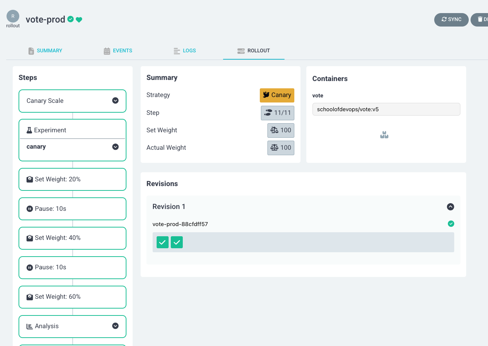

# Analysis and Experiments


In this lab, we aim to explore advanced deployment strategies using ArgoCD and Prometheus. We will set up and configure ArgoCD to visualize rollouts, deploy a metrics server for monitoring, and integrate Prometheus and Grafana for sophisticated monitoring and analysis. Additionally, we will implement canary deployments with experiments and analysis to ensure the stability and performance of our applications before fully rolling them out to production. This comprehensive approach will help us achieve reliable and efficient continuous delivery in our Kubernetes environment.


## Prepwork 

Delete the previous appset and clean up the application deployments using, 

```
kubectl delete appset instavote -n argocd 
```

Reconfigure the appset to launch only `vote` app in prod.  [You could use this code as reference](https://gist.githubusercontent.com/initcron/a5928b1fc4fad138045d88135faf0e44/raw/0e4bc43e3ee4c79c5c7075a03f34c01441fa6376/instavote-appset-vote-prod.yaml)


```
wget -c https://gist.githubusercontent.com/initcron/a5928b1fc4fad138045d88135faf0e44/raw/0e4bc43e3ee4c79c5c7075a03f34c01441fa6376/instavote-appset-vote-prod.yaml

kubectl apply -f instavote-appset-vote-prod.yaml
```

validate 

```   
kubectl get appset,app -n argocd    
``` 


## Setup ArgoCD Extension for Rollout Visualization

To apply the ArgoCD server patch to install the Argo Rollouts extension, follow these steps:

**Step 1: Save the Patch to a File**

Create a new YAML file, e.g., `argocd-rollouts-extension-patch.yaml`, and add the following content:

```yaml
apiVersion: apps/v1
kind: Deployment
metadata:
  name: argocd-server
  namespace: argocd
spec:
  template:
    spec:
      initContainers:
        - name: rollout-extension
          image: quay.io/argoprojlabs/argocd-extension-installer:v0.0.5
          env:
            - name: EXTENSION_URL
              value: 'https://github.com/argoproj-labs/rollout-extension/releases/download/v0.3.5/extension.tar'
          volumeMounts:
            - mountPath: /tmp/extensions/
              name: extensions
          securityContext:
            allowPrivilegeEscalation: false
      containers:
        - name: argocd-server
          volumeMounts:
            - mountPath: /tmp/extensions/
              name: extensions
      volumes:
        - name: extensions
          emptyDir: {}
```

**Step 2: Apply the Patch**

You could add the rollout extenstion so that you could view the progress of canary/blue/green deployments right from ArgoCD UI.

Run the following command to apply the patch to the `argocd-server` deployment:

```bash
kubectl patch deployment argocd-server -n argocd --patch-file argocd-rollouts-extension-patch.yaml
```

**Step 3: Restart the ArgoCD Server**

After applying the patch, restart the ArgoCD server to ensure changes take effect:

```bash
kubectl rollout restart deployment argocd-server -n argocd
```

**Step 4: Verify the Deployment**
Check if the `argocd-server` deployment includes the new `initContainers` section:

```bash
kubectl get deployment argocd-server -n argocd -o yaml | grep -A 10 "initContainers:"
```

To validate, try accessing your **ArgoCD UI**, navigate to an application, and you should see the **"Rollout" tab** under the app details. 🚀





----

## Setup Metrics Server

Its importantt to have metrics server to get the essential pod and node monitoring data. 

If you try to pull monitoring information using the following commands

```
kubectl top pod

kubectl top node
```

it does not show it, rather gives you a error message similar to

[output]

```
Error from server (NotFound): the server could not find the requested resource (get services http:heapster:)
```

Even though the error mentions heapster, its replaced with metrics server by default now.

Deploy metric server with the following commands,

```
cd ~
git clone https://github.com/schoolofdevops/metrics-server.git
kubectl apply -k metrics-server/manifests/overlays/release
```

Validate

```
kubectl get deploy,pods -n kube-system --selector='k8s-app=metrics-server'
```

You could validate again with

```
kubectl top pod

kubectl top node
```

where expected output should be similar to,

```
kubectl top node

NAME                 CPU(cores)   CPU%   MEMORY(bytes)   MEMORY%
kind-control-plane   123m         6%     688Mi           17%
kind-worker          39m          1%     498Mi           12%
kind-worker2         31m          1%     422Mi           10%
```

If you see a similar output, monitoring is now been setup.


## Deploy Prometheus and Grafana

To further setup sophisticated monitoring, we will deploy Prometheus and Grafana.

Begin by setting up the helm repository

```
helm repo add prometheus-community https://prometheus-community.github.io/helm-charts
helm repo update
```

Install Prometheus and Grafana as

```
helm upgrade --install prom -n monitoring \
  prometheus-community/kube-prometheus-stack \
  --create-namespace \
  --set grafana.service.type=NodePort \
  --set grafana.service.nodePort=30500 \
  --set prometheus.prometheusSpec.podMonitorSelectorNilUsesHelmValues=false \
  --set prometheus.prometheusSpec.serviceMonitorSelectorNilUsesHelmValues=false
```

Login using

```
User : admin
Pass: prom-operator
```

### Redeploy Nginx Ingress Controller

First, uninstall nginx ingress conroller as,

```
helm un ingress-nginx -n ingress-nginx
```


Re deploy nginx ingress controller with helm, this time enabling the exposing the metrics which can then be scraped/collected by prometheus. This will automatically integrate nginx with prometheus.


```
helm upgrade --install ingress-nginx ingress-nginx \
  --repo https://kubernetes.github.io/ingress-nginx \
  --namespace ingress-nginx --create-namespace \
  --set controller.metrics.enabled=true \
  --set controller.metrics.serviceMonitor.enabled=true --set \ controller.metrics.serviceMonitor.additionalLabels.release="prometheus" \
  --set controller.hostPort.enabled=true \
  --set controller.hostPort.ports.http=80 \
  --set controller.hostPort.ports.https=443 \
  --set controller.service.type=NodePort \
  --set-string controller.nodeSelector."kubernetes\.io/os"=linux \
  --set-string controller.nodeSelector.ingress-ready="true"

```

### Setup Grafana Dashboard for Nginx Ingress Controller

Now, login to grafana and import custom dashboard for Nginx Ingress as

* Left menu (hover over +) -> Dashboard
* Click New -> Import"
* Enter the copy pasted json from [https://raw.githubusercontent.com/kubernetes/ingress-nginx/main/deploy/grafana/dashboards/nginx.json](https://raw.githubusercontent.com/kubernetes/ingress-nginx/main/deploy/grafana/dashboards/nginx.json)
* Click `Import JSON / Load`
* Select the Prometheus data source
* Click "Import"

⠀
It may look similar to this, with possibly less data initially


However, if you see some metric coming in, your setup with Nginx Ingress and Promethus Integration is working ! You may pat your back at this time :)


----

### Configure Canary Rollout Configuration with Experiment and Analysis

In this section, we will configure canary rollout configurations with experiments and analysis using ArgoCD. We will set up a canary deployment strategy, define experiments for testing, and analyze the results to ensure the stability and performance of our applications before fully rolling them out to production.

Experiments and analysis are crucial components of the canary deployment strategy. Experiments involve running a temporary version of the application alongside the stable version to observe its behavior under real-world conditions. Analysis, on the other hand, involves collecting and evaluating metrics from these experiments to determine if the new version meets the desired performance and stability criteria. The purpose of these steps is to ensure that any issues are detected early, allowing for automatic rollbacks if necessary, thus minimizing the risk of deploying faulty updates to production.

Lets first update the canary rollout configuration to include experiments and analysis. 

Since we are using helm charts to deploy our application, we will need to update the relevant files in initcron-gitops repo. 

File: `instavote-gitops/charts/vote/env/prod.yaml`

```
canary:
  steps:
    - setCanaryScale:
        replicas: 2
    - experiment:
        duration: 3m
        templates:
        - name: fitness
          specRef: canary
          service:
            name: experiment
        analyses:
          - name: fitness-test
            templateName: canary-fitness-test
    - setWeight: 20
    - pause:
        duration: 10s
    - setWeight: 40
    - pause:
        duration: 10s
    - setWeight: 60
    - analysis:
        templates:
        - templateName: loadtest
        - templateName: latency
    - setWeight: 80
    - pause:
        duration: 10s
    - setWeight: 100
```


#### Explanation

*  **Rollout Configuration**:

   * The rollout strategy includes canary steps with set weights and pauses.  
   * Each canary step includes an experiment with a specified duration (e.g., 3 minutes).  
   * The experiment step runs a experimental replicaset and launches a fitness test to  validate if the new version looks okay.  
   * After 60% traffic is shifted to canary, a load test is lauched along with analysis from prometheus to check if the new version will perform okay with the load.  

*  **Analysis Templates**:

   * Defines a templates for running various tests and analyses.    
   * The `loadtest` container runs the load testing script against the canary service (`vote-preview`).  
   * The `fitness-test` job runs a test to validate if the new version is fit for deployment.  
   * the `latency` analysis fetches latency metrics from Prometheus and checks if the application is responding in acceptable time frame even with load conditions.  

⠀
#### How it Works

* At each setWeight step, traffic is gradually shifted to the canary version.  
* The analysis step includes both the load test and the metric analysis.  
* The experiment runs for 3 minutes, during which the fitness test is conducted.  
* Simultaneously with load test , the analysis template checks Prometheus metrics to ensure the canary is performing correctly.  
* If the analysis detects errors beyond the acceptable threshold, the rollout will trigger a rollback.  
* If the canary passes the load test and analysis, the rollout proceeds to the next step.  

⠀
By configuring the experiment and analysis to run in parallel, you can ensure comprehensive testing and validation of the canary version, enabling automatic rollback if any issues are detected.

Let's now create the experiment and analysis templates.

#### 1. Fitness Test Experiment for Canary

File: `intstavote-gitops/charts/vote/templates/fitness-analysistemplate.yaml`

```
apiVersion: argoproj.io/v1alpha1
kind: AnalysisTemplate
metadata:
  name: canary-fitness-test
spec:
  metrics:
  - name: canary-fitness
    interval: 30s
    count: 3
    successCondition: result == "true"
    failureLimit: 1
    provider:
      job:
        spec:
          template:
            spec:
              containers:
              - name: fitness-test
                image: curlimages/curl
                command: ["/bin/sh", "-c"]
                args:
                - |
                  FITNESS_RESULT="false"
                  CANARY_SERVICE_URL="http://vote-canary"

                  # Perform the fitness test
                  RESPONSE=$(curl -s $CANARY_SERVICE_URL)

                  # Check if the response contains the expected string
                  if [[ "$RESPONSE" == *"Processed by container ID"* ]]; then
                    FITNESS_RESULT="true"
                  fi

                  # Return the fitness test result
                  echo $FITNESS_RESULT
              restartPolicy: Never
          backoffLimit: 1
```

where, replace `CANARY_SERVICE_URL="http://vote-canary"` with the actual URL of the canary service.

#### 2. Analysis Template for Load Testing

File `intstavote-gitops/charts/vote/templates/loadtest-analysistemplate.yaml`

```
apiVersion: argoproj.io/v1alpha1
kind: AnalysisTemplate
metadata:
  name: loadtest
spec:
  metrics:
  - name: loadtest-vote
    provider:
      job:
        spec:
          template:
            spec:
              containers:
              - name: siege
                image: schoolofdevops/loadtest:v1
                command:
                  - siege
                  - "--concurrent=2"
                  - "--benchmark"
                  - "--time=5m"
                  - "--header='X-Canary: siege'"
                  - "http://vote.example.com"
              restartPolicy: Never
              hostAliases:
              - ip: "xx.xx.xx.xx"
                hostnames:
                - "vote.example.com"
          backoffLimit: 4
```

where,
* replace `xx.xx.xx.xx` with internal IP Address of `kind-worker` node which runs nginx. Find out by using
```
kubectl get nodes -o wide
```

[sample output]
```
NAME                 STATUS   ROLES           AGE     VERSION   INTERNAL-IP   EXTERNAL-IP   OS-IMAGE                         KERNEL-VERSION     CONTAINER-RUNTIME
kind-control-plane   Ready    control-plane   2d23h   v1.30.0   172.18.0.2    <none>        Debian GNU/Linux 12 (bookworm)   6.8.0-31-generic   containerd://1.7.15
kind-worker          Ready    <none>          2d23h   v1.30.0   172.18.0.4    <none>        Debian GNU/Linux 12 (bookworm)   6.8.0-31-generic   containerd://1.7.15
kind-worker2         Ready    <none>          2d23h   v1.30.0   172.18.0.3    <none>        Debian GNU/Linux 12 (bookworm)   6.8.0-31-generic   containerd://1.7.15
```

From this output, you are going to use `172.18.0.4` in the configuration above.

#### 3. AnalysisTemplate with Latecy Metrics from Prometheus

File : `intstavote-gitops/charts/vote/templates/latency-analysistemplate.yaml`

```
apiVersion: argoproj.io/v1alpha1
kind: AnalysisTemplate
metadata:
  name: latency
spec:
  metrics:
  - name: nginx-latency-ms
    initialDelay: 1m
    interval: 1m
    failureLimit: 2
    count: 4
    successCondition: result < 50.0
    failureCondition: result >= 50.0
    provider:
      prometheus:
        address: http://prom-kube-prometheus-stack-prometheus.monitoring.svc.cluster.local:9090
        query: |
          scalar(
            1000 * histogram_quantile(0.99,
              sum(
                rate(
                  nginx_ingress_controller_request_duration_seconds_bucket{ingress="vote", exported_namespace="instavote-prod"}[1m]
                )
              ) by (le)
            )
          )
```

#####  Commit and push the Helm Chart


validate 
```
helm template vote --values env/prod.yaml .
```

commit and push to git

```
git status
git add *
git status
git commit -am "added fitness test and prometheus analysis"
git push origin main

```

If you are mapping prod to release branch, raise a PR and merge the changes to release branch.


watch the rollout using

```
kubectl argo rollouts list rollout -A
watch kubectl argo rollouts get rollout  vote-prod -n instavote-prod
```

More commands to watch the progressive canary with 

```
kubectl get ar -A
kubectl get exp -A
kubectl get pods,jobs
```

You could also watch the rollout using the web UI.


## Cleaning Up

Once you are done with the lab, you can delete the components created during this lab using the following commands.

```
# Delete Appsets along with Applications
kubectl delete appset instavote -n argocd 
helm uninstall -n monitoring prom  

# From the path where you cloned the repo
kubectl delete -k metrics-server/manifests/overlays/release

# Uninstall Nginx Ingress Controller
helm uninstall -n ingress-nginx ingress-nginx

# Delete Argo Image Updater 
kubectl delete -n argocd -f https://raw.githubusercontent.com/argoproj-labs/argocd-image-updater/stable/manifests/install.yaml

```

## Summary

In this lab, we explored advanced deployment strategies using ArgoCD and Prometheus. We set up and configured ArgoCD to visualize rollouts, deployed a metrics server for monitoring, and integrated Prometheus and Grafana for sophisticated monitoring and analysis. We implemented canary deployments with experiments and analysis to ensure the stability and performance of our applications before fully rolling them out to production. By leveraging these tools and techniques, we achieved reliable and efficient continuous delivery in our Kubernetes environment, ensuring that any issues are detected early and allowing for automatic rollbacks if necessary. This comprehensive approach helps minimize the risk of deploying faulty updates to production and ensures the overall stability and performance of our applications.
