# Setup Automated CI/CD pipeline using GitHub Actions and ArgoCD

This lab describes the process of how you could quickly create a multi node Kubernetes Envonment using [KIND](https://kind.sigs.k8s.io/docs/user/ingress/#ingress-nginx), which is a simple and quick way to set up a learning environment. Advantage it offers over minikube or docker desktop based kubernetes setup is its a multi node environment closer to the real world setup.  

## Prerequisites

You would require the following tools and accounts to get started with this lab.

#### Tools 
- [Docker](https://docs.docker.com/get-docker/)  
- [Git](https://git-scm.com/downloads)  

#### Accounts 
- [GitHub Account](https://github.com/join)  
- [Docker Hub Account](https://hub.docker.com/signup)  

## Prepare the Environment


Begin by installing kubectl and kind utilities. 

To install `kubectl` client, refer to the official documentation here [Install Tools | Kubernetes](https://kubernetes.io/docs/tasks/tools/)

Validate by running
```
kubectl version --client=true

kubectl version --client=true -o yaml

```


Install KinD (Kubernetes inside Docker)  using operating specific instructions at  [kind – Quick Start](https://kind.sigs.k8s.io/docs/user/quick-start/#installation) .

Validate by running

```
kind
```


## Launch Three Node Kubernetes Cluster with KIND

Download  Cluster Configurations and Create  a 3 Node Kubernetes Cluster as

```
git clone https://github.com/initcron/k8s-code.git
cd k8s-code/helper/kind/
kind create cluster --config kind-three-node-cluster.yaml
```

Validate

```
kind get clusters
kubectl cluster-info --context kind-kind


kubectl get nodes
kubectl get pods -A 
```

[sample output]

```
root@demo:~# kubectl get nodes
NAME                 STATUS   ROLES    AGE   VERSION
kind-control-plane   Ready    master   78s   v1.19.1
kind-worker          Ready    <none>   47s   v1.19.1
kind-worker2         Ready    <none>   47s   v1.19.1
```

Wait till you see all nodes in Ready state and you have a cluster operational.

Wait for a couple of minutes and then validate if the nodes are up and running.


## Set up Nginx Ingress Controller for Traffic Routing

Install helm to setup Nginx Ingress Controller. To install helm version 3 on Linux or MacOS, you can follow following instructions.

```
curl https://raw.githubusercontent.com/helm/helm/master/scripts/get-helm-3 | bash
```

You could further refer to [Official HELM Install Instructions](https://helm.sh/docs/intro/install/) for alternative options.

Verify the installtion is successful,

```
helm --help
helm version
```

Launch Nginx Ingress controller using helm as :

```
helm upgrade --install ingress-nginx ingress-nginx \
  --repo https://kubernetes.github.io/ingress-nginx \
  --namespace ingress-nginx --create-namespace \
  --set controller.hostPort.enabled=true \
  --set controller.service.type=NodePort \
  --set controller.hostPort.ports.http=80 \
  --set-string controller.nodeSelector."kubernetes\.io/os"=linux \
  --set-string controller.nodeSelector.ingress-ready="true"

```


Check the pod for Nginx Ingress, if its running

```
kubectl get pods -n ingress-nginx
```

You may see the pod in pending state. Check why its pending by describing it.

Once you describe, you will see that its pending because it has a `nodeSelector` defined which is looking for a node with label set to `ingress-ready="true"`.

Check the label on the current nodes

```
kubectl get nodes --show-labels
```

Add this lable to first  of the worker nodes as
```

kubectl label node kind-worker ingress-ready="true"
```

validate
```
kubectl get nodes --show-labels
```

This time you should see the label added, and nginx ingress controller running, which can be validated using


```
kubectl get pods -n ingress-nginx --watch
```

Wait for the container for nginx ingress controller to be up. You could also validate by connecting to the IPADDRESS of your node where the cluster is beeng setup on port 80, where you should see `**404 Not Found**` error. This is the sign that nginx is set up as a ingress controller and looking for a request with hostname/path defined.

## Setup ArgoCD

Install ArgoCD

```
kubectl create namespace argocd

kubectl apply -n argocd -f https://raw.githubusercontent.com/argoproj/argo-cd/stable/manifests/install.yaml
```


Reset admin password to `password`

```
# bcrypt(password)=$2a$10$rRyBsGSHK6.uc8fntPwVIuLVHgsAhAX7TcdrqW/RADU0uh7CaChLa
kubectl -n argocd patch secret argocd-secret \
  -p '{"stringData": {
    "admin.password": "$2a$10$rRyBsGSHK6.uc8fntPwVIuLVHgsAhAX7TcdrqW/RADU0uh7CaChLa",
    "admin.passwordMtime": "'$(date +%FT%T%Z)'"
  }}'

```
Source: [reset-argo-password.sh](https://gist.github.com/initcron/09d8b6c70d527b5e8894472efa83a895)
Reference: [argo-cd/faq.md at master · argoproj/argo-cd · GitHub](https://github.com/argoproj/argo-cd/blob/master/docs/faq.md#i-forgot-the-admin-password-how-do-i-reset-it)

```
kubectl get all -n argocd
```

```
kubectl patch svc argocd-server -n argocd --patch \
  '{"spec": { "type": "NodePort", "ports": [ { "nodePort": 32100, "port": 443, "protocol": "TCP", "targetPort": 8080 } ] } }'

```
source: [patch_argo_svc.sh](https://gist.github.com/initcron/a14fe418b8a7325e3ed5ecebf6fadb53)

```
kubectl get svc -n argocd
```


Find out the IP address for one of the nodes. One way to do so is to run the following command,

```
kubectl get nodes -o wide
```

Note IP address for one of the nodes and browse to https://NODEIP:32100

where, replace `NODEIP` with the actual.


You should be presented with the  login page for ArgoCD as follows


* username  =.   `admin`
* password   =   `password`

#### Install ArgoCD CLI

You could refer to OS specific instructions to [Install ArgoCD CLI](https://argo-cd.readthedocs.io/en/stable/cli_installation/) for installing `agocd` utility.

## Install Argo Rollouts
Install Argo Rollouts Controller and CRDs with ,

```
kubectl create namespace argo-rollouts
kubectl apply -n argo-rollouts -f https://github.com/argoproj/argo-rollouts/releases/latest/download/install.yaml

```

Validate with,

```
kubectl api-resources | grep -i argo
```

Optionally, you could install argo plugin for kubectl  

On linux
```
cd ~

curl -LO https://github.com/argoproj/argo-rollouts/releases/latest/download/kubectl-argo-rollouts-linux-amd64

chmod +x ./kubectl-argo-rollouts-linux-amd64

sudo mv ./kubectl-argo-rollouts-linux-amd64 /usr/local/bin/kubectl-argo-rollouts
```

On Mac.
```
curl -LO https://github.com/argoproj/argo-rollouts/releases/latest/download/kubectl-argo-rollouts-darwin-amd64

chmod +x ./kubectl-argo-rollouts-darwin-amd64

sudo mv ./kubectl-argo-rollouts-darwin-amd64 /usr/local/bin/kubectl-argo-rollouts

```

And validate as,

```
kubectl argo rollouts version
```


Also install Kustomize by following the instructions in [official documentation](https://kubectl.docs.kubernetes.io/installation/kustomize/) here.

### Setup Argo Rollouts Dashboard 

```
apply -n argo-rollouts -f https://raw.githubusercontent.com/argoproj/argo-rollouts/stable/manifests/dashboard-install.yaml
```

```
kubectl patch svc argo-rollouts-dashboard -n argo-rollouts --type='merge' -p '{"spec": {"type": "NodePort", "ports": [{"port": 3100, "targetPort": 3100, "nodePort": 30600}]}}'
```

Access it using http://NODEIP:30600/rollouts

## Setup CI Pipeline with GitHub Actions

Fork the [sample repo](https://github.com/sfd226/vote) to get started. 

This repo contains a simple application written in python that allows you to vote, along with Dockerfile,  kubernetes manifests. 

To build a Continuous Integration Pipeline, you would add the  and GitHub Actions workflow to this repo. Create a GitHub Actions workflow pipeline at `.github/workflows/ci.yml` to setup the CI Process.  Here is a sample code. 

```
#.github/workflows/ci.yml
name: CI

on:
  push:
    branches:
      - main
    paths-ignore:
      - 'Dockerfile'
      - 'Jenkinsfile'
      - 'chart/**'
  pull_request:
    branches:
      - main
    paths-ignore:
      - 'Dockerfile'
      - 'Jenkinsfile'
      - 'chart/**'

jobs:
  build:
    runs-on: ubuntu-latest
    steps:
      - name: Checkout code
        uses: actions/checkout@v2

      - name: Set up Python
        uses: actions/setup-python@v2
        with:
          python-version: '3.x'

      - name: Install dependencies
        run: pip install -r requirements.txt

  unit-test:
    runs-on: ubuntu-latest
    needs: build
    steps:
      - name: Checkout code
        uses: actions/checkout@v2

      - name: Set up Python
        uses: actions/setup-python@v2
        with:
          python-version: '3.x'

      - name: Install dependencies
        run: pip install -r requirements.txt

      - name: Run tests
        run: nose2

  image-bp:
    runs-on: ubuntu-latest
    needs: unit-test
    steps:
      - name: Checkout code
        uses: actions/checkout@v2

      - name: Log in to DockerHub
        uses: docker/login-action@v2
        with:
          username: ${{ secrets.DOCKER_USERNAME }}
          password: ${{ secrets.DOCKER_PASSWORD }}

      - name: Build and push Docker image
        run: |
          COMMIT_HASH=$(echo ${{ github.sha }} | cut -c1-7)
          docker build -t ${{ secrets.DOCKER_USERNAME }}/vote:$COMMIT_HASH .
          docker push ${{ secrets.DOCKER_USERNAME }}/vote:$COMMIT_HASH
```
Read this guide to understand this code better: [GHA Code Explainer](https://kubernetes-tutorial.schoolofdevops.com/gha_code_explain/)

To make this work after adding this code,  all you need to do is,  add the secret variables in your repository settings so that GitHub Actions can access your DockerHub account.

### Adding DockerHub Secrets

You need to add DOCKER_USERNAME and DOCKER_PASSWORD as secrets in your GitHub repository settings. Here are the steps to add these secrets:  

  1 Go to your GitHub repository on the web.  
  2 Click on the Settings tab.
  3 In the left sidebar, click on Secrets and variables and then Actions.

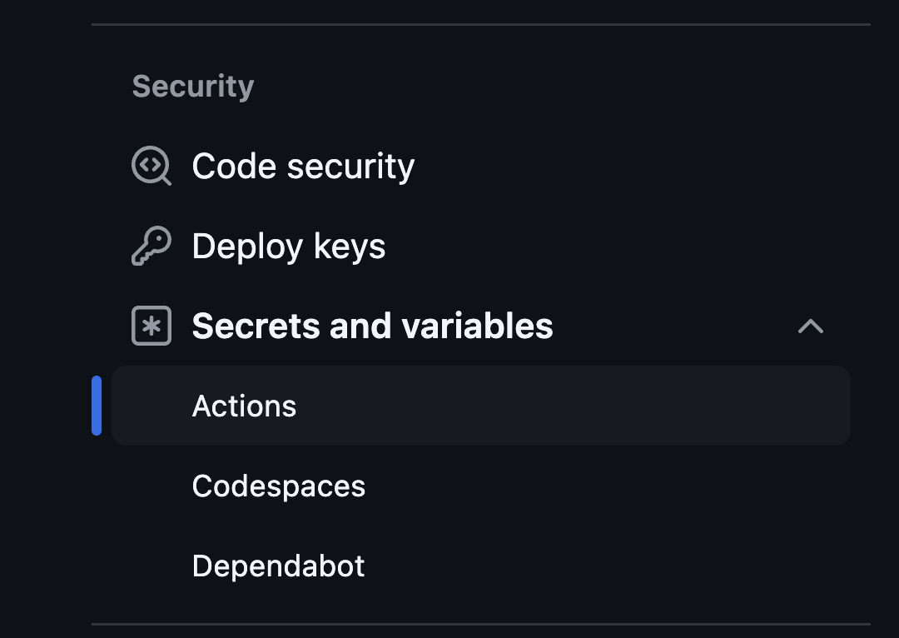

  4 Click the New repository secret button.  

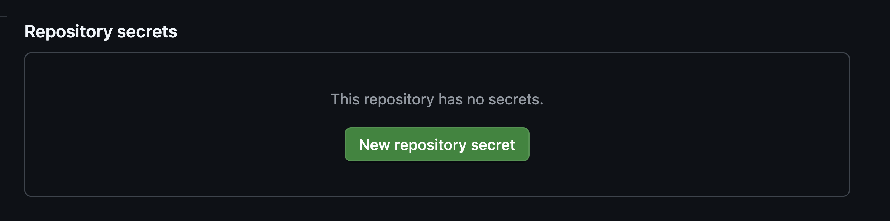

  5 Add a new secret with the name DOCKER_USERNAME and set its value to your DockerHub username.  
  6 Add another new secret with the name DOCKER_PASSWORD and set its value to your DockerHub password.  

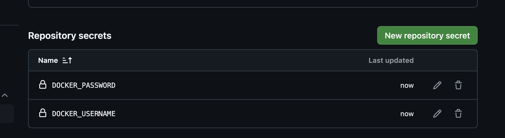

Once you have added these secrets, they will be available to your GitHub Actions workflow. The workflow file you provided already references these secrets correctly. 

Make some changes to the application and push the changes to your forked repository. This will trigger the GitHub Actions workflow. You can view the workflow run in the Actions tab of your repository.


## Setup Automated Deployments to Dev with ArgoCD 


Ensure that you have forked the application repo which also contains the helm chart code. 

Now to setup the automated deployment you should first create a Project and Repository. To do so,  log in to ArgoCD, select `settings` from left menu and browse to  `Projects`


Click on `New Project` -> Create and provide Project Name and Description as


Proceed to create the project.

From Project Configuration page that you are redirected to, edit `DESTINATIONS`

  * Select default cluster name from dropdown  
  * Select `in-cluster` as Name  
  * Add three entries, eacg for `dev`, `staging`, `prod` Namespaces respectively
  * Save

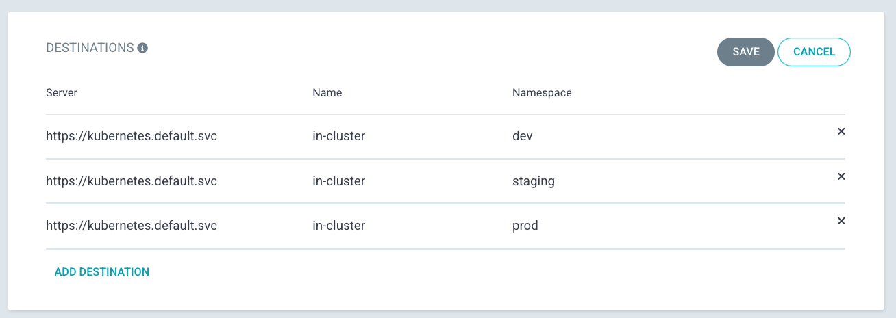


From `settings` from left menu and browse to  `Repositories`

Select `Connet Repo` and provide the following configuration

  * Via:  HTTPS  
  * Type: git  
  * Project: instavote   
  * Repository URL: https://github.com/xxxx/vote.git (replace with actual)  
  * Username: GitHub Username (If Private Repo)  
  * Password: GitHub Password or Token (If Private Repo)  


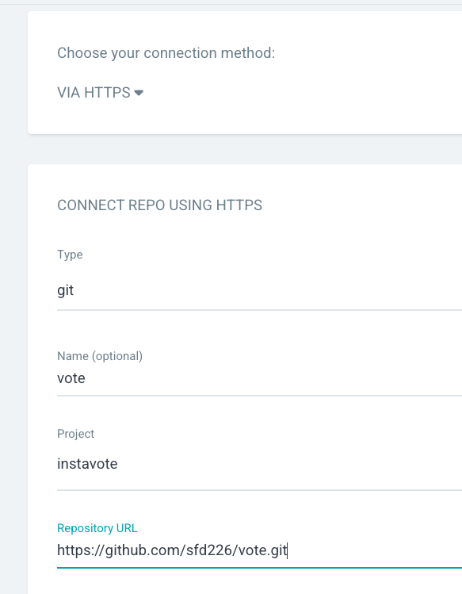


Finally click on `Connect` to add the repo.

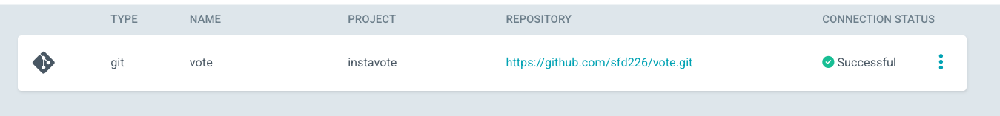

You should see connection status as `Successful`


### Deploy to Dev with ArgoCD

Create a `dev` namespace 

```
kubectl create namespace dev

```

Browse to ArgoCD web console and click on **Create Application**

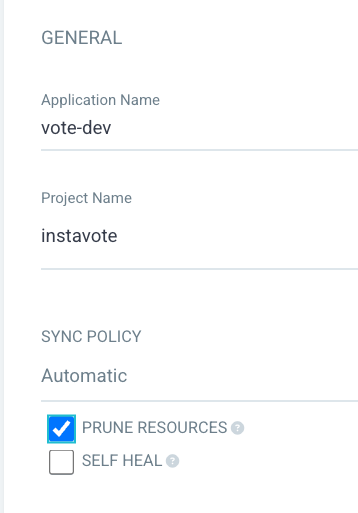


From General ,

  * Application Name : `vote-dev`  
  * Project : `instavote`  
  * Sync Policy : `Automatic`  
  * Prune Resources: Checked


From Source,  

  * Repository URL : `Your Repo URL (https)`  
  * Revision : `main` / `HEAD`   
  * Path :  `chart`  


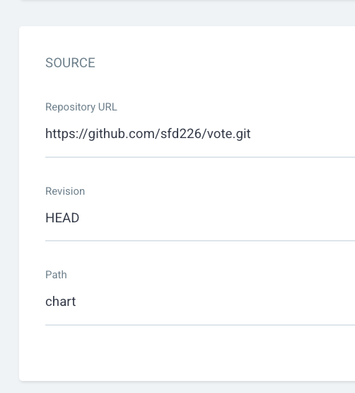


From Destination,  

  * Cluster URL :  https://kubernetes.default.svc   (default)  
  * Namespace : `dev`  


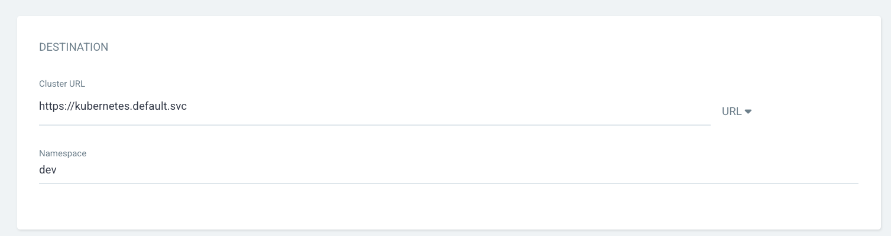


From Helm,  

  * Values Files : `values-dev.yaml`  from dropdown


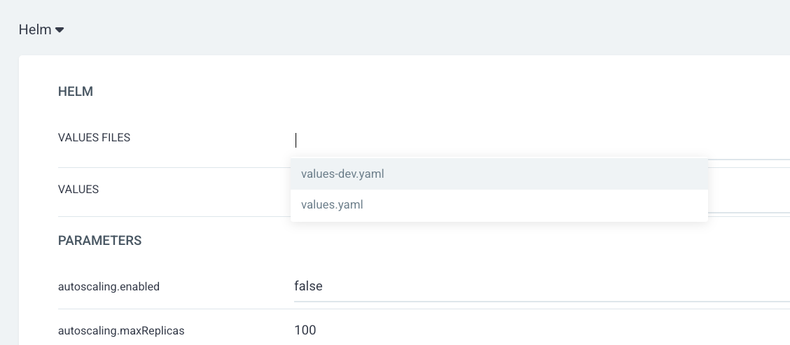


Click on **CREATE** button on the top


You shall see the application created on ArgoCD web console. 
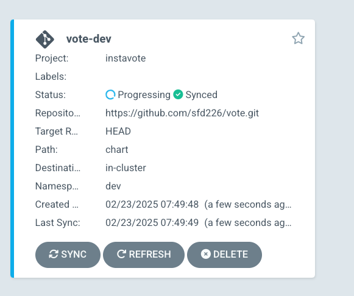

And can further examine the deployment status. 

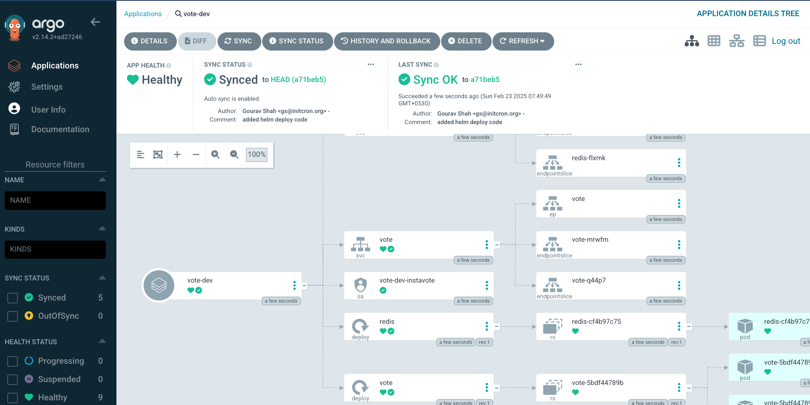


you could also validate from command line as,

```
kubectl get all -n dev
```

[sample output]

```
NAME                        READY   STATUS    RESTARTS   AGE
pod/redis-cf4b97c75-hh65q   1/1     Running   0          2m21s
pod/vote-5bdf44789b-7c7kt   1/1     Running   0          2m21s
pod/vote-5bdf44789b-97hwf   1/1     Running   0          2m21s

NAME            TYPE        CLUSTER-IP      EXTERNAL-IP   PORT(S)        AGE
service/redis   ClusterIP   10.96.246.118   <none>        6379/TCP       2m21s
service/vote    NodePort    10.96.250.9     <none>        80:30100/TCP   2m21s

NAME                    READY   UP-TO-DATE   AVAILABLE   AGE
deployment.apps/redis   1/1     1            1           2m21s
deployment.apps/vote    2/2     2            2           2m21s

NAME                              DESIRED   CURRENT   READY   AGE
replicaset.apps/redis-cf4b97c75   1         1         1       2m21s
replicaset.apps/vote-5bdf44789b   2         2         2       2m21s
```

## Set up Argo Image Updater

Install  [Argo CD Image Updater](https://argocd-image-updater.readthedocs.io/) as,

```
kubectl apply -n argocd -f https://raw.githubusercontent.com/argoproj-labs/argocd-image-updater/stable/manifests/install.yaml
```

Create a  Secret with your GitHub credentials so that the image updater can discover and commit the image tags to git repository.  

```
kubectl -n argocd create secret generic git-creds \
  --from-literal=username=xxxxxx \
  --from-literal=password=ghp_yyyyyy
```

Note : replace `xxxxxx` with your GitHub Username and `ghp_yyyyyy` with GitHub Access Token with write access to repository.  If you do not already have token, create it from GitHub

Validate by running

```
kubectl get pods -n argocd
```

[expected output]
```
NAME                                               READY   STATUS    RESTARTS   AGE
argocd-image-updater-74ddc74d5d-j5wkg              1/1     Running   0          2m42s
```


## Conencting CI with CD using Auto Image Updates

When you set up dev deployment, ArgoCD has created a application object for you.  You would need to add a few annotations  to it so that the Image Updater knows that this application is been marked for image auto update.

Observe the existing application created from ArgoCD UI as,

```
kubectl get application -n argocd

kubectl describe application -n argocd vote-dev
```

specifically observe the annotations

```
Annotations:  <none>
```

To update this application with  appropriate annotations create a patch file with the name and content given below,

File : `argo-applications-vote-dev-patch.yaml`

```
metadata:
  annotations:
    argocd-image-updater.argoproj.io/git-branch: main
    argocd-image-updater.argoproj.io/image-list: myimage=xxx/vote
    argocd-image-updater.argoproj.io/myimage.allow-tags: regexp:^[0-9a-f]{7}$
    argocd-image-updater.argoproj.io/myimage.ignore-tags: latest, dev
    argocd-image-updater.argoproj.io/myimage.update-strategy: newest-build
    argocd-image-updater.argoproj.io/myimage.helm.image-name: vote.image.repository
    argocd-image-updater.argoproj.io/myimage.helm.image-tag: vote.image.tag
    argocd-image-updater.argoproj.io/myimage.force-update: "true"
    argocd-image-updater.argoproj.io/write-back-method: git:secret:argocd/git-creds
    argocd-image-updater.argoproj.io/write-back-target: "helmvalues:values-dev.yaml"
```

Where,

* Replace `xxxxxx/vote` with your own repo in the `argocd-image-updater.argoproj.io/image-list` annotation.  

Apply the above patch as,

```
kubectl patch application --type=merge -n argocd vote-dev --patch-file argo-applications-vote-dev-patch.yaml

```

Validate annotations are added,

```
kubectl describe application -n argocd vote-dev
```

[sample output]
```
Name:         vote-dev
Namespace:    argocd
Labels:       <none>
Annotations:  argocd-image-updater.argoproj.io/git-branch: main
              argocd-image-updater.argoproj.io/image-list: myimage=initcron/initcron
              argocd-image-updater.argoproj.io/myimage.allow-tags: regexp:^[0-9a-f]{7}$
              argocd-image-updater.argoproj.io/myimage.force-update: true
              argocd-image-updater.argoproj.io/myimage.helm.image-name: vote.image.repository
              argocd-image-updater.argoproj.io/myimage.helm.image-tag: vote.image.tag
              argocd-image-updater.argoproj.io/myimage.ignore-tags: latest, dev
              argocd-image-updater.argoproj.io/myimage.kustomize.image-name: schoolofdevops/vote
              argocd-image-updater.argoproj.io/myimage.update-strategy: newest-build
              argocd-image-updater.argoproj.io/write-back-method: git:secret:argocd/git-creds
              argocd-image-updater.argoproj.io/write-back-target: helmvalues:values-dev.yaml
API Version:  argoproj.io/v1alpha1
Kind:         Application
...
```

If everything goes well, within a few minutes, you should see a commit to the main branch of the `vote-deploy` repository that you have.

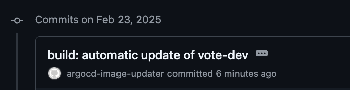

And a few minutes after that, you should see the dev deployment on ArgoCD  pick up the newly updated image tag and deploy it.

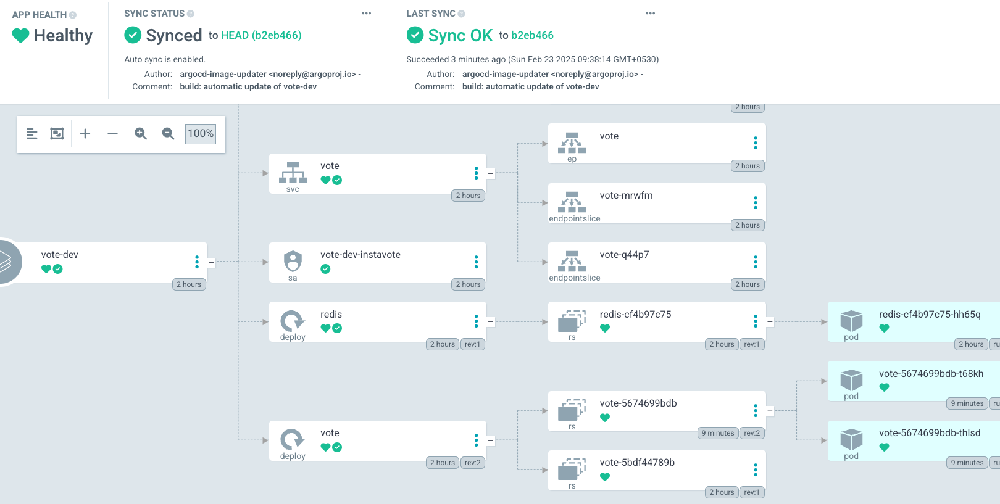


and also validate with

```
kubectl describe application -n argocd vote-dev
```

where you should see the following in the output status

```
  Summary:
    Images:
      initcron/initcron:1065b15
      redis:alpine
  Sync:
    Compared To:
      Destination:
        Namespace:  dev
        Server:     https://kubernetes.default.svc
```


You could check the logs for the image updater which is running in `argocd` namespace by using a command similar to

```
kubectl logs -f -l "app.kubernetes.io/name=argocd-image-updater" -n argocd
```

[sample output]

```

time="2025-02-23T04:06:17Z" level=info msg="Committing 1 parameter update(s) for application vote-dev" application=vote-dev
time="2025-02-23T04:06:17Z" level=info msg="Initializing https://github.com/sfd226/vote.git to /tmp/git-vote-dev4083369370"
time="2025-02-23T04:06:17Z" level=info msg="git fetch origin main --force --prune --depth 1" dir=/tmp/git-vote-dev4083369370 execID=2bc9e
time="2025-02-23T04:06:18Z" level=info msg=Trace args="[git fetch origin main --force --prune --depth 1]" dir=/tmp/git-vote-dev4083369370 operation_name="exec git" time_ms=796.059257
time="2025-02-23T04:06:18Z" level=info msg="git checkout --force main" dir=/tmp/git-vote-dev4083369370 execID=5dbc4
time="2025-02-23T04:06:18Z" level=info msg=Trace args="[git checkout --force main]" dir=/tmp/git-vote-dev4083369370 operation_name="exec git" time_ms=8.651031
time="2025-02-23T04:06:18Z" level=info msg="git clean -ffdx" dir=/tmp/git-vote-dev4083369370 execID=85664
time="2025-02-23T04:06:18Z" level=info msg=Trace args="[git clean -ffdx]" dir=/tmp/git-vote-dev4083369370 operation_name="exec git" time_ms=1.851311
time="2025-02-23T04:06:18Z" level=info msg="Successfully updated the live application spec" application=vote-dev
time="2025-02-23T04:06:18Z" level=info msg="Processing results: applications=1 images_considered=1 images_skipped=0 images_updated=1 errors=0"
```


Thats all ! If you have gotten till here, congratulate yourself as you have just built a simplistic but completely working modern CI/CD Pipeline ! Hurray !!

You could test this complete CI/CD pipeline by making changes to the `vote` application and pushing it to the `main` branch.
You will see that,   
1. When you me a change to the `vote` application, it will be automatically trigger GitHub Actions workflow which will build a new image and push it to the `dev` namespace.  
2. The Argo Image Updater will detect the new image and update the image tag in the repository which containts the helm chart.   
3. The ArgoCD will detect the change in the helm chart and deploy the new image to the `dev` namespace.  
4. You could then test the application by accessing the URL of the `dev` namespace.  


