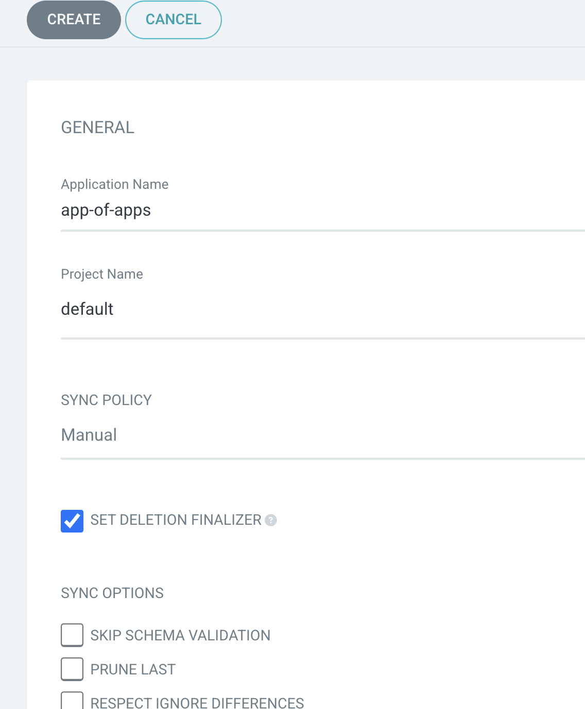
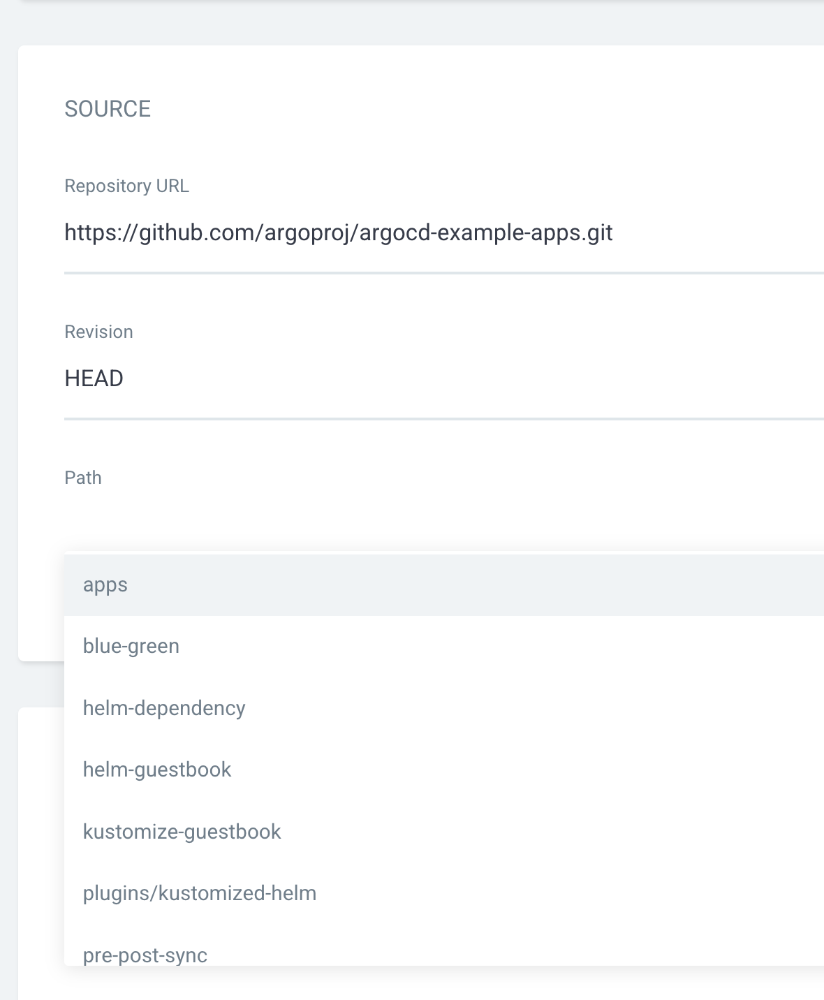
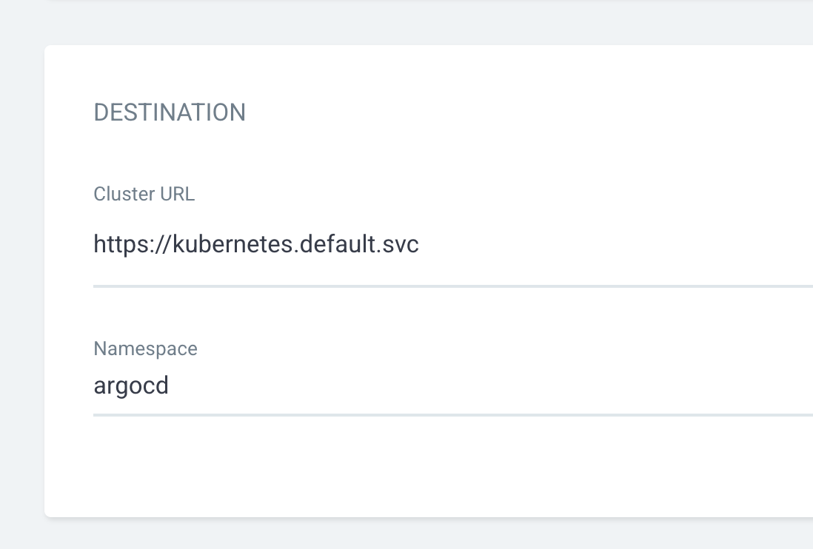
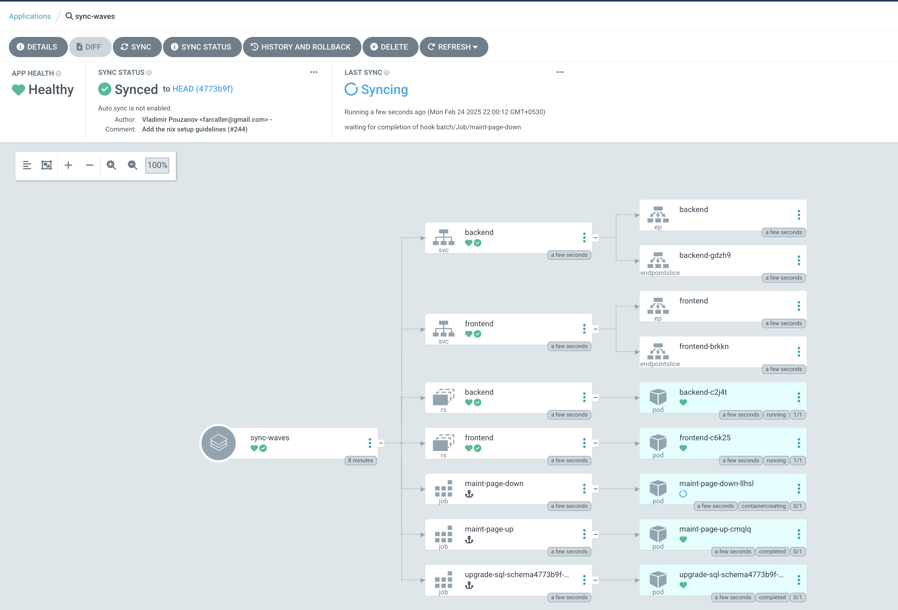

# Testing Advanced Sync Strategies 

Start by reading the articles on 

* Advanced Sync Strategies: [ArgoCD Advanced Sync Strategies - Kubernetes Tutorial with CKA/CKAD Prep](https://kubernetes-tutorial.schoolofdevops.com/articles/argo_adv_sync_strategies/)
* ArgoCD Sync Policies and Options: [ArgoCD Sync Options - Kubernetes Tutorial with CKA/CKAD Prep](https://kubernetes-tutorial.schoolofdevops.com/articles/argo_sync_options/)

To test the sync waves, lets setup the example app repository using app of apps pattern. 

## App of Apps Deployment

Start by examining the example apps repo at ([argoproj/argocd-example-apps: Example Apps to Demonstrate Argo CD](https://github.com/argoproj/argocd-example-apps))

Create a new App of Apps with ArgoCD 

### General Section
* Application Name : `app-of-apps`
* Project : `default`
* Sync Policy : `manual`
* Set Delete Finalizer :  `checked` 


### Source Section: 
* Repository URL : https://github.com/argoproj/argocd-example-apps.git
* Revision: `HEAD` 
* Path: `apps`


### Destination Section: 
* Cluster URL :  https://kubernetes.default.svc (default from dropdown)
* Namespace : `argocd`


Create the app and then manually `SYNC` it. When 


Once you sync it, you shall see it creates a group of apps. This is the app of apps pattern.   All these apps are added to argocd namespace. 

You could validate it from CLI as, 

```
kubectl get apps -n argocd
```

[Expected Output]
```
NAME                  SYNC STATUS   HEALTH STATUS
app-of-apps           Synced        Healthy
helm-guestbook        OutOfSync     Missing
helm-hooks            OutOfSync     Missing
kustomize-guestbook   OutOfSync     Missing
sync-waves            OutOfSync     Missing
```

```
kubectl get namespace
```

[Expected Output]
```

NAME                  STATUS   AGE
helm-guestbook        Active   62s
helm-hooks            Active   62s
kube-system           Active   34h
kustomize-guestbook   Active   62s
sync-waves            Active   62s
```

These are the namespaces created by this app of app deployment. In addition you would see your existing namespaces too. 

## Using Argo Hooks to create Waves

Examine the sync wave manifest here : [argocd-example-apps/sync-waves at master · argoproj/argocd-example-apps](https://github.com/argoproj/argocd-example-apps/tree/master/sync-waves)

Sample code snippets which define the 
* PreSync Hook
* Sync Hook
  * sync-wave : 0/1/2/3
  
```
---
apiVersion: batch/v1
kind: Job
metadata:
  generateName: upgrade-sql-schema
  annotations:
    argocd.argoproj.io/hook: PreSync
```

```
apiVersion: batch/v1
kind: Job
metadata:
  name: maint-page-up
  annotations:
    argocd.argoproj.io/hook: Sync
    argocd.argoproj.io/hook-delete-policy: BeforeHookCreation
    argocd.argoproj.io/sync-wave: "1"
```


```
apiVersion: apps/v1
kind: ReplicaSet
metadata:
  name: frontend
  annotations:
    argocd.argoproj.io/sync-wave: "2"
```

```
apiVersion: batch/v1
kind: Job
metadata:
  name: maint-page-down
  annotations:
    argocd.argoproj.io/hook: Sync
    argocd.argoproj.io/hook-delete-policy: BeforeHookCreation
    argocd.argoproj.io/sync-wave: "3"
```

start watching for pods  in `sync-waves` namespace 

```
watch kubectl get pods -n sync-waves
```

Select sync wave app from ArgoCD and sync it manually.  

You will see it syncing in a certain sequence based on the config in the manifest. 


You could also observe on the CLI which shows you as the resources are creates/synced

```
Every 2.0s: kubectl get pods -n sync-waves                                dkr-01: Mon Feb 24 16:34:00 2025

NAME                                                     READY   STATUS      RESTARTS   AGE
pod/backend-c2j4t                                        1/1     Running     0          4m4s
pod/frontend-c6k25                                       1/1     Running     0          3m53s
pod/maint-page-down-llhsl                                0/1     Completed   0          3m49s
pod/maint-page-up-cmqlq                                  0/1     Completed   0          4m
pod/upgrade-sql-schema4773b9f-presync-1740414585-4jzdn   0/1     Completed   0          4m15s

```


## Using Helm Hooks to create  Waves

Examine the helm hooks [argocd-example-apps/helm-hooks at master · argoproj/argocd-example-apps](https://github.com/argoproj/argocd-example-apps/tree/master/helm-hooks)

Sample code with 
* helm hooks
* pre and post install hooks
* hook weights 

```
apiVersion: batch/v1
kind: Job
metadata:
  generateName: upgrade-sql-schema
  annotations:
    helm.sh/hook: pre-install
    helm.sh/hook-weight: "-2"
```

```
---
apiVersion: batch/v1
kind: Job
metadata:
  name: maint-page-up
  annotations:
    helm.sh/hook: pre-install
    helm.sh/hook-delete-policy: before-hook-creation
    helm.sh/hook-weight: "-1"
```

```
---
apiVersion: v1
kind: Service
metadata:
  name: frontend
  annotations:
    helm.sh/hook-weight: "2"
```


```
---
apiVersion: batch/v1
kind: Job
metadata:
  name: maint-page-down
  annotations:
    helm.sh/hook: post-install
    helm.sh/hook-delete-policy: before-hook-creation
```

Sync the `helm-hooks`  app to examine how it woks.  You will notrice that it helps you achieve the same result as with the `sync-waves` with argo. 


Once you are done experimenting with these examples, clean up everything by removing the `app-of-apps` application that you created with ArgoCD, which will also clean up the child apps and all the resources created by it.  


#courses/argo/labs/adv