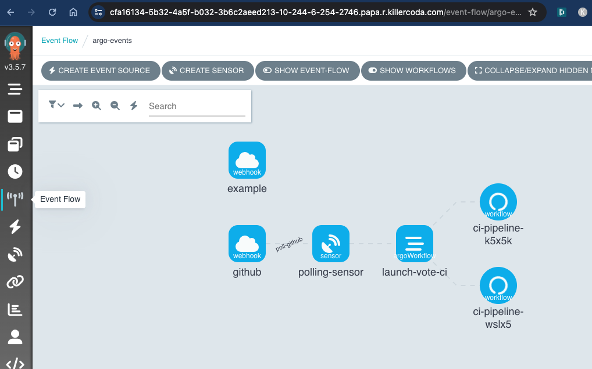
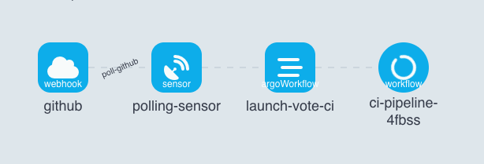

# Argo Events

Author: Gourav Shah  
Publisher: School of Devops  
Version : v2024.06.02.01  
- - -


**Project:** Trigger CI Pipeline on GitHub Changes


## Set up Argo Events

Launch [Argo Workflow](https://killercoda.com/argoproj/course/argo-workflows/workflow-examples) Environment with Killercoda , set up server UI and have it open.

Install Argo Events

```
kubectl create namespace argo-events
kubectl apply -f https://raw.githubusercontent.com/argoproj/argo-events/stable/manifests/install.yaml
# Install with a validating admission controller
kubectl apply -f https://raw.githubusercontent.com/argoproj/argo-events/stable/manifests/install-validating-webhook.yaml
kubectl apply -n argo-events -f https://raw.githubusercontent.com/argoproj/argo-events/stable/examples/eventbus/native.yaml

```

Create RBAC Policies

```
kubectl apply -n argo-events -f https://raw.githubusercontent.com/argoproj/argo-events/master/examples/rbac/sensor-rbac.yaml

kubectl apply -n argo-events -f https://raw.githubusercontent.com/argoproj/argo-events/master/examples/rbac/workflow-rbac.yaml
```

## Setup Components to Trigger CI Pipeline

You will now set up the components required for the Argo Events to trigger the CI workflow based on changes to GitHub. For this you are going to need

   * Event Source - To listen to GitHub change events   
   * Sensor - Which activates on updated to event source and triggers the workflow  
   * Workflow Template - To create an instance of the CI Pipeline Workflow   
   * Container Registry Credentials - Used by the workflow to publish images with   

Create an Argo Events EventSource and Sensor to handle the events sent by your polling job.

File: `webook-eventsource.yaml`

```
apiVersion: argoproj.io/v1alpha1
kind: EventSource
metadata:
  name: webhook
  namespace: argo-events
spec:
  service:
    ports:
      - port: 12000
        targetPort: 12000
  webhook:
    example:
      port: "12000"
      endpoint: /example
      method: POST

    github:
      port: "12000"
      endpoint: /github
      method: POST

```

apply

```
kubectl apply -f webook-eventsource.yaml
```

Check the Argo Workflow for Vote CI Pipeline converted into a [Workflow Template](https://gist.githubusercontent.com/initcron/c1704b560909f424e66062d86af9ff5c/raw/f7c5f73605a732d358a93854bc2da652113de494/vote-ci-template.yaml).

Create workflow template using this code as

```
kubectl apply -f https://gist.githubusercontent.com/initcron/c1704b560909f424e66062d86af9ff5c/raw/f7c5f73605a732d358a93854bc2da652113de494/vote-ci-template.yaml

```

validate

```
kubectl get workflowtemplate -A

argo template list -A
```


add registry credentials to `argo-events` namespace again with

```
kubectl create secret -n argo-events docker-registry docker-registry-creds  \
   --docker-server=https://index.docker.io/v1/ \
   --docker-username=xxxx  --docker-password=yyyy
```

where replace,  

* `xxxx` with registry username  
* `yyyy` with registry access token  

Add sensor which will listen to updates to `github` webhook created with event source and then trigger the argo workflow as,

File : `sensor.yaml`
```
apiVersion: argoproj.io/v1alpha1
kind: Sensor
metadata:
  name: polling-sensor
  namespace: argo-events
spec:
  template:
    serviceAccountName: operate-workflow-sa
  dependencies:
    - name: poll-github
      eventSourceName: webhook
      eventName: github
  triggers:
    - template:
        name: launch-vote-ci
        argoWorkflow:
          operation: submit
          source:
            resource:
              apiVersion: argoproj.io/v1alpha1
              kind: Workflow
              metadata:
                generateName: ci-pipeline-
              spec:
                workflowTemplateRef:
                  name: vote-ci-template
                arguments:
                  parameters:
                  - name: repo-url
                    value: "https://github.com/xxxxxx/vote.git"
                  - name: branch
                    value: "master"
                  - name: image
                    value: "xxxxxx/vote"
                  - name: dockerfile
                    value: "Dockerfile"

```

where,

* replace `repo-url` with your code repository url  
* update image tag by replacing `xxxxxx` with your docker hub user name  

apply

```
kubectl apply -f sensor.yaml

```

validate

```
kubectl get pods -n argo-events
```

you could also check the logs for sensor controller (useful for troubleshooting) using

```
kubectl logs -n argo-events -l "controller=sensor-controller"
```

you should see a new pod launched to run this sensor.

At this time, if you have Argo Workflow set up, you should see a event flow such as this

Event Flow :




## Deploy GitHub Poller

After setting up the event flow, you also need to set up something which will trigger the event source on changes to GitHub.

You could do this in two ways

  * Using Webhooks : You could expose the event source service to outside and let GitHub trigger a webhook whenever there is a push event. This is useful if your event source can be publically available (GitHub can connect to it).
  * In-cluster Polling :  You could alternately set up in cluster system to periodically poll GitHub for changes, and trigger the event source. This is useful when you can not expose event source service pubically, and are running your cluster in a private network.

Since we do not assume your cluster is  public, we will employ the second approach.

To achisve in-cluster polling, create the following  Kubernetes CronJob that periodically polls GitHub for new commits. If new commits are found, the job can trigger the event source webhook created earlier.

File: `poller-cronjob.yaml`

```
---
apiVersion: batch/v1
kind: CronJob
metadata:
  name: github-polling-job
spec:
  schedule: "* * * * *"  # Poll every minute
  jobTemplate:
    spec:
      template:
        spec:
          containers:
          - name: poller
            image: schoolofdevops/github-poller:latest  
            env:
            - name: GITHUB_API_URL
              value: "https://api.github.com/repos/yourusername/yourrepo/commits"
            - name: GITHUB_TOKEN
              valueFrom:
                secretKeyRef:
                  name: github-token-secret
                  key: token
            - name: LAST_COMMIT_FILE
              value: "/data/last_commit.txt"
            - name: ARGO_EVENT_SOURCE_URL
              value: "http://webhook-eventsource-svc.argo-events.svc.cluster.local:12000/github"
            volumeMounts:
            - name: commit-storage
              mountPath: /data
          restartPolicy: OnFailure
          volumes:
          - name: commit-storage
            persistentVolumeClaim:
              claimName: poller-pvc  # Use a PVC to persist the last commit file
---
apiVersion: v1
kind: PersistentVolumeClaim
metadata:
  name: poller-pvc
spec:
  accessModes:
    - ReadWriteOnce
  resources:
    requests:
      storage: 10Mi

```

where,

  * replace value of `GITHUB_API_URL` to match your user name and repo components  e.g. `https://api.github.com/repos/devops-0001/vote/commits`   
  * verify values for all env variables to be correct    

Also create secret with github token with access to the repository, which is used in the cronjob above.

```
kubectl create secret generic github-token-secret --from-literal=token=xxxx
```

replace `xxxx` with actul GitHub access token.

create this cronjob as

```
kubectl apply -f poller-cronjob.yaml
```

now start watching the cronjobs as well as event flow from Argo Workflow dashboard.  

Event Flow :



Workflows:


