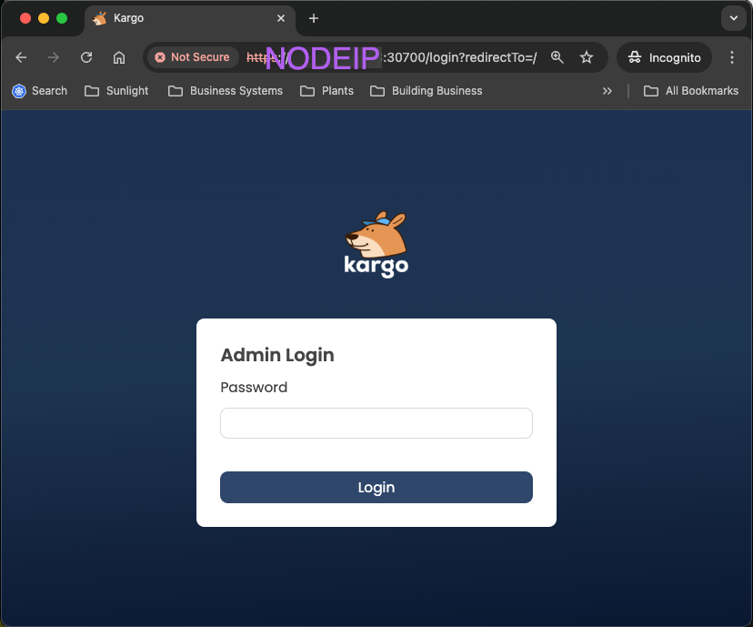
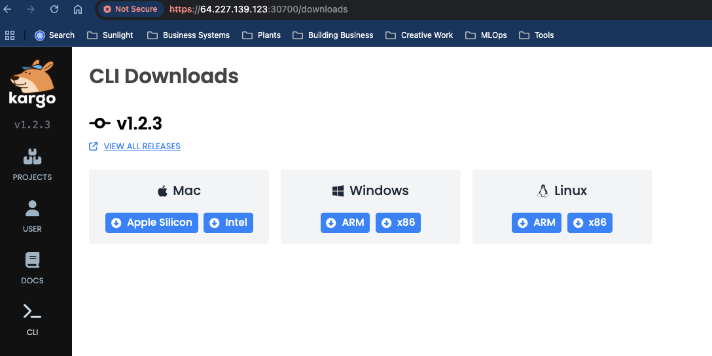
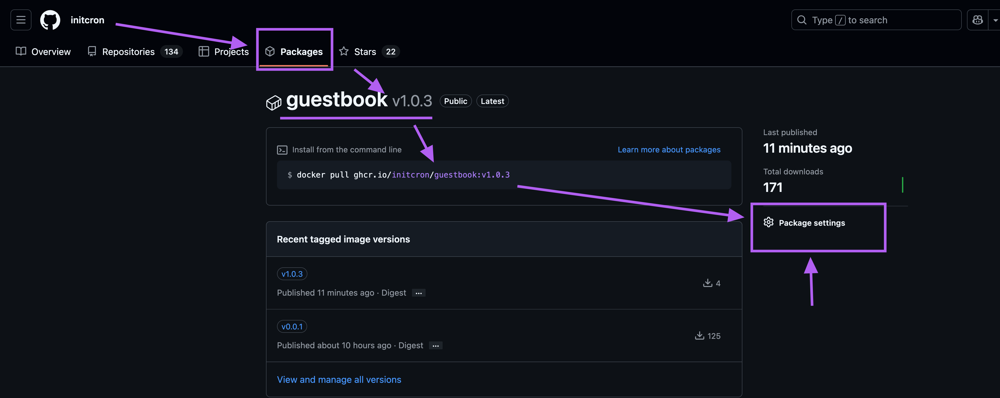
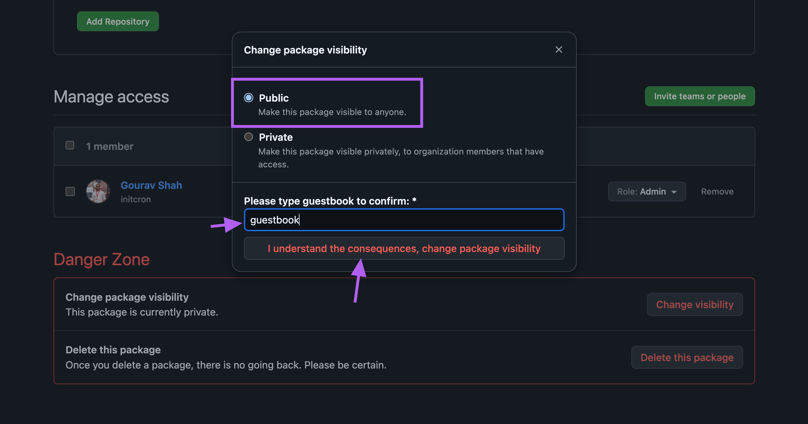
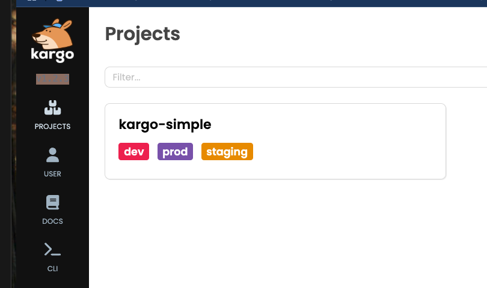
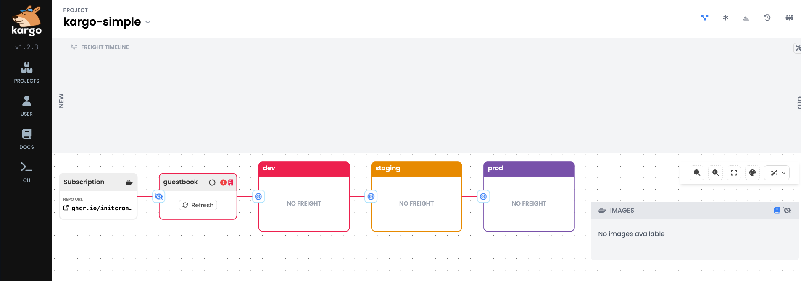
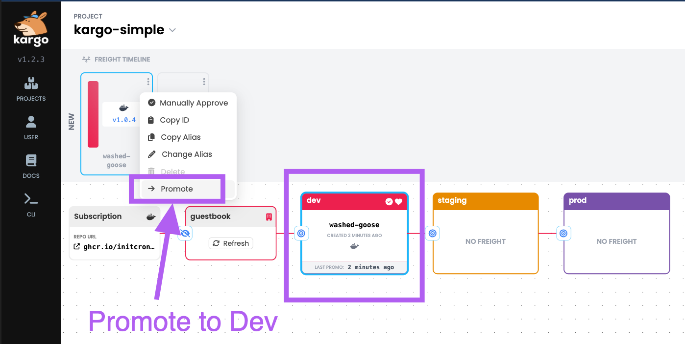

# Setup Promotion Pipeline with Kargo 


## Install Cert Manager 


```
helm repo add jetstack https://charts.jetstack.io
helm repo update
helm install cert-manager jetstack/cert-manager --namespace cert-manager --create-namespace --set installCRDs=true

```

validate : 

```
kubectl get all -n cert-manager
```

## Install kargo 

```
pass=$(openssl rand -base64 48 | tr -d "=+/" | head -c 32)
echo "Password: $pass"
hashed_pass=$(htpasswd -bnBC 10 "" $pass | tr -d ':\n')
signing_key=$(openssl rand -base64 48 | tr -d "=+/" | head -c 32)
```

Note: Remember to save the password which is echoed after `echo "Password: $pass"` step. You will need it later to login to kargo UI.

If you do not have htpasswd installed, install it as 

On linux : 

```
apt-get install apache2-utils
```

on macOS:  
```
brew install httpd-tools
```

On windows:  

```
choco install apache-utils
```


Once you generate the hashed_pass and signing_key, you could use them to install kargo using helm as, 

```
helm upgrade --install kargo oci://ghcr.io/akuity/kargo-charts/kargo \
  --namespace kargo \
  --create-namespace \
  --set api.adminAccount.passwordHash=$hashed_pass \
  --set api.adminAccount.tokenSigningKey=$signing_key \
  --set api.service.type=NodePort \
  --set api.service.nodePort=30700 \
  --wait
```

[sample output]

```
Release "kargo" has been upgraded. Happy Helming!
NAME: kargo
LAST DEPLOYED: Tue Feb 25 15:25:20 2025
NAMESPACE: kargo
STATUS: deployed
REVISION: 2
TEST SUITE: None
NOTES:
.----------------------------------------------------------------------------------.
|     _                            _                    _          _ _             |
|    | | ____ _ _ __ __ _  ___    | |__  _   _     __ _| | ___   _(_) |_ _   _     |
|    | |/ / _` | '__/ _` |/ _ \   | '_ \| | | |   / _` | |/ / | | | | __| | | |    |
|    |   < (_| | | | (_| | (_) |  | |_) | |_| |  | (_| |   <| |_| | | |_| |_| |    |
|    |_|\_\__,_|_|  \__, |\___/   |_.__/ \__, |   \__,_|_|\_\\__,_|_|\__|\__, |    |
|                   |___/                |___/                           |___/     |
'----------------------------------------------------------------------------------'

Ready to get started?

⚙️  You've configured Kargo's API server with a Service of type NodePort.

   The Kargo API server is reachable on port 30700 of any reachable node in
   your Kubernetes cluster.

   If a node in a local cluster were addressable as localhost, the Kargo API
   server would be reachable at:

      https://localhost:30700

🖥️  To access Kargo's web-based UI, navigate to the address above.

⚠️  Your API server is using a self-signed certificate and you should expect a
   warning from your browser. You may safely disregard this.

⬇️  The latest version of the Kargo CLI can be downloaded from:

      https://github.com/akuity/kargo/releases/latest

🛠️  To log in using the Kargo CLI:

      kargo login https://localhost:30700 --admin --insecure-skip-tls-verify

📚  Kargo documentation can be found at:

      https://docs.kargo.io

🙂  Happy promoting!
```


validate : 

```
kubectl get all -n kargo
```

You should also be able to access the Kargo UI at https://NODEIP:30700



You would have to use the password you noted earlier to login.

Download and Install kargo CLI from Web UI opions 




Example on linux, 

```
wget -c https://github.com/akuity/kargo/releases/latest/download/kargo-linux-amd64

chmod +x kargo-linux-amd64

mv kargo-linux-amd64 /usr/local/bin/karg
```

validate 
```
kargo 
```

[sample output]
```
Usage:
  kargo [flags]
  kargo [command]

Available Commands:
  apply       Apply a resource from a file or from stdin
  approve     Manually approve a piece of freight for promotion to a stage
  completion  Generate the autocompletion script for the specified shell
  config      Manage Kargo CLI configuration
  create      Create a resource from a file or from stdin
  dashboard   Open the Kargo Dashboard in your default browser
  delete      Delete resources by file and names
  get         Display one or many resources
  grant       Grant a role to a user or grant permissions to a role
  help        Help about any command
  login       Log in to a Kargo API server
  logout      Log out of the Kargo API server
  promote     Promote a piece of freight
  refresh     Refresh a stage or warehouse
  revoke      Revoke a role from a user or revoke permissions from a role
  server      Start a local Kargo API server
  update      Update a resource
  verify      Verify a stage
  version     Show the client and server version information

Flags:
  -h, --help   help for kargo

Use "kargo [command] --help" for more information about a command.
```

Analyse the CRDs added by kargo

```
kubectl get crd
ubectl api-resources | grep -i kargo
```

```
# kubectl api-resources | grep -i kargo
clusterpromotiontasks               clusterpromotask,clusterpromotasks   kargo.akuity.io/v1alpha1          false        ClusterPromotionTask
freights                                                                 kargo.akuity.io/v1alpha1          true         Freight
projects                                                                 kargo.akuity.io/v1alpha1          false        Project
promotions                          promo,promos                         kargo.akuity.io/v1alpha1          true         Promotion
promotiontasks                      promotask,promotasks                 kargo.akuity.io/v1alpha1          true         PromotionTask
stages                                                                   kargo.akuity.io/v1alpha1          true         Stage
warehouses                                                               kargo.akuity.io/v1alpha1          true         Warehouse
```

Login to kargo using CLI 


```
kargo login --admin  --insecure-skip-tls-verify  https://localhost:30700
```

Again, use the same password you noted earlier and used to login from the  web UI.

## Prepare to deploy the Guestbook App 

Fork the guestbook app from [https://github.com/sfd226/guestbook](https://github.com/sfd226/guestbook)


Clone it to your local machine  where you have docker setup 

```
git clone https://github.com/XXXXXX/guestbook.git
```
where, replace XXXXXX with your github username.

Build a container image from the guestbook app
```
cd guestbook
docker image build -t ghcr.io/XXXXXX/guestbook:v1.0.3  .
```
where, replace XXXXXX with your github username. Ensure that you are using your personal github account so that you can control the access to the image repository etc.

Login to github container registry as  per the instructions [here](https://docs.github.com/en/packages/working-with-a-github-packages-registry/working-with-the-container-registry)

```
docker login ghcr.io
```

Push the container image to github container registry

```
docker push ghcr.io/XXXXXX/guestbook:v1.0.3
```
where, replace XXXXXX with your github username.

Validate that the image is available in github container registry by visting https://github.com/users/XXXXXX/packages

Make the package  public  by visting your package at  https://github.com/users/xxxxxx/packages/container/package/guestbook  and selecting "Package Settings". 



From Danger Zone -> Change Vissibility , select "Public" and save.





## Create Simple Promotion Workflow with Kargo


Fork the kargo-simple repo from [https://github.com/sfd226/kargo-simple](https://github.com/sfd226/kargo-simple)

Clone it to your local machine  where you have kubernetes and argo setup already. 

```
git clone https://github.com/XXXXXX/kargo-simple.git
```
where, replace XXXXXX with your github username.

Personalize the kargo-simple.yaml file with your github username and token.

```
cd kargo-simple
./personalize.sh <yourgithubusername>
```

Commit and push the personalized manifests to your forked repo.

```
git commit -a -m "personalize manifests"
git push origin main
```


Deploy kargo app 

```
cd kargo-simple 
kargo apply -f ./kargo
```

[sample output]
```
project.kargo.akuity.io/kargo-simple created
promotiontask.kargo.akuity.io/promote created
promotiontask.kargo.akuity.io/promote-with-pr created
stage.kargo.akuity.io/dev created
stage.kargo.akuity.io/staging created
stage.kargo.akuity.io/prod created
warehouse.kargo.akuity.io/guestbook created
```

at this time, you shall see a kargo promotion workflow created for you with dev -> stage -> prod stages.



You could further examine the promotion workflow by clicking on the box which displays the name of the promotion workflow.




Add the Git repository credentials to Kargo. 

```
kargo create credentials github-creds \
  --project kargo-simple \
  --git \
  --username <yourgithubusername> \
  --repo-url https://github.com/<yourgithubusername>/kargo-simple.git
  --password <yourgithubtoken>
```

As part of the promotion process, Kargo requires privileges to commit changes to your Git repository, as well as the ability to create pull requests. Ensure that the given token has these privileges.

Create a ArgoCD app 

```
apiVersion: argoproj.io/v1alpha1
kind: Application
metadata:
  annotations:
    kargo.akuity.io/authorized-stage: kargo-simple:dev
  name: guestbook-dev
  namespace: argocd
spec:
  destination:
    namespace: guestbook-simple-dev
    server: https://kubernetes.default.svc
  project: default
  source:
    path: env/dev
    repoURL: https://github.com/xxxxxx/kargo-simple.git
    targetRevision: HEAD
```

where, replace XXXXXX with your github username.

apply this app to your cluster

```
kubectl apply -f guestbook-dev.yaml
```

validate that the app is deployed to dev namespace
```
kubectl get apps -n argocd
kubectl get pods -n guestbook-simple-dev
```


### Simulate promotion of the guestbook app 

Switch to guesstbook app repo abd make some change to `public/index.html`

For example, change the version number in the body tag to somet other number.

```
   <title>Guestbook</title>
  </head>
  <body>
    <div id="header">
      <h1>Guestbook 1.0.4</h1>
    </div>

```
Build the container image and push it to github container registry.

```
docker image build -t ghcr.io/<yourgithubusername>/guestbook:v1.0.3  .
docker push ghcr.io/<yourgithubusername>/guestbook:v1.0.4
```

Now you should see a new freight available on kargo, which you could promote to dev by clickin on the target icon and selecting "Promote into stage" option. 



