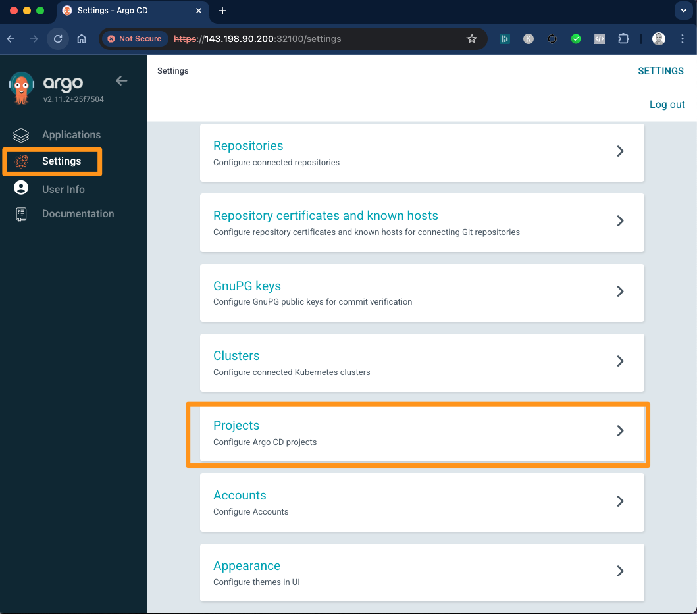
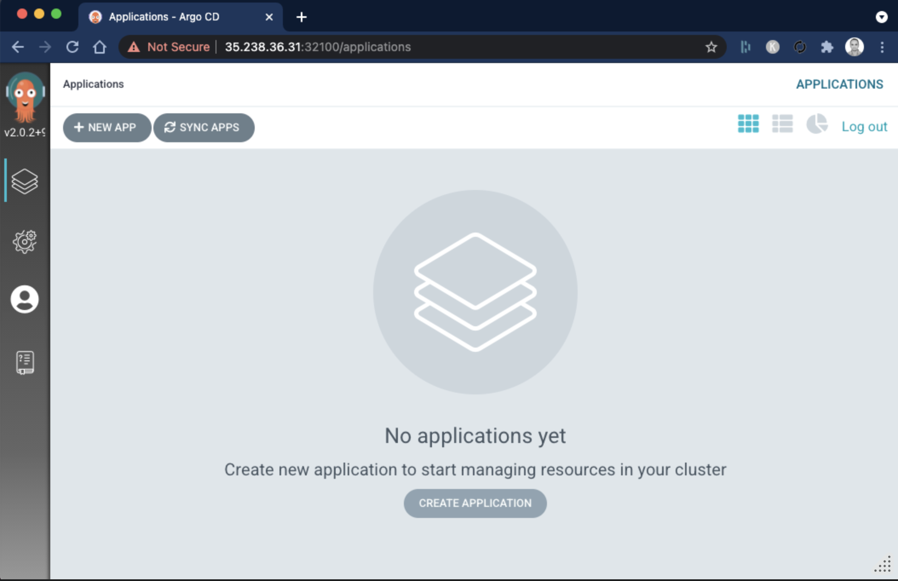
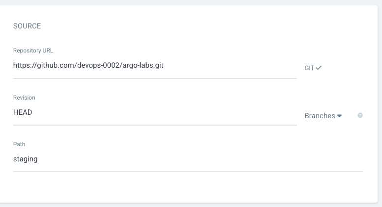
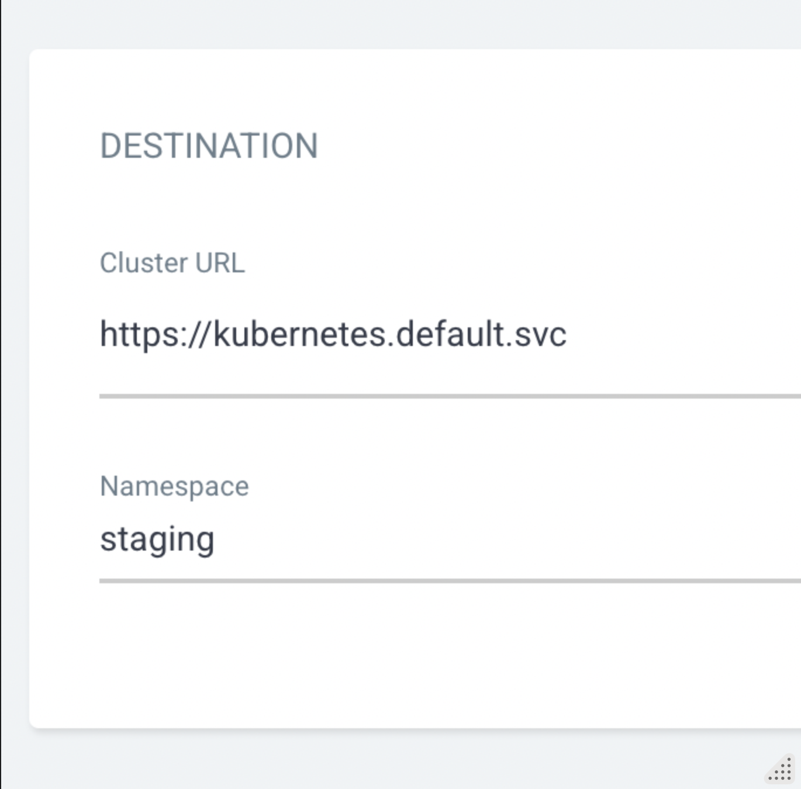
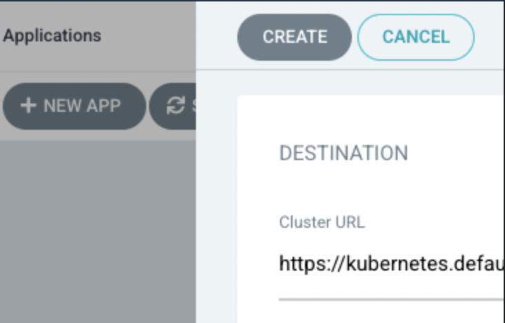
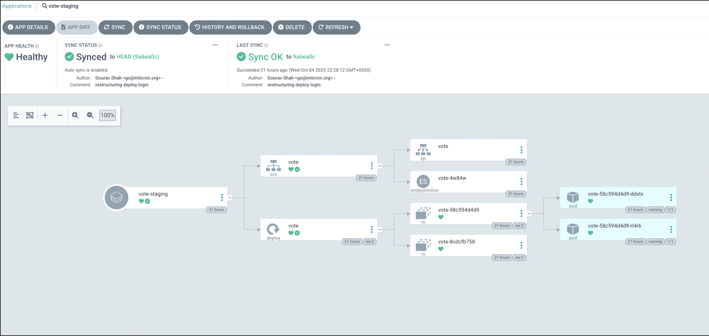
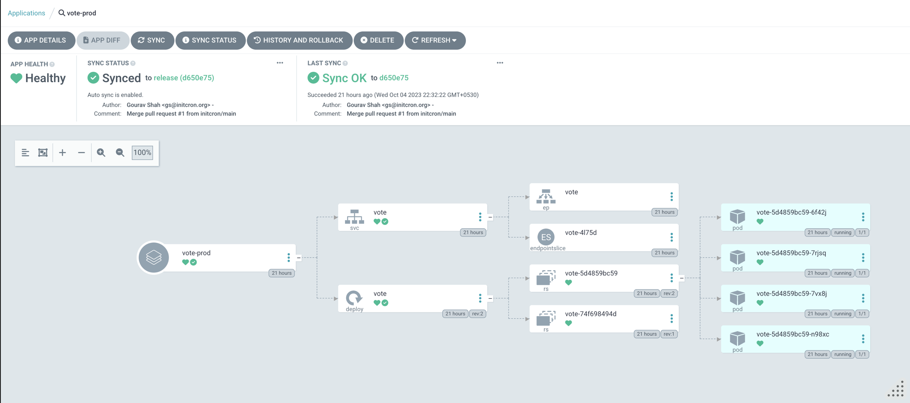
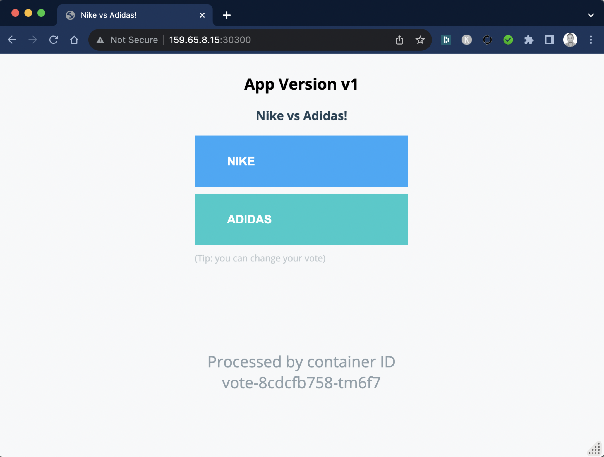

# Lab 10A -  Setting up Automated Deployments with ArgoCD
Author: Gourav Shah  
Publisher: School of Devops  
Version : v2024.06.02.01  
- - -

## Setup ArgoCD

Install ArgoCD

```
kubectl create namespace argocd

kubectl apply -n argocd -f https://raw.githubusercontent.com/argoproj/argo-cd/stable/manifests/install.yaml
```


Reset admin password to `password`

```
# bcrypt(password)=$2a$10$rRyBsGSHK6.uc8fntPwVIuLVHgsAhAX7TcdrqW/RADU0uh7CaChLa
kubectl -n argocd patch secret argocd-secret \
  -p '{"stringData": {
    "admin.password": "$2a$10$rRyBsGSHK6.uc8fntPwVIuLVHgsAhAX7TcdrqW/RADU0uh7CaChLa",
    "admin.passwordMtime": "'$(date +%FT%T%Z)'"
  }}'

```
Source: [reset-argo-password.sh](https://gist.github.com/initcron/09d8b6c70d527b5e8894472efa83a895)
Reference: [argo-cd/faq.md at master · argoproj/argo-cd · GitHub](https://github.com/argoproj/argo-cd/blob/master/docs/faq.md#i-forgot-the-admin-password-how-do-i-reset-it)

```
kubectl get all -n argocd
```

```
kubectl patch svc argocd-server -n argocd --patch \
  '{"spec": { "type": "NodePort", "ports": [ { "nodePort": 32100, "port": 443, "protocol": "TCP", "targetPort": 8080 } ] } }'

```
source: [patch_argo_svc.sh](https://gist.github.com/initcron/a14fe418b8a7325e3ed5ecebf6fadb53)

```
kubectl get svc -n argocd
```


Find out the IP address for one of the nodes. One way to do so is to run the following command,

```
kubectl get nodes -o wide
```

Note IP address for one of the nodes and browse to https://NODEIP:32100

where, replace `NODEIP` with the actual.


You should be presented with the  login page for ArgoCD as follows


* username  =.   `admin`
* password   =   `password`


## Configuring Repository and Project


Ensure that you have checked in all the code from earlier labs and pushed it to your repository.


Once logged in to ArgoCD, select `settings` from left menu and browse to  `Projects`



Click on `New Project` -> Create and provide Project Name and Description as


Proceed to create the project.

From Projecr Configuration page that you are redirected to, edit `DESTINATIONS`

  * Select default cluster name from dropdown  
  * Select `in-cluster` as Name  
  * Add two entries, one for `staging` and another for `prod` Namespace  
  * Save


From `settings` from left menu and browse to  `Repositories`

Select `Connet Repo` and provide the following configuration

  * Via:  HTTPS  
  * Type: git  
  * Project: instavote   
  * Repository URL: https://github.com/xxxx/argo-labs.git (replace with actual)  
  * Username: GitHub Username (If Private Repo)  
  * Password: GitHub Password or Token (If Private Repo)  


  


Finally click on `Connect` to add the repo.


## Setup Staging and Prod Deployments with ArgoCD

Clean up resources in the namespaces for `staging` and `prod` environments if you haven't already,

```
cd argo-labs
kubectl delete -k staging/ -n staging
kubectl delete -k prod/ -n prod

```

Browse to ArgoCD web console and click on **Create Application**




From General ,

  * Application Name : `vote-staging`  
  * Project : `instavote`  
  * Sync Policy : `Automatic`  
  * Prune Resources: Checked


From Source,  

  * Repository URL : `Your Repo URL (https)`  
  * Revision : `main` / `HEAD`   
  * Path :  `staging`  





From Destination,  

  * Cluster URL :  https://kubernetes.default.svc   (default)  
  * Namespace : `staging`  


  


Click on **CREATE** button on the top





### Set up Deploy to Prod Configuration


You will deploy to prod based on a specific git branch e.g. `release`.  Create a release branch to deploy the application to prod with,

```
cd argo-labs/
git pull origin main
git checkout -b release
git push origin release

```

You will see a new branch created on GitHub for this repository.

Create another application, repeat the same configurations with the following changes,

  * Application Name: `vote-prod`  
  * Project Name: `instavote`  
  * Sync Policy: `Manual`  
  * Repository: Same Repo  
  * Revision: `release`  
  * Path: `prod`  
  * Cluster URL: default  
  * Namespace  : `prod`  

Create and Sync manually.


Once synced, you should see two applications configured on ArgoCD tracking two environments.

You could also check the applications using kubectl as

```
kubectl get applications -n argocd
kubectl describe  application vote-prod  -n argocd

```

## Deployments in Action

Open two  terminals and start watching for changes in the staging namespace

Terminal 1
```
watch kubectl get all -n staging
```

Terminal 2
```
watch kubectl get all -n prod
```


Watch for the changes in the console as well as on Argo.  You shall see the application synced from the Git Repo to the Kubernetes Cluster in a few seconds.  

Staging


Prod


Validate by accessing the vote apps on

  * Staging : http://NODEIP:30000  
  * Prod  : http://NODEIP:30200  

where, replace `NODEIP` with actual IP or Hostname of your cluster node.

e.g.



## Exercises


* Set up branch protection rule to lock down `release` branch and allow changes via pull requests. You can experiment by adding additional policies as well.
* Try modifying YAML manifests in Deploy  Repo in Git in main branch by changing the image tag in `staging/kustomization.yaml` and  wait for the staging deployment.  Then raise the pull request to merge it into release and see it deployed to prod.  


### References

* Getting Started with Argo [Getting Started - Argo CD - Declarative GitOps CD for Kubernetes](https://argoproj.github.io/argo-cd/getting_started/)
* Reset admin password [argo-cd/faq.md at master · argoproj/argo-cd · GitHub](https://github.com/argoproj/argo-cd/blob/master/docs/faq.md#i-forgot-the-admin-password-how-do-i-reset-it)
