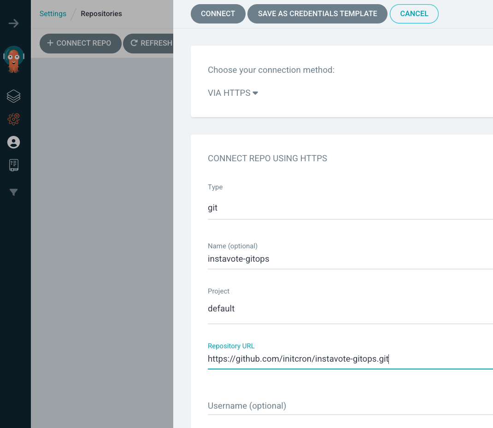

# Building Multi-Tenant Deployment System 

## Overview

This lab guide walks you through setting up a multi-tenant, multi-environment deployment system using Argo CD and related tools. We'll start with a simple deployment to the dev environment and then expand to a full multi-environment setup.

### Tools Used
- Argo CD
- ApplicationSets
- GitHub
- Helm
- Argo AppProjects

## Prerequisites

- Kubernetes cluster with Argo CD installed
- kubectl configured with admin access
- Git client
- GitHub account

## Repository Structure

```
instavote-gitops/
├── charts/
│   ├── vote/                  # Vote frontend service
│   │   ├── Chart.yaml
│   │   ├── values.yaml
│   │   ├── templates/
│   │   │   ├── rollout.yaml
│   │   │   ├── service.yaml
│   │   │   └── preview-service.yaml
│   │   └── env/
│   │       ├── dev.yaml
│   │       ├── staging.yaml
│   │       └── prod.yaml
│   └── redis/                 # Redis backend service
│       ├── Chart.yaml
│       ├── values.yaml
│       ├── templates/
│       │   ├── deployment.yaml
│       │   └── service.yaml
│       └── env/
│           ├── dev.yaml
│           ├── staging.yaml
│           └── prod.yaml
├── tenants/
│   ├── dev/
│   │   └── project.yaml
│   ├── staging/
│   │   └── project.yaml
│   └── prod/
│       └── project.yaml
└── applicationset/
    └── instavote-apps.yaml
```

## Lab Steps

### Phase 1: Development Environment Setup


#### 1. Repository Setup

Fork the repositories:
```bash
# Fork these repositories to your GitHub account
https://github.com/GITHUB_ORG/instavote-gitops
https://github.com/GITHUB_ORG/instavote-platform-config
```

Clone your forked repositories:
```bash
git clone https://github.com/YOUR_USERNAME/instavote-gitops
git clone https://github.com/YOUR_USERNAME/instavote-platform-config
```


#### 2. Register Repository in Argo CD:
- Navigate to Settings → Repositories in Argo CD UI
- Click "Connect Repo"
- Add repository URL and leave other fields as default

- Click "Connect"
- Verify repository shows "Successful" connection status

#### 3. Create ArgoCD Project for Dev Environment:
```bash
# Switch to Platform Repo
cd instavote-platform-config 

# Apply the project definition
kubectl apply -f tenants/dev/project.yaml

# Verify project creation
kubectl get appprojects -n argocd
```

#### 4. Create Initial ApplicationSet for Dev:
```yaml
# applicationset/instavote-dev.yaml
apiVersion: argoproj.io/v1alpha1
kind: ApplicationSet
metadata:
  name: instavote-dev
  namespace: argocd
spec:
  generators:
    - git:
        repoURL: https://github.com/YOUR_USERNAME/instavote-gitops
        revision: HEAD
        directories:
        - path: "charts/*"
  template:
    metadata:
      name: '{{path.basename}}-dev'
      annotations:
        debug.path: '{{path}}'
        debug.path.basename: '{{path.basename}}'
    spec:
      project: instavote-dev
      source:
        repoURL: https://github.com/YOUR_USERNAME/instavote-gitops
        targetRevision: HEAD
        path: '{{path}}'
        helm:
          valueFiles:
            - env/dev.yaml
      destination:
        server: https://kubernetes.default.svc
        namespace: 'instavote-dev'
      syncPolicy:
        automated:
          prune: true
          selfHeal: true
        syncOptions:
          - CreateNamespace=true
```
Note : Replace `YOUR_USERNAME` with the actual GitHub User/Org Name

#### 5. Apply and Verify Dev Environment:
```bash
# Validate ApplicationSet
kubectl apply -f applicationset/instavote-dev.yaml --dry-run=client

# Apply ApplicationSet
kubectl apply -f applicationset/instavote-dev.yaml

# Check status
kubectl get applicationset instavote-dev -n argocd
kubectl get applications -n argocd

# Check generated resources
kubectl get all -n instavote-dev
```

You should see two Applications(auto deploy configs) created from ArgoCD Web at this time

### Phase 2: Multi-Environment Setup

#### 1. Create Projects for All Environments:
```bash
# Switch to Platform Repo
cd instavote-platform-config 

# Apply all project definitions
kubectl apply -f tenants/dev/project.yaml
kubectl apply -f tenants/staging/project.yaml
kubectl apply -f tenants/prod/project.yaml

# Verify
kubectl get appprojects -n argocd
```

#### 2. Create Matrix-based ApplicationSet:
```yaml
# applicationset/instavote-apps.yaml
apiVersion: argoproj.io/v1alpha1
kind: ApplicationSet
metadata:
  name: instavote
  namespace: argocd
spec:
  generators:
    - matrix:
        generators:
          - git:
              repoURL: https://github.com/YOUR_USERNAME/instavote-gitops
              revision: HEAD
              directories:
                - path: "charts/*"
          - list:
              elements:
                - environment: dev
                  namespace: instavote-dev
                - environment: staging
                  namespace: instavote-staging
                - environment: prod
                  namespace: instavote-prod
  template:
    metadata:
      name: '{{path.basename}}-{{environment}}'
      annotations:
        debug.path: '{{path}}'
    spec:
      project: instavote-{{environment}}
      source:
        repoURL: https://github.com/YOUR_USERNAME/instavote-gitops
        targetRevision: HEAD
        path: '{{path}}'
        helm:
          valueFiles:
            - env/{{environment}}.yaml
      destination:
        server: https://kubernetes.default.svc
        namespace: '{{namespace}}'
      syncPolicy:
        automated:
          prune: true
          selfHeal: true
        syncOptions:
          - CreateNamespace=true

```

Note : Replace `YOUR_USERNAME` with the actual GitHub User/Org Name

#### 3. Clean Up Dev-only ApplicationSet:
```bash
# Remove the dev-only ApplicationSet
kubectl delete applicationset instavote-dev -n argocd
```

#### 4. Apply Matrix ApplicationSet:
```bash
# Validate first
kubectl apply -f applicationset/instavote-apps.yaml --dry-run=client

# Apply if validation succeeds
kubectl apply -f applicationset/instavote-apps.yaml
```

#### 5. Verify Multi-Environment Deployment:
```bash
# Check ApplicationSet status
kubectl get applicationset instavote -n argocd
kubectl describe applicationset instavote -n argocd

```

[Expected Sample Status for `describe applicationset ` command ]
```
Status:
  Conditions:
    Last Transition Time:  2025-02-23T14:19:55Z
    Message:               Successfully generated parameters for all Applications
    Reason:                ApplicationSetUpToDate
    Status:                False
    Type:                  ErrorOccurred
    Last Transition Time:  2025-02-23T14:19:55Z
    Message:               Successfully generated parameters for all Applications
    Reason:                ParametersGenerated
    Status:                True
    Type:                  ParametersGenerated
    Last Transition Time:  2025-02-23T14:19:55Z
    Message:               ApplicationSet up to date
    Reason:                ApplicationSetUpToDate
    Status:                True
    Type:                  ResourcesUpToDate
  Resources:
    Group:  argoproj.io
    Health:
    Kind:       Application
    Name:       redis-dev
    Namespace:  argocd
    Version:    v1alpha1
    Group:      argoproj.io
    Health:
    Kind:       Application
    Name:       redis-prod
    Namespace:  argocd
    Version:    v1alpha1
    Group:      argoproj.io
    Health:
    Kind:       Application
    Name:       redis-staging
    Namespace:  argocd
    Version:    v1alpha1
    Group:      argoproj.io
    Health:
    Kind:       Application
    Name:       vote-dev
    Namespace:  argocd
    Version:    v1alpha1
    Group:      argoproj.io
    Health:
    Kind:       Application
    Name:       vote-prod
    Namespace:  argocd
    Version:    v1alpha1
    Group:      argoproj.io
    Health:
    Kind:       Application
    Name:       vote-staging
    Namespace:  argocd
    Version:    v1alpha1
Events:
  Type    Reason   Age   From                       Message
  ----    ------   ----  ----                       -------
  Normal  created  7s    applicationset-controller  created Application "redis-dev"
  Normal  created  7s    applicationset-controller  created Application "redis-staging"
  Normal  created  7s    applicationset-controller  created Application "redis-prod"
  Normal  created  7s    applicationset-controller  created Application "vote-dev"
  Normal  created  7s    applicationset-controller  created Application "vote-staging"
  Normal  created  7s    applicationset-controller  created Application "vote-prod"
```

Further validation 
```
# List all applications
kubectl get applications -n argocd

# Check resources in each namespace
kubectl get all -n instavote-dev
kubectl get all -n instavote-staging
kubectl get all -n instavote-prod
```

You should also be able to see a beautiful matrix of all the applications created on the ArgoCD .

## Troubleshooting

If you encounter issues:

1. Check ApplicationSet Controller Logs:
```bash
kubectl logs -n argocd -l app.kubernetes.io/name=argocd-applicationset-controller -f
```

[Expected Sample Output]
```
time="2025-02-23T14:19:55Z" level=info msg="created Application" app=argocd/vote-staging applicationset=argocd/instavote
time="2025-02-23T14:19:55Z" level=info msg="created Application" app=argocd/vote-prod applicationset=argocd/instavote
time="2025-02-23T14:19:55Z" level=info msg="end reconcile in 152.613578ms" applicationset=argocd/instavote requeueAfter=3m0s
time="2025-02-23T14:19:55Z" level=info msg="applications result from the repo service" allPaths="[charts charts/redis charts/redis/env charts/redis/templates charts/redis/templates/tests charts/vote charts/vote/env charts/vote/templates]" pathParamPrefix= repoURL="https://github.com/initcron/instavote-gitops" revision=HEAD total=8
time="2025-02-23T14:19:55Z" level=info msg="generated 6 applications" applicationset=argocd/instavote
time="2025-02-23T14:19:55Z" level=info msg="end reconcile in 190.512675ms" applicationset=argocd/instavote requeueAfter=3m0s
time="2025-02-23T14:19:55Z" level=info msg="applications result from the repo service" allPaths="[charts charts/redis charts/redis/env charts/redis/templates charts/redis/templates/tests charts/vote charts/vote/env charts/vote/templates]" pathParamPrefix= repoURL="https://github.com/initcron/instavote-gitops" revision=HEAD total=8
time="2025-02-23T14:19:55Z" level=info msg="generated 6 applications" applicationset=argocd/instavote
time="2025-02-23T14:19:55Z" level=info msg="end reconcile in 99.411667ms" applicationset=argocd/instavote requeueAfter=3m0s
time="2025-02-23T14:20:09Z" level=info msg="Alloc=10928 TotalAlloc=108116 Sys=30805 NumGC=262 Goroutines=97"
```

2. Check Application Status:
```bash
kubectl get applications -n argocd
kubectl describe application vote-dev -n argocd
```

3. Common issues and solutions:
   - Repository not found: Verify repository registration in Argo CD UI
   - Sync failed: Check application events and logs
   - Resources not created: Check namespace status and RBAC permissions

## Next Steps

After completing the basic setup you could possibly try this:
1. Implement network policies
2. Add resource quotas
3. Set up monitoring
4. Configure CI pipeline integration

