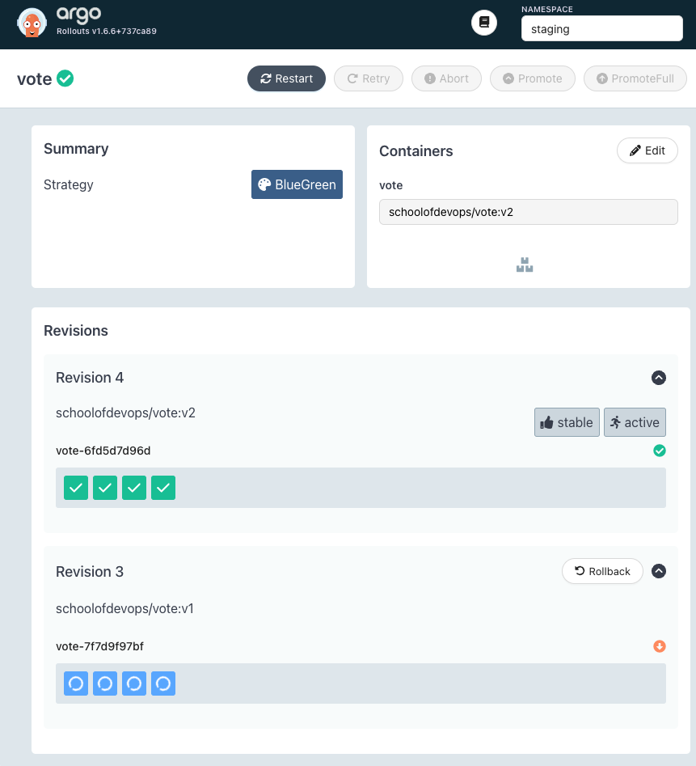

# Blue Green Releases with Argo Rollouts

Author: Gourav Shah  
Publisher: School of Devops  
Version : v2023.09.07.01  
Status : Work In Progress  
- - -


## Launch Vote App with Deployment

Lets begin by first deploying the `vote` service with the [deployment code](https://github.com/schoolofdevops/argo-labs) available.


* Create a fork of [Kubernetes Deployment Code for Vote App](https://github.com/schoolofdevops/argo-labs)


While creating the fork, ensure that you uncheck the `Copy the main branch only` option as shown in screenshot below.


Review the code created with kustomization overlay configured for `staging` and `prod` environments in additional to the base manifests.


Create namespaces for staging environments as,

```
kubectl create ns staging

kubectl get ns

kubectl config set-context --current --namespace=staging

```

validate

```
kubectl config get-contexts

```

[sample output]
```
CURRENT   NAME        CLUSTER     AUTHINFO    NAMESPACE
*         kind-kind   kind-kind   kind-kind   staging
```

Now clone the forked repo and switch to it

```
git clone https://github.com/xxxx/argo-labs.git

```
replace `xxxx` with your user name

```
cd argo-labs
kubectl apply -k staging
```

where, `-k` option applies the kustomization spec.

validate

```
kubectl get all
```

You should see the deployment and service for vote app. And you should be able to access the staging deployment with  nodeport `30000`.


## Install Argo Rollouts
Install Argo Rollouts Controller and CRDs with ,

```
kubectl create namespace argo-rollouts
kubectl apply -n argo-rollouts -f https://github.com/argoproj/argo-rollouts/releases/latest/download/install.yaml

```

Validate with,

```
kubectl api-resources | grep -i argo
```

Optionally, you could install argo plugin for kubectl  

On linux
```
cd ~

curl -LO https://github.com/argoproj/argo-rollouts/releases/latest/download/kubectl-argo-rollouts-linux-amd64

chmod +x ./kubectl-argo-rollouts-linux-amd64

sudo mv ./kubectl-argo-rollouts-linux-amd64 /usr/local/bin/kubectl-argo-rollouts
```

On Mac.
```
curl -LO https://github.com/argoproj/argo-rollouts/releases/latest/download/kubectl-argo-rollouts-darwin-amd64

chmod +x ./kubectl-argo-rollouts-darwin-amd64

sudo mv ./kubectl-argo-rollouts-darwin-amd64 /usr/local/bin/kubectl-argo-rollouts

```

And validate as,

```
kubectl argo rollouts version
```

## Create a Preview Service

Create a preview service  during blue-green analysis

File: `argo-labs/base/preview-service.yaml`

```
---
apiVersion: v1
kind: Service
metadata:
  name: vote-preview
  labels:
    role: vote
spec:
  selector:
    app: vote
  ports:
    - port: 80
      targetPort: 80
      protocol: TCP
      nodePort: 30100
  type: NodePort
```


Update `base/kustomization.yaml` with the following


```
apiVersion: kustomize.config.k8s.io/v1beta1
kind: Kustomization
resources:
- deployment.yaml
- service.yaml
- preview-service.yaml
```


Create rollout along with preview service with
```
kubectl apply -k staging
```


Validate

```
kubectl get all
kubectl describe svc vote
kubectl describe svc vote-preview
```

Both services should be pointing to the same set of pods.

## Migrate Deployment to Argo Rollout


From `argo-labs/base`  , create a copy of existing deployment spec as,

```
git mv deployment.yaml rollout.yaml
```

also update `kustomization.yaml` to replace `deployment.yaml` with `rollout.yaml`

```
apiVersion: kustomize.config.k8s.io/v1beta1
kind: Kustomization
resources:
- rollout.yaml
- service.yaml
- preview-service.yaml
```

Now edit `base/rollout.yaml` to add Blue/Green Release spec as per the [documentation here](https://argoproj.github.io/argo-rollouts/features/bluegreen/).

Update the following properties

  * apiVersion: `argoproj.io/v1alpha1`
  * kind: `Rollout`  
  * replicas: `4`  

Remove `spec.template.metadata.name` if present.

Replace the strategy with blue green as,

```
  strategy:
    blueGreen:
      autoPromotionEnabled: true
      autoPromotionSeconds: 30
      activeService: vote
      previewService: vote-preview
```

Also update `argo-labs/staging/kustomization.yaml` to remove the following

file: `staging/kustomization.yaml`

```
replicas:
- count: 2
  name: vote
```


Delete the deployment

```
kubectl delete deploy vote
```

And then create the rollout from `argo-labs` path as,

```
kubectl apply -k staging
```

Validate

```
kubectl get ro,all
kubectl describe ro vote
```


## Deploy a Blue/Green Release


Open a new terminal and start watching with

```
watch kubectl get ro,all --show-labels
```


Also open two browser windows to watch for `vote` and `vote-preview` services respectively as

```
watch kubectl describe svc vote
watch kubectl describe svc vote-preview

```


If you had installed the argo rollout plugin for `kubectl`, you could also launch the Rollout UI with

```
kubectl argo rollouts dashboard -p 3100
```

and then start watching for the rollout using [http://localhost:3100/rollouts](http://localhost:3100/rollouts)


Now, trigger a rollout by updating the image by adding the following to `staging/kustomization.yaml`

```
images:
 - name: schoolofdevops/vote
   newName: schoolofdevops/vote
   newTag: v2
```

and then by applying it as

```
kubectl apply -k staging
```

In the same terminal you could watch the status of the rollout with,

```
kubectl argo rollouts status vote
```

You could also watch the status using Argo Rollouts Dashboard as



You would notice that,

  * A new replica set is created with new version  
  * Service `vote-bg` (Preview service)  starts pointing to the new version, while the active service `vote` still pointing to previous version  
  * After all pods with new version are ready, it will pause for about 30 seconds as configured in the rollout configuration.  
  * Once the wait interval is over, active service starts pointing to the new version pods created with the newly launched replica set. This is where there maybe just a blip of a nominal downtime.  
  * Eventually the replicase with older version will scale down to zero, completing the rollout.  


### Publish Changes to Repo

Scale down the staging replicas so that you could accommodate more replicas created for prod environment, which will be yet another namespace in the same cluster.

edit `base/rollout.yaml` and set the replicas count to `1`
```
spec:
  replicas: 1
```

apply

```
kubectl apply -k staging/
```

validate

```
kubectl get all
```

All the changes that you have made so dat for the repo

```
git status
git add base/*.yaml
git status
git commit -am "updated staging deployment code with blue green release"
git push origin main
```
