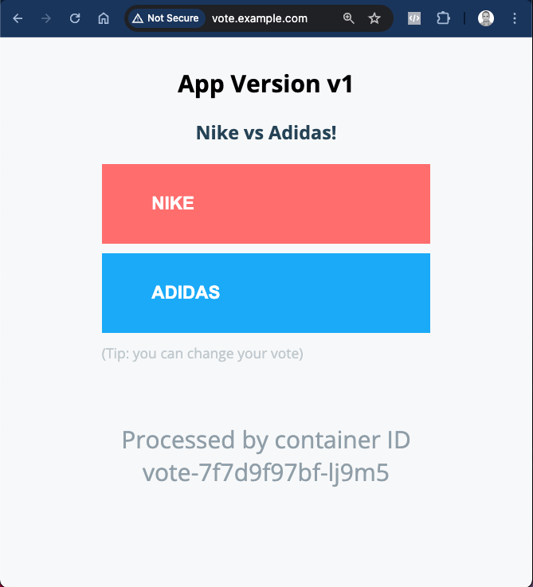

# Implementing Canary Release for Prod

Author: Gourav Shah  
Publisher: School of Devops  
Version : v2024.06.02.01  
- - -


## Prepare Prod Environment

Create and switch to prod namespace

```
kubectl create ns prod

kubectl get ns

kubectl config set-context --current --namespace=prod

```

validate

```
kubectl config get-contexts

```

[sample output]
```
CURRENT   NAME        CLUSTER     AUTHINFO    NAMESPACE
*         kind-kind   kind-kind   kind-kind   prod
```


Create a copy of the deployment code


```
cd argo-labs
cp -r staging prod
```

update NodePort for prod

File : `prod/service.yaml`

```
apiVersion: v1
kind: Service
metadata:
  name: vote
spec:
  ports:
  - name: "80"
    nodePort: 30200
    port: 80
    protocol: TCP
    targetPort: 80
  type: NodePort
```

create previw service kustomization overlay

File: `prod/previw-service.yaml`

```
apiVersion: v1
kind: Service
metadata:
  name: vote
spec:
  ports:
  - name: "80"
    nodePort: 30300
    port: 80
    protocol: TCP
    targetPort: 80
  type: NodePort
```

update `kustomization` with

   * namespace set to `prod`  
   * path for `preview-service.yaml` added


File: `prod/kustomization.yaml`
```
apiVersion: kustomize.config.k8s.io/v1beta1
kind: Kustomization
resources:
- ../base
namespace: prod
commonAnnotations:
  supported-by: sre@example.com
labels:
- includeSelectors: false
  pairs:
    project: instavote
patches:
- path: service.yaml
- path: preview-service.yaml
images:
 - name: schoolofdevops/vote
   newName: schoolofdevops/vote
   newTag: v2
```

apply with

```
kubectl apply -k prod/
```

validate as

```
kubectl get all
```


## Create Canary Release


Create `prod/rollout.yaml` with the patch configurations to update  

  * Replicas Count
  * Strategy

as

Filename: `prod/rollout.yaml`

```
apiVersion: argoproj.io/v1alpha1
kind: Rollout
metadata:
  name: vote
spec:
  replicas: 5
  strategy:
    blueGreen: null
    canary:
      steps:
      - setWeight: 20
      - pause:
          duration: 10s
      - setWeight: 40
      - pause:
          duration: 10s
      - setWeight: 60
      - pause:
          duration: 10s
      - setWeight: 80
      - pause:
          duration: 10s
      - setWeight: 100
```

add this to `prod/kustomization.yaml` as

```
apiVersion: kustomize.config.k8s.io/v1beta1
kind: Kustomization
resources:
- ../base
namespace: prod
commonAnnotations:
  supported-by: sre@example.com
labels:
- includeSelectors: false
  pairs:
    project: instavote
patches:
- path: service.yaml
- path: preview-service.yaml
- path: rollout.yaml
images:
 - name: schoolofdevops/vote
   newName: schoolofdevops/vote
   newTag: v2
```

If you have `kustomize` installed, verify the configs from `argo-labs` as

```
kustomize build prod
```

apply

```
kubectl apply -k prod/
```

validate

```
kubectl get all,ro

```


If you have the Argo ROllouts Dashboard, switch the namespace from top right corner to  `prod`


and check the Canary Release as


Before starting rollout start wathing for the following in 3 different terminals

[Termina 1]
```
watch kubectl get ro,all --show-labels
```

[Terminal 2]
```
watch kubectl describe svc vote
```

[Terminal 3]
```
watch kubectl describe svc vote-preview
```

You could also keep monitoring the Argo Rollouts Dashboard. Launch it if required as

```
kubectl argo rollouts dashboard -p 3100
```

Trigger a new rollout by modifying `prod/kustomization.yaml` file with new image tag as  

```
images:
 - name: schoolofdevops/vote
   newName: schoolofdevops/vote
   newTag: v3
```

and apply

```
kubectl apply -k prod/
```

Here you could see the progressive canary in action, implmenting it step by step, ultimately rolling out the new version.


## Getting Ready to add Traffic Management - Set up Nginx Ingress Controller

Install helm to setup Nginx Ingress Controller. To install helm version 3 on Linux or MacOS, you can follow following instructions.

```
curl https://raw.githubusercontent.com/helm/helm/master/scripts/get-helm-3 | bash
```

You could further refer to [Official HELM Install Instructions](https://helm.sh/docs/intro/install/) for alternative options.

Verify the installtion is successful,

```
helm --help
helm version
```

Launch Nginx Ingress controller using helm as :

```
helm upgrade --install ingress-nginx ingress-nginx \
  --repo https://kubernetes.github.io/ingress-nginx \
  --namespace ingress-nginx --create-namespace \
  --set controller.hostPort.enabled=true \
  --set controller.hostPort.ports.http=80 \
  --set-string controller.nodeSelector."kubernetes\.io/os"=linux \
  --set-string controller.nodeSelector.ingress-ready="true"

```


Check the pod for Nginx Ingress, if its running

```
kubectl get pods -n ingress-nginx
```

You may see the pod in pending state. Check why its pending by describing it.

Once you descibe, you will see that its pending because it has a `nodeSelector` defined which is looking for a node with label set to `ingress-ready="true"`.

Check the label on the current nodes

```
kubectl get nodes --show-labels
```

Add this lable to first  of the worker nodes as
```

kubectl label node kind-worker ingress-ready="true"
```

validate
```
kubectl get nodes --show-labels
```

This time you should see the label added, and nginx ingress controller running, which can be validated using


```
kubectl get pods -n ingress-nginx
```

You could also validate by connecting to the IPADDRESS of your node where the cluster is beeng setup on port 80, where you should see `**404 Not Found**` error. This is the sign that nginx is set up as a ingress controller and looking for a request with hostname/path defined.

Add a path based routing

Once you have the ingress controller working,  add the following ingress rule


File : `prod/vote-ing.yaml`

```
---
apiVersion: networking.k8s.io/v1
kind: Ingress
metadata:
  name: vote
  namespace: instavote
spec:
  ingressClassName: nginx
  rules:
  - host: vote.example.com
    http:
      paths:
      - path: /
        pathType: Prefix
        backend:
          service:
            name: vote
            port:
              number: 80
```

add this to `prod/kustomization.yaml` so that it gets applied as

File: `prod/kustomization.yaml`

```
apiVersion: kustomize.config.k8s.io/v1beta1
kind: Kustomization
resources:
- ../base
- ingress.yaml
```


and apply with

```
kubectl apply -k prod/
```

At this time, you would have ingress rule applied.

You could validate it using

```
kubectl get ing

kubectl describe ing vote
```


Also add the host file configuration as per [this lab guide](https://kubernetes-tutorial.schoolofdevops.com/ingress/#add-local-dns)   and validate you are able to use http://vote.example.com/ to access vote  service via ingress.


If you browse to the nginx ingress URI, you should see the app as



With this you have successfully set up Nginx Ingress Controller in front of your prod app and are ready to use Traffic Management features of Argo Rollouts.


## Canary with Traffic Routing


Read [this document](https://argoproj.github.io/argo-rollouts/features/traffic-management/) to understand the need for traffic routing. You could set up the traffic routing rules with Nginx by modifying the rollout spec as

File : `prod/rollout.yaml`

```
apiVersion: argoproj.io/v1alpha1
kind: Rollout
metadata:
  name: vote
spec:
  replicas: 5
  strategy:
    blueGreen: null
    canary:
      canaryService: vote-preview
      stableService: vote
      trafficRouting:
        nginx:
          stableIngress: vote
      steps:
      - setWeight: 20
      - pause:
          duration: 10s
      - setWeight: 40
      - pause:
          duration: 10s
      - setWeight: 60
      - pause:
          duration: 10s
      - setWeight: 80
      - pause:
          duration: 10s
      - setWeight: 100
```

You could refer to [Nginx Ingress Controller for Traffic Routing](https://argoproj.github.io/argo-rollouts/features/traffic-management/nginx/) document to understand this spec.

and apply as

```
kubectl apply -k prod/
```

You could watching using the same commands as earlier as well as using Argo Dashboard. You could also watch for a new canary service created during rollout as

```
kubectl describe ing vote-vote-canary
```

where you will see the weight changing as the release progresses.


### Publish Changes to Repo


All the changes that you have made so dat for the repo

```
git status
git add base/*.yaml
git add prod/*.yaml
git status
git commit -am "added canary releases for prod"
git push origin main
```


#### Cleaning Up

Once you are done with this lab, clean up the environment with

```
kubectl delete -k prod/
```
