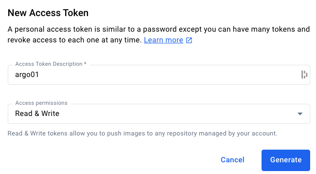
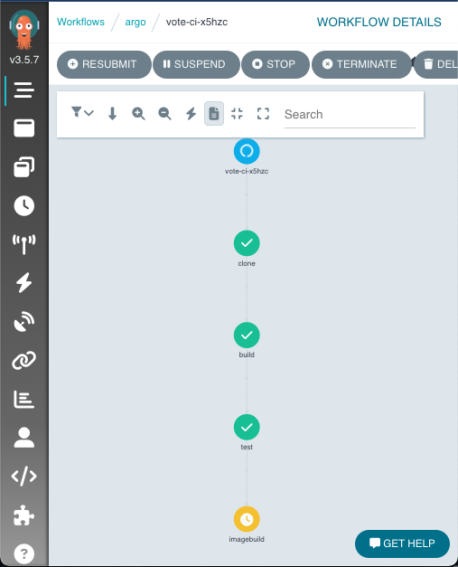
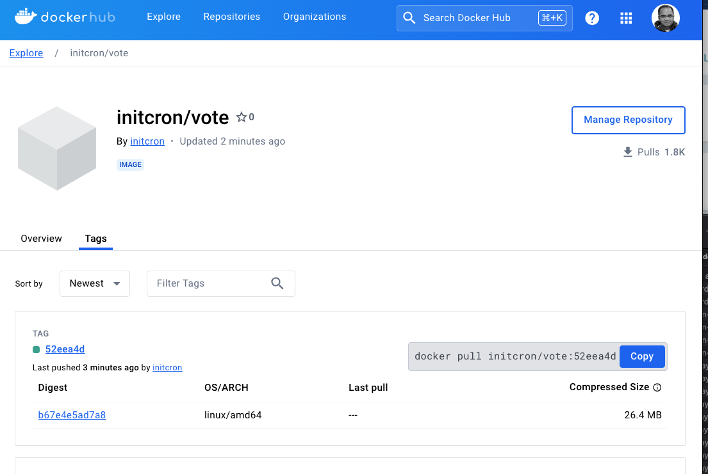

# Argo Workflows

Author: Gourav Shah  
Publisher: School of Devops  
Version : v2024.06.03.01  
- - -

**Project:**: Set up a Continuous Integration Pipeline with Argo Workflow.

## Setting up Argo Workflow

  * Signup and Login to [Killercoda](https://killercoda.com/)  
  * From [Argo Workflows by argoproj](https://killercoda.com/argoproj/course/argo-workflows) launch `Workflow Examples` scenario  
  * This will take a few minutes for the scenario to be ready with Argo Workflow installed   

  

  * Once set up, click on `START` and then run the command under `View the server UI`

  

  * Select `Click here to access the UI` to see th Workflow Dashboard as follows

  


## Building CI Pipeline with Argo Workflow  

Before you begin, fork the [repository containing source code for vote service](https://github.com/sfd226/vote) on to your account. You are going to use this repository to set up the CI Pipeline with.


You are going to set up Argo Workflow which will build a CI Pipeline for you.  This workflow will have the following stpes/stages

  1. clone - Clones the source code from Git and store it in a volume which is available to all subsequent steps.   
  1. build - Build the application. In case of this python flask app, its just about checking if the dependencies are being built/instlled with python-pip.  
  1. test - Run unit tests with python nose testing framework.  
  1. imagebuild - Uses kaniko to build and publish container image. This step will require you to provide credentials to container registry.  


Create a secret with your container registry credentials which is then used in `imagebuild` step of the workflow as described above with:


```
kubectl create secret -n argo docker-registry docker-registry-creds  \
   --docker-server=https://index.docker.io/v1/ \
   --docker-username=xxxx --docker-password=yyyy
```

where replace,  

* `xxxx` with registry username  
* `yyyy` with registry access token   

Instead of providing your password for `--docker-password`, it is recommended that you create a access token.  For Docker Hub, you could do that as follows:

  * Sign in to [Docker Hub](https://hub.docker.com/)  
  * From top right corner where you see your profile picture, select `Account settings`  
  * From `Security` -> `Access Tokens` select `New Access Token`  
  * Add a Description/Name and set access permissions to `Read & Write`  
  

  Proceed to Generate the token, and copy it to a safe location. Keep it handy as you are going to need this a few times throughout this course.  

Once you have the token, proceed to create the secret with the command provided above.

Once you create the secret, create the Argo Workflow with all the necessary steps as described earlier.  

File : `vote-ci-workflow.yaml`

```
apiVersion: argoproj.io/v1alpha1
kind: Workflow
metadata:
  generateName: vote-ci-
spec:
  entrypoint: main
  arguments:
    parameters:
    - name: repo-url
      value: "https://github.com/xxxxxx/vote.git"
    - name: branch
      value: "main"
    - name: image
      value: "yyyyyy/vote"
    - name: dockerfile
      value: "Dockerfile"

  volumeClaimTemplates:
  - metadata:
      name: workspace
    spec:
      accessModes: ["ReadWriteOnce"]
      resources:
        requests:
          storage: 100Mi

  volumes:
  - name: docker-config
    secret:
      secretName: docker-registry-creds
      items:
        - key: .dockerconfigjson
          path: config.json

  templates:
  - name: main
    inputs:
      parameters:
      - name: repo-url
      - name: branch
      - name: image
      - name: dockerfile
    steps:
    - - name: clone
        template: clone
        arguments:
          parameters:
          - name: repo-url
            value: "{{inputs.parameters.repo-url}}"
          - name: branch
            value: "{{inputs.parameters.branch}}"
    - - name: build
        template: build
    - - name: test
        template: test
    - - name: imagebuild
        template: imagebuild
        arguments:
          parameters:
          - name: commit-sha
            value: "{{steps.clone.outputs.parameters.commit-sha}}"
          - name: image
            value: "{{inputs.parameters.image}}"
          - name: dockerfile
            value: "{{inputs.parameters.dockerfile}}"

  # Clone task
  - name: clone
    inputs:
      parameters:
      - name: repo-url
      - name: branch
    script:
      image: alpine/git
      command: [sh]
      source: |
        #!/bin/sh
        git clone --branch {{inputs.parameters.branch}} {{inputs.parameters.repo-url}} /workspace
        cd /workspace
        COMMIT_SHA=$(git rev-parse --short HEAD)
        echo $COMMIT_SHA > /workspace/commit-sha.txt
      volumeMounts:
      - name: workspace
        mountPath: /workspace
    outputs:
      parameters:
      - name: commit-sha
        valueFrom:
          path: /workspace/commit-sha.txt

  # Build task
  - name: build
    script:
      image: python:3.9
      command: ["sh"]
      source: |
        #!/bin/sh
        cd /workspace
        pip install -r requirements.txt
      volumeMounts:
      - name: workspace
        mountPath: /workspace

  # Test task
  - name: test
    script:
      image: python:3.9
      command: ["sh"]
      source: |
        #!/bin/sh
        cd /workspace
        pip install nose
        nosetests
      volumeMounts:
      - name: workspace
        mountPath: /workspace

  # Image build and publish task using Kaniko
  - name: imagebuild
    inputs:
      parameters:
      - name: commit-sha
      - name: image
      - name: dockerfile
    container:
      image: gcr.io/kaniko-project/executor:latest
      command: ["/kaniko/executor"]
      args:
      - --dockerfile=/workspace/{{inputs.parameters.dockerfile}}
      - --context=/workspace
      - --destination={{inputs.parameters.image}}:{{inputs.parameters.commit-sha}}
      - --force
      volumeMounts:
      - name: workspace
        mountPath: /workspace
      - name: docker-config
        mountPath: /kaniko/.docker
      env:
      - name: DOCKER_CONFIG
        value: /kaniko/.docker


```

create a workflow by providing your own repo and image tag and start watching it using the following command:

```
argo submit -n argo --watch vote-ci-workflow.yaml \
  -p repo-url=https://github.com/xxxxxx/vote.git \
  -p branch=main \
  -p image=yyyyyy/vote \
  -p dockerfile=Dockerfile
```

where,

  * Replace `xxxxxx` with approapriate repo URL   
  * Replace `yyyyyy` with your docker hub user id. Update the repo name as necessary.

you could also watch the pods

```
watch kubectl get pods -n argo
```

and using dashboard as




If you were watching the workflow here is the sample output

```
Name:                vote-ci-x5hzc
Namespace:           argo
ServiceAccount:      argo
Status:              Succeeded
Conditions:          
 PodRunning          False
 Completed           True
Created:             Tue Jun 04 09:01:06 +0000 (2 minutes ago)
Started:             Tue Jun 04 09:01:06 +0000 (2 minutes ago)
Finished:            Tue Jun 04 09:03:50 +0000 (now)
Duration:            2 minutes 44 seconds
Progress:            4/4
ResourcesDuration:   12s*(1 cpu),2m33s*(100Mi memory)
Parameters:          
  repo-url:          https://github.com/devops-0001/vote.git
  branch:            master
  image:             initcron/flask-app
  dockerfile:        Dockerfile

STEP               TEMPLATE    PODNAME                              DURATION  MESSAGE
 ✔ vote-ci-x5hzc   main                                                         
 ├───✔ clone       clone       vote-ci-x5hzc-clone-2858201196       34s         
 ├───✔ build       build       vote-ci-x5hzc-build-959094096        47s         
 ├───✔ test        test        vote-ci-x5hzc-test-1680485113        10s         
 └───✔ imagebuild  imagebuild  vote-ci-x5hzc-imagebuild-1986147349  43s      
```

if you broese to DockerHub account, you should see a new image tag published as a result of the argo workflow.




## Summary

With this lab you learnt how to set up a simple  Continuous Integration Pipeline using Argo Workflows. This pipeline runs a sequence of jobs including build, test and container image build and publish. The result of this pipeline is a new container image available on the registry. This can be further iterated over to create conditionl logic, parallel execution of steps etc. with Argo Workflow.
