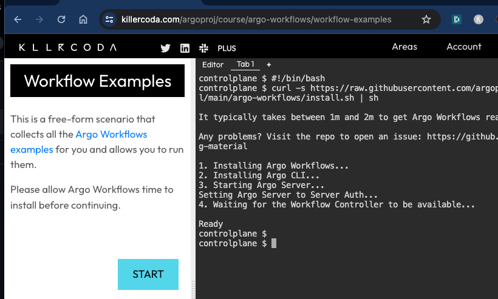

# Argo Workflows

Author: Gourav Shah  
Publisher: School of Devops  
Version : v2024.06.03.01  
- - -

**Project:**: Set up a Continuous Integration Pipeline with Argo Workflow.

## Setting up Argo Workflow

  * Signup and Login to [Killercoda](https://killercoda.com/)  
  * From [Argo Workflows by argoproj](https://killercoda.com/argoproj/course/argo-workflows) launch `Workflow Examples` scenario  
  * This will take a few minutes for the scenario to be ready with Argo Workflow installed   

  

  * Once set up, click on `START` and then run the command under `View the server UI`

  

  * Select `Click here to access the UI` to see th Workflow Dashboard as follows

  

## Building CI Pipeline with Workflow  


```
kubectl create secret -n argo docker-registry docker-registry-creds  \
   --docker-server=https://index.docker.io/v1/ \
   --docker-username=xxxx \
   --docker-password=yyyy
```

where replace,
* `xxxx` with registry username
* `yyyy` with registry access token


File : `vote-ci-workflow.yaml`

```
apiVersion: argoproj.io/v1alpha1
kind: Workflow
metadata:
  generateName: vote-ci-
spec:
  entrypoint: main
  arguments:
    parameters:
    - name: repo-url
      value: "https://github.com/your-username/your-flask-app.git"
    - name: branch
      value: "main"
    - name: image
      value: "your-registry/your-flask-app"
    - name: dockerfile
      value: "Dockerfile"

  volumeClaimTemplates:
  - metadata:
      name: workspace
    spec:
      accessModes: ["ReadWriteOnce"]
      resources:
        requests:
          storage: 100Mi

  volumes:
  - name: docker-config
    secret:
      secretName: docker-registry-creds
      items:
        - key: .dockerconfigjson
          path: config.json

  templates:
  - name: main
    inputs:
      parameters:
      - name: repo-url
      - name: branch
      - name: image
      - name: dockerfile
    steps:
    - - name: clone
        template: clone
        arguments:
          parameters:
          - name: repo-url
            value: "{{inputs.parameters.repo-url}}"
          - name: branch
            value: "{{inputs.parameters.branch}}"
    - - name: build
        template: build
    - - name: test
        template: test
    - - name: imagebuild
        template: imagebuild
        arguments:
          parameters:
          - name: commit-sha
            value: "{{steps.clone.outputs.parameters.commit-sha}}"
          - name: image
            value: "{{inputs.parameters.image}}"
          - name: dockerfile
            value: "{{inputs.parameters.dockerfile}}"

  # Clone task
  - name: clone
    inputs:
      parameters:
      - name: repo-url
      - name: branch
    script:
      image: alpine/git
      command: [sh]
      source: |
        #!/bin/sh
        git clone --branch {{inputs.parameters.branch}} {{inputs.parameters.repo-url}} /workspace
        cd /workspace
        COMMIT_SHA=$(git rev-parse --short HEAD)
        echo $COMMIT_SHA > /workspace/commit-sha.txt
      volumeMounts:
      - name: workspace
        mountPath: /workspace
    outputs:
      parameters:
      - name: commit-sha
        valueFrom:
          path: /workspace/commit-sha.txt

  # Build task
  - name: build
    script:
      image: python:3.9
      command: ["sh"]
      source: |
        #!/bin/sh
        cd /workspace
        pip install -r requirements.txt
      volumeMounts:
      - name: workspace
        mountPath: /workspace

  # Test task
  - name: test
    script:
      image: python:3.9
      command: ["sh"]
      source: |
        #!/bin/sh
        cd /workspace
        pip install nose
        nosetests
      volumeMounts:
      - name: workspace
        mountPath: /workspace

  # Image build and publish task using Kaniko
  - name: imagebuild
    inputs:
      parameters:
      - name: commit-sha
      - name: image
      - name: dockerfile
    container:
      image: gcr.io/kaniko-project/executor:latest
      command: ["/kaniko/executor"]
      args:
      - --dockerfile=/workspace/{{inputs.parameters.dockerfile}}
      - --context=/workspace
      - --destination={{inputs.parameters.image}}:{{inputs.parameters.commit-sha}}
      - --force
      volumeMounts:
      - name: workspace
        mountPath: /workspace
      - name: docker-config
        mountPath: /kaniko/.docker
      env:
      - name: DOCKER_CONFIG
        value: /kaniko/.docker


```

```
argo submit -n argo --watch vote-ci-workflow.yaml \
  -p repo-url=https://github.com/devops-0001/vote.git \
  -p branch=master \
  -p image=initcron/flask-app \
  -p dockerfile=Dockerfile
```

you could also watch the pods

```
watch kubectl get pods -n argo
```
