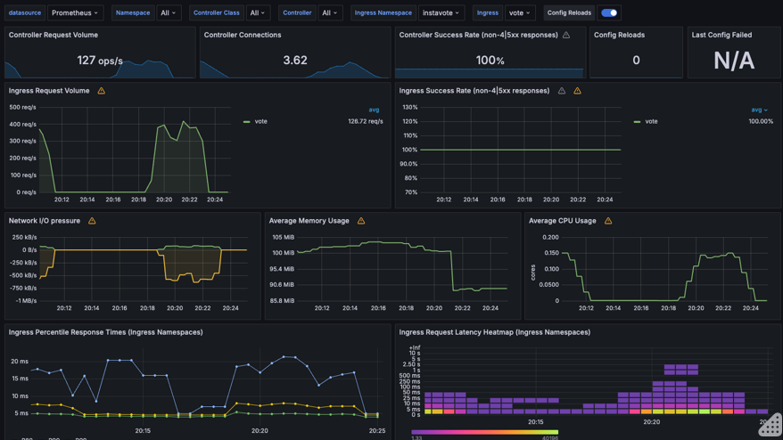

# Auto Scaling on Custom Metric

For this lab, you must have configured Prometheus and Grafana using help already. Refer to [Lab K113 - HELM Package Manager - Kubernetes Tutorial with CKA/CKAD Prep](https://kubernetes-tutorial.schoolofdevops.com/helm/) to set it up.

### Setup Nginx Ingress with Metrics

Delete existing nginx ingress controller setup with KIND  

```
kubectl delete -f  https://raw.githubusercontent.com/kubernetes/ingress-nginx/main/deploy/static/provider/kind/deploy.yaml
```

Re deploy nginx ingress controller with helm, this time enabling the exposing the metrics which can then be scraped/collected by prometheus.

```
helm upgrade --install ingress-nginx ingress-nginx \
  --repo https://kubernetes.github.io/ingress-nginx \
  --namespace ingress-nginx --create-namespace \
  --set controller.metrics.enabled=true \
  --set controller.metrics.serviceMonitor.enabled=true --set \ controller.metrics.serviceMonitor.additionalLabels.release="prometheus" \
  --set controller.hostPort.enabled=true \
  --set controller.hostPort.ports.http=80 \
  --set controller.hostPort.ports.https=443 \
  --set-string controller.nodeSelector."kubernetes\.io/os"=linux \
  --set-string controller.nodeSelector.ingress-ready="true"

```

### Configure Prometheus to monitor Nginx Ingress

Update the existing Prometheus installation to support scrpaing services in all namespaces

assuming you deployed prometheus stack from `kube-prometheus-stack` path, switch to

```
cd ~/kube-prometheus-stack/
```

and upgrade

```
helm upgrade prom -n monitoring --values my.values.yaml . --set prometheus.prometheusSpec.podMonitorSelectorNilUsesHelmValues=false --set prometheus.prometheusSpec.serviceMonitorSelectorNilUsesHelmValues=false
```

What this does is starts collecting metrics from services from all the namespaces not just the one in which prometheus is deployed. And it reads the annotations from the pods to figure out where to collect the metrics from.  

Now, login to grafana and import custom dashboard for Nginx Ingress as

  * Left menu (hover over +) -> Dashboard
  * Click "Import"
  * Enter the copy pasted json from [https://raw.githubusercontent.com/kubernetes/ingress-nginx/main/deploy/grafana/dashboards/nginx.json](https://raw.githubusercontent.com/kubernetes/ingress-nginx/main/deploy/grafana/dashboards/nginx.json)
  * Click Import JSON
  * Select the Prometheus data source
  * Click "Import"

It may look similar to this, with possibly less data initially


However, if you see some metric coming in, your setup with Nginx Ingress and Promethus Integration is working !  You may pat your back at this time :)

### Setup Prometheus Adapter

Prometheus adapter converts the prometheus metrics and makes it available in kubernetes under  `custom.metrics.k8s.io`  api which can then read by the HPA and used as a input for autoscaling.


Begin by creating the configuration for this adapter to pick a specific metric from prometheus and expose it under custom API as,

File : `prometheus-adapter-values.yaml`

```
prometheus:
  url: http://prom-kube-prometheus-stack-prometheus  # Ensure this is correctly pointing to your Prometheus
  port: 9090

rules:
  default: false
  custom:
    - seriesQuery: 'nginx_ingress_controller_requests'
      resources:
        overrides:
          namespace: {resource: "namespace"}
          ingress: {resource: "ingress"}
      name:
        matches: "^nginx_ingress_controller_requests$"
        as: "nginx_ingress_controller_requests_per_second"
      metricsQuery: 'sum(rate(nginx_ingress_controller_requests{status=~"2.."}[2m])) by (namespace, ingress)'
    - seriesQuery: 'nginx_ingress_controller_request_duration_seconds_bucket'
      resources:
        overrides:
          namespace: {resource: "namespace"}
          ingress: {resource: "ingress"}
      name:
        matches: "^nginx_ingress_controller_request_duration_seconds_bucket$"
        as: "nginx_ingress_controller_latency"
      metricsQuery: 'sum(rate(nginx_ingress_controller_request_duration_seconds_bucket{}[2m])) by (namespace, ingress, le)'
```


install the adapter as,  

```
helm upgrade --install  prometheus-adapter prometheus-community/prometheus-adapter -f prometheus-adapter-values.yaml -n monitoring
```


validate its running
```
kubectl get pods -n monitoring
```

validate that custom apis are working with

```
kubectl get --raw "/apis/custom.metrics.k8s.io" | jq .

kubectl get --raw "/apis/custom.metrics.k8s.io/v1beta1/namespaces/instavote/ingresses/vote/nginx_ingress_controller_requests_per_second" | jq .

kubectl get --raw "/apis/custom.metrics.k8s.io/v1beta1/namespaces/instavote/ingresses/vote/nginx_ingress_controller_latency" | jq .
```

with the second command, you are expected to see
[sample output]
```
{
  "kind": "MetricValueList",
  "apiVersion": "custom.metrics.k8s.io/v1beta1",
  "metadata": {},
  "items": [
    {
      "describedObject": {
        "kind": "Ingress",
        "namespace": "instavote",
        "name": "vote",
        "apiVersion": "networking.k8s.io/v1"
      },
      "metricName": "nginx_ingress_controller_requests_per_second",
      "timestamp": "2024-05-10T02:41:54Z",
      "value": "0",
      "selector": null
    }
  ]
}
```

If you see this, your adapter configuration integratd with prometheus is set up and ready to be consumed by the hpa.
## Configure Custom Autoscaling Policies

Add autoscaling policies based on the custom metric as

File : `vote-custom-hpa.yaml`
```
apiVersion: autoscaling/v2
kind: HorizontalPodAutoscaler
metadata:
  name: vote-custom
  namespace: instavote
spec:
  scaleTargetRef:
    apiVersion: apps/v1
    kind: Deployment
    name: vote
  minReplicas: 2
  maxReplicas: 10
  metrics:
    - type: Object
      object:
        metric:
          name: nginx_ingress_controller_requests_per_second
        describedObject:
          apiVersion: networking.k8s.io/v1
          kind: Ingress
          name: vote
        target:
          type: Value
          value: 100  # Target 200 requests per second per replica
    - type: Object
      object:
        metric:
          name: nginx_ingress_controller_latency
        describedObject:
          apiVersion: networking.k8s.io/v1
          kind: Ingress
          name: vote
        target:
          type: Value
          value: 50  # Target 50 milliseconds
  behavior:
    scaleDown:
      policies:
      - type: Pods
        value: 2
        periodSeconds: 120
      - type: Percent
        value: 25
        periodSeconds: 120
      stabilizationWindowSeconds: 60
      selectPolicy: Min
    scaleUp:
      stabilizationWindowSeconds: 45
      policies:
      - type: Percent
        value: 100
        periodSeconds: 15
      - type: Pods
        value: 2
        periodSeconds: 15
      selectPolicy: Max
```


Apply it as

```
kubectl delete hpa vote
kubectl apply -f vote-custom-hpa.yaml

```

validate

```
kubectl get hpa
```

[sample output]

```
NAME          REFERENCE         TARGETS       MINPODS   MAXPODS   REPLICAS   AGE
vote-custom   Deployment/vote   0/100, 0/50   2         10        2          10h
```


now create a new load test config

File:  `loadtest-ing-job.yaml`
```
apiVersion: batch/v1
kind: Job
metadata:
  generateName: loadtest-ing
spec:
  template:
    spec:
      containers:
      - name: siege
        image: schoolofdevops/loadtest:v1
        command: ["siege", "--concurrent=2", "--benchmark", "--time=4m", "http://vote.staging.example.com"]
      restartPolicy: Never
      hostAliases:
      - ip: "ww.xx.yy.zz"
        hostnames:
        - "vote.example.com"
  backoffLimit: 4
```

where, replace `ww.xx.yy.zz` with the INTERNAL-IP address of the node which runs ingress which you can find using

```
kubectl get nodes -o wide
```

```
NAME                 STATUS   ROLES           AGE   VERSION   INTERNAL-IP   EXTERNAL-IP   OS-IMAGE                         KERNEL-VERSION     CONTAINER-RUNTIME
kube-control-plane   Ready    control-plane   47h   v1.29.2   172.18.0.2    <none>        Debian GNU/Linux 12 (bookworm)   6.8.0-31-generic   containerd://1.7.13
kube-worker          Ready    <none>          47h   v1.29.2   172.18.0.3    <none>        Debian GNU/Linux 12 (bookworm)   6.8.0-31-generic   containerd://1.7.13
kube-worker2         Ready    <none>          47h   v1.29.2   172.18.0.4    <none>        Debian GNU/Linux 12 (bookworm)   6.8.0-31-generic   containerd://1.7.13
```

in the above example, `kube-worker` is the node where ingress is running which has and ip address of `172.18.0.3`. Thats what should be used in the load test config.


Before launching the load test, ensure that the http auth for the ingress is disabled. Remove the annotations block similar to follows  from the ingress configuration for vote if you see it....

e.g. change the ingress spec from
```
apiVersion: networking.k8s.io/v1
kind: Ingress
metadata:
  name: vote
  namespace: instavote
  annotations:
    nginx.ingress.kubernetes.io/auth-type: basic
    nginx.ingress.kubernetes.io/auth-secret: basic-auth
    # message to display with an appropriate context why the authentication is required
    nginx.ingress.kubernetes.io/auth-realm: 'Authentication Required - Vote App'
```

to

```
apiVersion: networking.k8s.io/v1
kind: Ingress
metadata:
  name: vote
  namespace: instavote
```

Finally create an instance of this job as,

```
kubectl create -f loadtest-ing-job.yaml
```

and now watch the scaling
```
watch 'kubectl top pods; kubectl get hpa; kubectl get pods'
```
