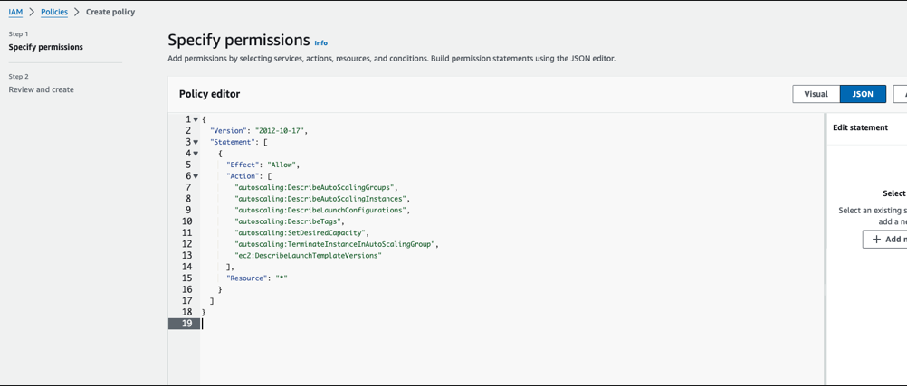
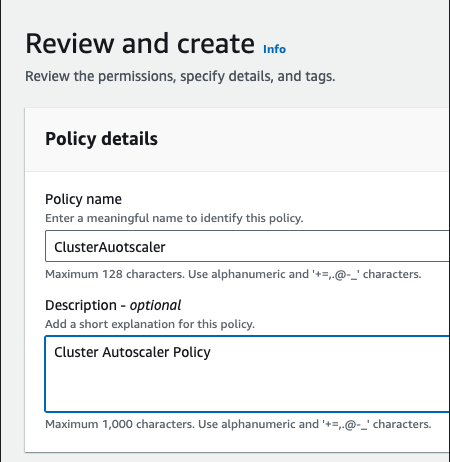
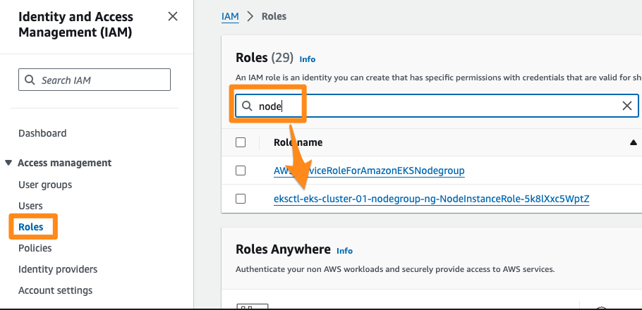
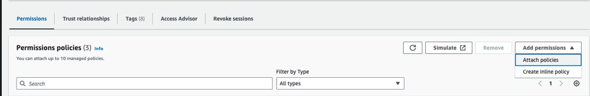
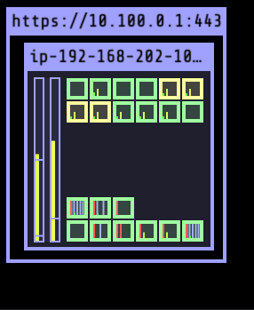
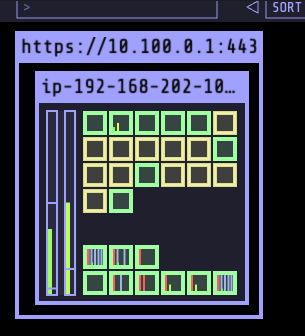
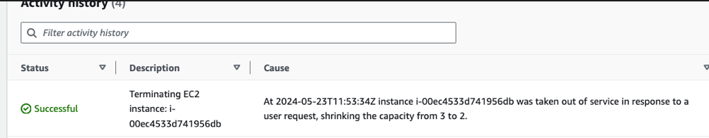

# Lab 06 - Scaling EKS Nodes


When cluster nodes are exhausted of capacity, and when you have more pods to schedule, you would also want the underlying nodes to scale. This can be achieved in two differnt ways as follows 

* Using Cluster Autoscale 
* With Karpenter 

In this lab, you will set up Cluster Autoscaler to scale the node groups. 


### Scale Down the NodeGroup 

Before starting to scale, you may want to scale down your node group to minimum, so that you could quickly  see the autoscaler in action 

```
eksctl scale nodegroup --cluster eks-cluster-01 ng-2-workers --nodes 1
```

validate 

```
eksctl get nodegroups -c eks-cluster-01

kubectl get nodes
```

wait for a few minutes for the addiontal nodes to be drained and removed, leaving only one node in the node group. 

Also make sure all the pods are rescheduled and are running 

```
kubectl get pods -A 
```

## Set up Cluster Autoscaler


### Create IAM Policy for Cluster Autoscaler

* From IAM -> Policies -> Create Policy. Select JSON tab and add the following policy 

```
{
  "Version": "2012-10-17",
  "Statement": [
    {
      "Effect": "Allow",
      "Action": [
        "autoscaling:DescribeAutoScalingGroups",
        "autoscaling:DescribeAutoScalingInstances",
        "autoscaling:DescribeLaunchConfigurations",
        "autoscaling:DescribeTags",
        "autoscaling:SetDesiredCapacity",
        "autoscaling:TerminateInstanceInAutoScalingGroup",
        "ec2:DescribeLaunchTemplateVersions"
      ],
      "Resource": "*"
    }
  ]
}

```




* Proceed to Next, add the policy name eg. `ClusterAutoscaler`  along with a description. 

  

* Proceed to create the policy. 
* From IAM -> Roles , search for node which select the role associated with the nodegroup 




* From Permissions -> Add Permissions -> Attach policies 



* Select the policies created above e.g. `ClusterAutoscaler` and Add permissions. 


Now  Install Cluster Autoscaler as 

```
kubectl apply -f https://raw.githubusercontent.com/kubernetes/autoscaler/master/cluster-autoscaler/cloudprovider/aws/examples/cluster-autoscaler-autodiscover.yaml
```


```
kubectl patch deployment cluster-autoscaler -n kube-system \
--type='json' -p='[{"op": "replace", "path": "/spec/template/spec/containers/0/command/6", "value": "--node-group-auto-discovery=asg:tag=k8s.io/cluster-autoscaler/enabled,k8s.io/cluster-autoscaler/eks-cluster-01"}]'

```

where, replace `eks-cluster-01` with  actual cluster name.  Also ensure that this pod can not be evicted with 

```
kubectl -n kube-system annotate deployment.apps/cluster-autoscaler \
cluster-autoscaler.kubernetes.io/safe-to-evict="false"
```


validate with  

```
kubectl get pods -n kube-system -l "app=cluster-autoscaler"

kubectl describe pods -n kube-system -l "app=cluster-autoscaler"
```

Now start watching the cluster autoscaler logs in one dedicated window so that you can see the autoscaling in action 

```
kubectl logs -f  -n kube-system -l "app=cluster-autoscaler"
```

## Cluster Auotscaler in Action 


Ensure that the deployment spec for `vote` app has resources defined 

e.g. `vote-deploy.yaml`
```
    spec:
      containers:
      - image: 665496447754.dkr.ecr.ap-southeast-1.amazonaws.com/demo:v1
        name: vote
        resources:
          requests:
            cpu: "50m"
            memory: "64Mi"
          limits:
            cpu: "250m"
            memory: "128Mi"
```

without resources being defined properly, the scheduler and the autoscaler will not work optimally. 

Now, start scaling up in steps 

```
 kubectl scale deploy vote --replicas=7
```



``` 
kubectl scale deploy vote --replicas=15
```



If you are watching the cluster autoscaler logs, you may see lines such as this: 

[sample autoscaler log]

```
I0523 11:37:09.853039       1 klogx.go:87] Pod instavote/vote-6b7c9f85c5-2fnws is unschedulable
I0523 11:37:09.853045       1 klogx.go:87] Pod instavote/vote-6b7c9f85c5-2b4cs is unschedulable
I0523 11:37:09.853097       1 scale_up.go:194] Upcoming 0 nodes
I0523 11:37:09.853458       1 waste.go:55] Expanding Node Group eks-ng-1-workers-eec7d297-f093-b47e-bb83-2cd15d8505fd would waste 95.00% CPU, 93.35% Memory, 94.17% Blended
I0523 11:37:09.853476       1 scale_up.go:282] Best option to resize: eks-ng-1-workers-eec7d297-f093-b47e-bb83-2cd15d8505fd
I0523 11:37:09.853487       1 scale_up.go:286] Estimated 1 nodes needed in eks-ng-1-workers-eec7d297-f093-b47e-bb83-2cd15d8505fd
I0523 11:37:09.853511       1 scale_up.go:405] Final scale-up plan: [{eks-ng-1-workers-eec7d297-f093-b47e-bb83-2cd15d8505fd 2->3 (max: 5)}]
I0523 11:37:09.853531       1 scale_up.go:608] Scale-up: setting group eks-ng-1-workers-eec7d297-f093-b47e-bb83-2cd15d8505fd size to 3
I0523 11:37:09.853560       1 auto_scaling_groups.go:248] Setting asg eks-ng-1-workers-eec7d297-f093-b47e-bb83-2cd15d8505fd size to 3
I0523 11:37:09.854328       1 event_sink_logging_wrapper.go:48] Event(v1.ObjectReference{Kind:"ConfigMap", Namespace:"kube-system", Name:"cluster-autoscaler-status", UID:"a52ab2f7-d7c4-4c82-bbed-058e1069e2b8", APIVersion:"v1", ResourceVersion:"273910", FieldPath:""}): type: 'Normal' reason: 'ScaledUpGroup' Scale-up: setting group eks-ng-1-workers-eec7d297-f093-b47e-bb83-2cd15d8505fd size to 3 instead of 2 (max: 5)

```

this indicated the scaling activity. 

From EC2 => Auto Scaler Groups => Group Name => Activity, you could observe the node autoscaling as : 


After a few minutes, scale down to 2 

```
kubectl scale deploy vote --replicas=2
```

In a few minutes time, you should start seeing cluster autoscaler trying to optimize and scale down the nodes  


```

I0523 11:45:32.175261       1 eligibility.go:102] Scale-down calculation: ignoring 1 nodes unremovable in the last 5m0s
I0523 11:45:32.175281       1 cluster.go:153] ip-192-168-127-100.ap-southeast-1.compute.internal for removal
I0523 11:45:32.175374       1 hinting_simulator.go:77] Pod instavote/vote-6b7c9f85c5-2fnws can be moved to ip-192-168-208-12.ap-southeast-1.compute.internal
I0523 11:45:32.175390       1 cluster.go:176] node ip-192-168-127-100.ap-southeast-1.compute.internal may be removed
I0523 11:45:32.175399       1 nodes.go:84] ip-192-168-127-100.ap-southeast-1.compute.internal is unneeded since 2024-05-23 11:43:21.695771883 +0000 UTC m=+769.391776888 duration 2m10.478714846s
I0523 11:45:32.175434       1 static_autoscaler.go:589] Scale down status: lastScaleUpTime=2024-05-23 11:37:09.852038741 +0000 UTC m=+397.548043742 lastScaleDownDeleteTime=2024-05-23 10:30:38.231213092 +0000 UTC m=-3594.072781890 lastScaleDownFailTime=2024-05-23 10:30:38.231213092 +0000 UTC m=-3594.072781890 scaleDownForbidden=false scaleDownInCooldown=true
I0523 11:47:12.590771       1 delete.go:103] Successfully added DeletionCandidateTaint on node ip-192-168-127-100.ap-southeast-1.compute.internal

```


You could also corraborate from the EC2 Autoscaling Group to see the cluster nodes are scaling down. 

