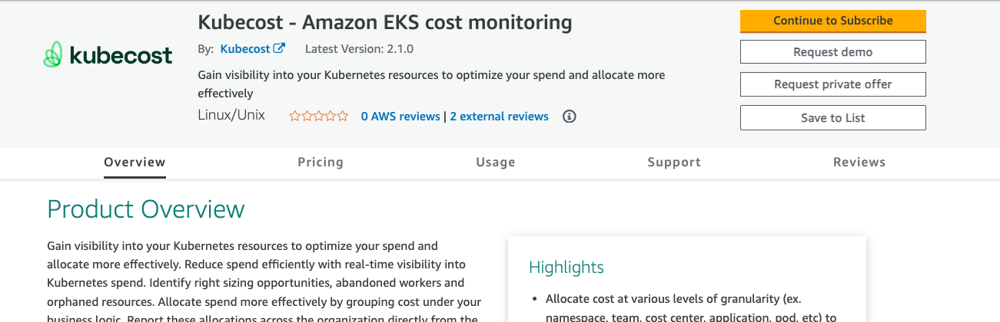
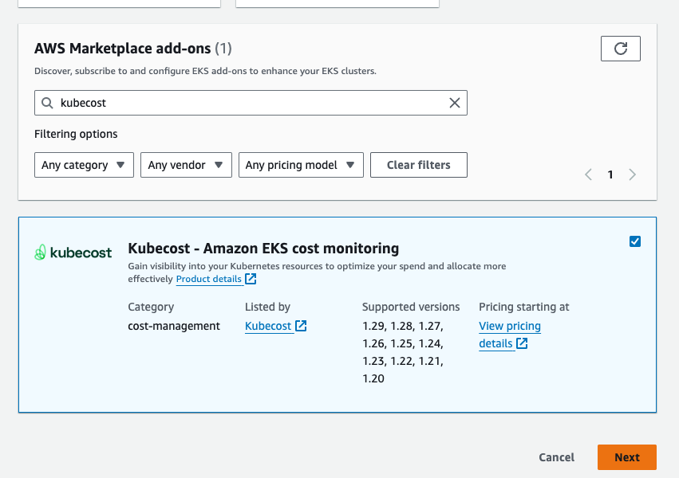
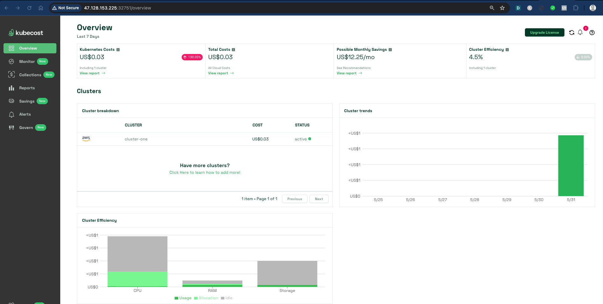

# Costs Monitoring with Kubecost


  Visit [Kubecost](https://aws.amazon.com/marketplace/pp/prodview-asiz4x22pm2n2?sr=0-1&ref_=beagle&applicationId=AWSMPContessa) from AWS Marketplace.  

  Select `Continue to Subscribe`  
      


  It will take a few minutes to process your request
      


Once its configured, continue to Configure the software and Launch it on EKS Console.

  * Fulfillment Options : Amazon EKS Add-on
  * Kubecost - Amazon EKS Cost Monitoring - EKS Add On
  * Software Version - Keep Auto Selected

  


Once its configured, head over to **EKS CLuster** , go to Add-ons -> Get more add-ons.

Search for `kubecost`

  

Select the add-on, click on next and have it be installed.

After its installed, validate with

```
kubectl get all -n kubecost
```

set the service type to NodePort as

```
kubectl patch svc cost-analyzer -n kubecost --type='json' -p '[{"op":"replace","path":"/spec/type","value":"NodePort"}]'
```

validate

```
kubectl get svc -n kubecost
```

[sample output]
```
NAME                              TYPE        CLUSTER-IP       EXTERNAL-IP   PORT(S)                         AGE
cost-analyzer                     NodePort    10.100.149.159   <none>        9003:32367/TCP,9090:32751/TCP   93m
```

pick up the port mapped with 9090 e.g. `32751` in above case and use that to access kubecost UI.

e.g.

  

From here on you should be explore kubecost insights.
