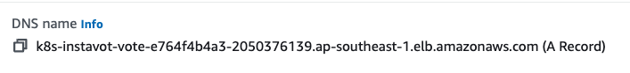

# Lab 04 - Ingress with ALB

In this lab you are going to learn how to route traffic to your applications running inside EKS using Application Load Balancer offered by AWS.

## Pre Requisites

  - [ ] EKS Cluster
  - [ ] Two Subnets in two AZs  
  - [ ] Public/Private Subnets should have relevant tags (Already done if created with Cloudformation Template)

## Install AWS Load Balancer Controller (LBC)

The Load Balancer Controller (LBC) is a Kubernetes controller that manages Elastic Load Balancers (ELBs) for a Kubernetes cluster. It automatically provisions and configures AWS Application Load Balancers (ALBs) or Network Load Balancers (NLBs) to expose Kubernetes services to external traffic, ensuring scalability, high availability, and secure ingress traffic management. The LBC monitors Kubernetes Ingress resources and dynamically adjusts the configuration of the load balancers to reflect changes in the cluster, thereby simplifying the deployment of applications that require external access and integrating seamlessly with AWS networking and security features.

Here is a diagram that explains how the Load Balancer Controller (LBC) works by listening to Ingress rules and controlling Application Load Balancers (ALBs):

```
+---------------------+               +-----------------------+
| Kubernetes Cluster  |               |        AWS            |
|                     |               |                       |
|                     |               |                       |
|  +--------------+   |               |   +---------------+   |
|  |              |   |               |   |               |   |
|  |   Ingress    |   |               |   |     ALB       |   |
|  |   Resource   |   |               |   | (Application  |   |
|  +------+-------+   |               |   | Load Balancer)|   |
|         |           |               |   +-------+-------+   |
|         |           |               |            |          |
|  +------+-------+   |               |            |          |
|  |              |   |  Listens to   |            |          |
|  |   LBC (Load  +------------------------------->|          |
|  |  Balancer    |   |   Ingress     |   Controls |          |
|  |  Controller) |   |    Rules      |   ALBs     |          |
|  +------+-------+   |               |            |          |
|         |           |               |            |          |
|         |           |               |            |          |
|  +------+-------+   |               |   +-------+-------+   |
|  |              |   |               |   |               |   |
|  |  Services/   +---------------------->| Target Groups |   |
|  |  Pods        |   |               |   |               |   |
|  |              |   |               |   +---------------+   |
+---------------------+               +-----------------------+
```


* **Kubernetes Cluster**: Represents your Kubernetes environment where applications are deployed.
* **Ingress Resource**: Defines rules for how inbound traffic should be routed to services within the cluster.
* **Load Balancer Controller (LBC)**: Watches for changes in Ingress resources and automatically manages ALBs in AWS.
* **AWS**: Represents the AWS cloud where the Application Load Balancer (ALB) and Target Groups are hosted.
* **ALB (Application Load Balancer)**: A type of load balancer that LBC configures to route external traffic based on the Ingress rules.
* **Services/Pods**: The backend endpoints within the Kubernetes cluster that the ALB routes traffic to, organized in target groups.

⠀
The LBC listens to the Ingress resources in the Kubernetes cluster and dynamically updates the ALB configuration in AWS to match the defined routing rules, ensuring seamless traffic management.


Download IAM Policy
```
curl -O https://raw.githubusercontent.com/kubernetes-sigs/aws-load-balancer-controller/main/docs/install/iam_policy.json
```

Create IAM Policy

```
aws iam create-policy \
    --policy-name AWSLoadBalancerControllerIAMPolicy \
    --policy-document file://iam_policy.json
```

Note the ARN which you will use in the next command.

**Create IAM Role using** eksctl

Replace eks-cluster-01 with the name of your cluster, 111122223333 with your account ID, and then run the command. If your cluster is in the AWS GovCloud (US-East) or AWS GovCloud (US-West) AWS Regions, then replace arn:aws: with arn:aws-us-gov:.

```
eksctl create iamserviceaccount \
  --cluster=eks-cluster-01 \
  --namespace=kube-system \
  --name=aws-load-balancer-controller \
  --role-name AmazonEKSLoadBalancerControllerRole \
  --attach-policy-arn=arn:aws:iam::111122223333:policy/AWSLoadBalancerControllerIAMPolicy \
  --approve
```


validate

```
eksctl get iamserviceaccount --cluster eks-cluster-01
```

You should also see a cloudformation stack created  e.g. `eksctl-eks-cluster-01-addon-iamserviceaccount-kube-system-aws-load-balancer-controller`


###### Install AWS Load Balancer Controller using [Helm V3](https://helm.sh/)

Add and update  `eks-charts` Helm chart repository. AWS maintains [this repository](https://github.com/aws/eks-charts) on GitHub.

```
helm repo add eks https://aws.github.io/eks-charts
helm repo update eks

```

Install the AWS Load Balancer Controller.

Replace ``eks-cluster-01`` with the name of your cluster. In the following command, `aws-load-balancer-controller` is the Kubernetes service account that you created in a previous step.

```
helm install aws-load-balancer-controller eks/aws-load-balancer-controller \
  -n kube-system \
  --set clusterName=eks-cluster-01 \
  --set serviceAccount.create=false \
  --set replicaCount=1 \
  --set serviceAccount.name=aws-load-balancer-controller

```

validate

```
helm list -A

kubectl get deployment,pods -n kube-system -l "app.kubernetes.io/instance=aws-load-balancer-controller"
```


## Create Ingress Rules

Create ingress rules to route traffic to the existing vote and result apps.  

File : `vote-ing.yaml`

```
apiVersion: networking.k8s.io/v1
kind: Ingress
metadata:
  namespace: instavote
  name: vote
  annotations:
    alb.ingress.kubernetes.io/scheme: internet-facing
    alb.ingress.kubernetes.io/target-type: ip
spec:
  ingressClassName: alb
  rules:
    - host: vote.example.com
      http:
        paths:
        - path: /
          pathType: Prefix
          backend:
            service:
              name: vote
              port:
                number: 80
    - host: result.example.com
      http:
        paths:
        - path: /
          pathType: Prefix
          backend:
            service:
              name: result
              port:
                number: 80
```


```
kubectl apply -f vote-ing.yaml
```

```
kubectl get ing
```

You could further get the details of the ALB using AWS CLI as

```
aws elbv2 describe-load-balancers --query 'LoadBalancers[?contains(LoadBalancerName, `k8s-instavot-vote`) == `true`]'
```

At this time, you shall see a Application Load Balancer(ALB) created with the rules autoamtically added to route traffic to vote and result apps. 


## Add Local DNS

You have created the ingress rules based on hostnames e.g. **vote.example.com** and **result.example.com**. In order for you to be able to access those, there has to be a dns entry pointing to your ALB.

```
   vote.example.com    -------+                        +----- vote:80
                              |     +-------------+    |
                              |     |   ingress   |    |
                              +===> |   node:80   | ===+
                              |     +-------------+    |
                              |                        |
  result.example.com   -------+                        +----- result:80
```

To achieve this you need to either,

* Find out the IP Address that your ALB is pointing to
* Create a DNS entry, provided you own the domain and have access to the dns management console.
* Create a local **hosts** file entry. On unix systems its in `/etc/hosts` file. On windows its at `C:\Windows\System32\drivers\etc\hosts`. You need admin access to edit this file.

⠀
For example, on a linux or osx, you could edit it as,

```
sudo vim /etc/hosts
```

And add an entry such as ,

```
xxx.xxx.xxx.xxx vote.example.com result.example.com  
```

where,

* xxx.xxx.xxx.xxx is one of the  actual IP addresss of ALB.

You could find the IP address by using the following command

```
nslookup k8s-instavot-vote-e764f4b4a3-2050376139.ap-southeast-1.elb.amazonaws.com
```

where DNS name is copied from ALB’s DNS name


And then access the app urls using http://vote.example.com or http://result.example.com


## Reference


* AWS Load Balancer Controller : [What is the AWS Load Balancer Controller?](https://docs.aws.amazon.com/eks/latest/userguide/aws-load-balancer-controller.html)
* Application load balancing on Amazon EKS [Application load balancing on Amazon EKS](https://docs.aws.amazon.com/eks/latest/userguide/alb-ingress.html)
* Install ALB Ingress Controller using HELM  : [Install the AWS Load Balancer Controller using Helm](https://docs.aws.amazon.com/eks/latest/userguide/lbc-helm.html)
* Load balancers in Instance Mode vs IP Mode: [IP mode](https://www.eksworkshop.com/docs/fundamentals/exposing/loadbalancer/ip-mode)
* Grouping Ingress Rules onto one ALB: [Multiple Ingress pattern](https://www.eksworkshop.com/docs/fundamentals/exposing/ingress/multiple-ingress)
