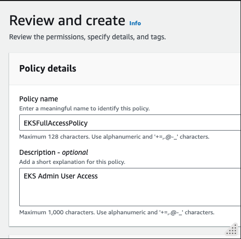
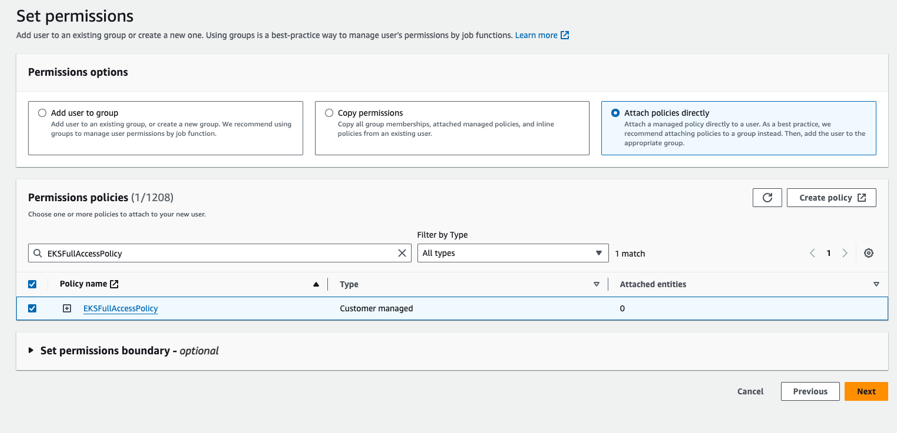
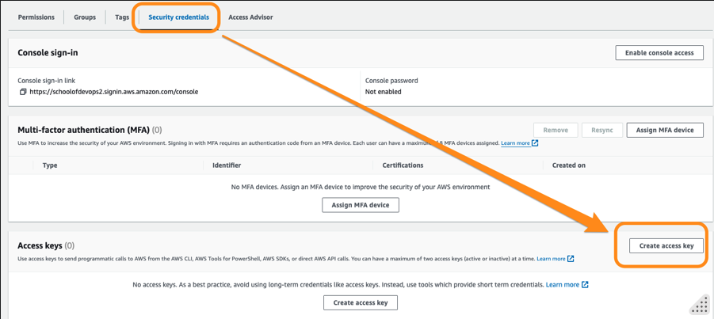

# Lab 01 - EKS Preparatory Setup

Author: Gourav Shah 
Publisher:  School of Devops
Version : 22.05.2024.01
- - -


This lab is about getting ready to setup a EKS Cluster on AWS. Before you begin, make sure you have a operational AWS Account with access to create IAM Users and access to all relevant services including   
* IAM   
* VPC   
* EKS   
* S3  
* EC2   

## Installing Pre-requisite Tools 

### Install eksctl 

If you haven't installed `eksctl` yet, you can do so by following these instructions:

**macOS/Linux:**

```
curl --silent --location "https://github.com/weaveworks/eksctl/releases/latest/download/eksctl_$(uname -s)_amd64.tar.gz" | tar xz -C /tmp

sudo mv /tmp/eksctl /usr/local/bin
```

**Windows:** Download the latest `eksctl` binary from the [releases page](https://github.com/weaveworks/eksctl/releases) and add it to your system path.

Refer to the official documentation here [Installation](https://eksctl.io/installation/) to get the exact and up to date instructions to install eksctl as well as auto shell completions. 


### Install `kubectl`

**macOS/Linux:**

```
curl -LO "https://dl.k8s.io/release/$(curl -L -s https://dl.k8s.io/release/stable.txt)/bin/$(uname -s | tr '[:upper:]' '[:lower:]')/amd64/kubectl"
chmod +x kubectl
sudo mv kubectl /usr/local/bin
```

**Windows:**

1. Download the latest release of `kubectl` from the [official Kubernetes releases page]().
2. Rename the downloaded file to `kubectl.exe`.
3. Move the file to a directory included in your system's `PATH`.

⠀
You can also install `kubectl` on Windows using `chocolatey` or `scoop`:

**Using Chocolatey:**

```
choco install kubernetes-cli
```

**Using Scoop:**

```
scoop install kubectl
```

#### Verify Installation

After installing `kubectl`, verify the installation by checking the version:

```
kubectl version --client
```

This command should display the client version of `kubectl`, indicating that it has been installed successfully.


### Install `aws` CLI 

Refer to the official documentation to install `aws` CLI  with os specific instructions from [Install or update to the latest version of the AWS CLI - AWS Command Line Interface](https://docs.aws.amazon.com/cli/latest/userguide/getting-started-install.html)


### Install Helm

To install helm version 3 on Linux or MacOS, you can follow following instructions.

```
curl https://raw.githubusercontent.com/helm/helm/master/scripts/get-helm-3 | bash
```

You could further refer to [Official HELM Install Instructions](https://helm.sh/docs/intro/install/) for alternative options.

Verify the installtion is successful,

```
helm --help
helm version
```

## Configuring EKS Admin User 

When configuring the AWS CLI to create and manage an EKS cluster using `eksctl`, the IAM user (or role) whose credentials you are using needs to have sufficient permissions to perform all the necessary actions. This includes permissions to create and manage EKS clusters, EC2 instances, VPCs, IAM roles, and other related resources. Here’s a list of the permissions required:

### Required IAM Permissions

1. **Amazon EKS Full Access**
2. **Amazon EC2 Full Access**
3. **AWS CloudFormation Full Access**
4. **IAM Permissions to Create Roles and Policies**
5. **Amazon S3 Full Access** (if you need to use S3 for storing logs or other purposes)
6. Systems Manager (SSM) - Optional if you use Parameter Store
7. AWS Key Management Service (KMS) - Optional if you encrypt Secrets using KMS

Here’s a detailed policy document that grants the necessary permissions. You can create a custom IAM policy with these permissions and attach it to the IAM user or role.

Refer to [Installation](https://eksctl.io/installation/) documentation to understand the authorization required for the user which will run `eksctl` 


`JSON Policy (use it in next step)`

```
{
	"Version": "2012-10-17",
	"Statement": [
		{
			"Effect": "Allow",
			"Action": [
				"eks:*",
				"ec2:*",
				"cloudformation:*",
				"iam:*",
				"ecr:*",
				"autoscaling:*",
				"cloudwatch:*",
				"elasticloadbalancing:*",
				"s3:*",
				"ssm:GetParameter",
				"ssm:DescribeParameters",
				"kms:ListAliases",
				"kms:DescribeKey",
				"kms:CreateGrant",
				"kms:RetireGrant",
				"kms:RevokeGrant",
				"sts:AssumeRole"
			],
			"Resource": "*"
		}
	]
}

```

### Steps to Attach the Policy

1. **Create a Custom Policy:**

   * Go to the IAM console in AWS.
   * Click on **Policies** in the left-hand menu.
   * Click on **Create policy**.
   * Select the **JSON** tab.
   * Copy and paste the above JSON policy document.
   * Click on **Next** button to **Review policy**.
   * Name the policy (e.g., `EKSFullAccessPolicy`) and provide a description.
   * Click on **Create policy**.


2. **Attach the Policy to a User:**

   * Go to **Users** in the IAM console.
   * Create a new user `eks-admin`  who will be creating the EKS cluster. Do not select **Provide user access to the AWS Management Console.** Select **Next**.
   * Select  **Attach policies directly** and search for **EKSFullAccessPolicy** as created above. Select **Next**. 
   * Select the policy and click on **Next: Review**, then click on **Create user**.


3. **Create Access Keys for eks-admin User:**

   * Go to **Users** in the IAM console.
   * Select`eks-admin`  user 
   * From **Security credentials** select **Create access key** 
   * Select use case as **Command Line Interface (CLI)** , provide confirmation and select **Next**. 
   * Add a description value as something e.g. `AWS CLI Utility` and proceed to **Create access key**. 
   * Note the Access Key and Secret key which you will use in the next step to configure with AWS CLI. 

### Configure AWS CLI with EKS Admin User

Once you have created the user, proceed to create Security Credentials and generate the AWS Access Key + AWS Secret Key pair.  

Then make sure your AWS CLI is configured with the necessary permissions to create EKS clusters. You can configure it using:

```
aws configure
```

You'll need your AWS Access Key ID, Secret Access Key, region, and output format. The available output formats are:

1. **json**: The default output format. Provides the output in JSON format.
2. **text**: Provides the output in plain text format. This format is useful for simple parsing and readability.
3. **table**: Provides the output in a readable table format. This format is useful for human readability but less suitable for parsing.
4. **yaml**: Provides the output in YAML format. This is useful for configurations and other uses where YAML is preferred.
5. **yaml-stream**: Provides the output in a streaming YAML format, where each document is separated by `---`. This format is useful for continuous data processing.

Select region as `ap-southeast-1` to be consistent with the labs created as part of this course. 

[sample output]
```
➜  ~ aws configure
AWS Access Key ID [****************QSJX]: XXXX
AWS Secret Access Key [****************P01d]: YYYY
Default region name [ap-southeast-1]: ap-southeast-1
Default output format [None]: table


➜  ~ cat ~/.aws/config
[default]
region = ap-southeast-1
output = table
```


### Create SSH key Pair 

To create a SSH key pair that you would use to log into the nodes created with EKS,
* Switch to EC2 Service from AWS Console, and make sure you have selected the same region you are going to launch EKS cluster inside e.g. Singapore 
* Select **Key Pairs** from left side menu header **Network & Security**. 
* Create a key pair of type **RSA** and download a **.pem** or **.ppk** file based on how and from where  you are going to connect. 


* Move the downloaded private key to a safe location and change its permissions. 
e.g. 

```
mv ~/Downloads/eks-spore.pem ~/.ssh
ls -al  ~/.ssh/eks-spore.pem
chmod 600 ~/.ssh/eks-spore.pem
ls -al  ~/.ssh/eks-spore.pem
```


Now that the preparatory setup is done, you could proceed to create a EKS Cluster. 

