# Lab 02 - Setting up EKS Cluster with eksctl 

Author: Gourav Shah 
Publisher:  School of Devops
Version : 22.05.2024.01
- - -


While setting up EKS Cluster on AWS, there are two main options that you could consider 

* Using `eksctl` which is a dedicated EKS Cluster Management Tool 
* Using `aws` CLI along with `kubectl` which is a more complex approach, but comes with  more control in your hands  

Both `eksctl` and the combination of `aws cli` with `kubectl` have their advantages and use cases when creating and managing AWS EKS clusters. Here's a comparison to help you decide which approach might be best for your course:

### `eksctl`

**Pros:**
1. **Ease of Use:** `eksctl` is specifically designed to simplify the creation and management of EKS clusters. It abstracts many of the complexities involved.
2. **Quick Setup:** With a single command, you can create a fully functioning EKS cluster.
3. **Default Best Practices:** It follows AWS best practices for cluster creation and configuration.
4. **Less Code:** Requires fewer commands and less code to manage the cluster.

⠀
**Cons:**
1. **Less Granular Control:** While it simplifies many tasks, it might abstract away some of the details, giving you less control over specific configurations.
2. **Dependency:** Adds an additional dependency that students need to install and manage.

⠀
### `aws cli` with `kubectl`

**Pros:**
1. **Granular Control:** Provides more control over the EKS cluster configuration and setup, allowing for fine-tuning and customization.
2. **Learning Opportunity:** Teaches students more about the underlying AWS services and Kubernetes configurations.
3. **Versatility:** `aws cli` and `kubectl` are versatile tools that can be used for a wide range of AWS and Kubernetes operations beyond just cluster creation.
**Cons:**
1. **Complexity:** Requires more steps and a deeper understanding of AWS and Kubernetes concepts, which might be overwhelming for beginners.
2. **More Commands:** Involves writing more commands and scripts, which can be error-prone.

As part of this lab, you will take a simpler approach and use `eksctl` to quickly create a cluster. 


## Create VPC  with Public Subnets

EKS needs a VPC to launch itself in. There are three different options while creating the VPCs as follows 

* VPC with Public and Private Subnets 
* VPC with only Public Subnets 
* VPC with only Private Subnets 

While you would ideally create VPC with public and private subnets so that you could host your applications in private subnets and set up load balancers and ingress controllers in public, as part of this lab guide, you are going to set up VPC with public subnets only.  This is to avoid creation of two NAT Gateways, which would incur additional costs. 

The VPC that you are going to create has three public subnets that are deployed into different Availability Zones in an AWS Region. All nodes are automatically assigned public `IPv4` addresses and can send and receive internet traffic through an [internet gateway](https://docs.aws.amazon.com/vpc/latest/userguide/VPC_Internet_Gateway.html). A [security group](https://docs.aws.amazon.com/vpc/latest/userguide/VPC_SecurityGroups.html) is deployed that denies all inbound traffic and allows all outbound traffic. The subnets are tagged so that Kubernetes can deploy load balancers to them.

If you choose to create a VPC with a different configuration, please pick a relevant template from [Creating a VPC for your Amazon EKS cluster](https://docs.aws.amazon.com/eks/latest/userguide/creating-a-vpc.html). 
⠀

###### To create your VPC

1. Open the AWS CloudFormation console at [https://console.aws.amazon.com/cloudformation](https://console.aws.amazon.com/cloudformation/).

2. From the navigation bar, select an AWS Region that supports EKS e.g.  Singapore .

3. Choose **Create stack**, **With new resources (standard)**.

4. From Prepare Temaplte, select **Choose and existing template** and Under **Template source**, select **Amazon S3 URL**.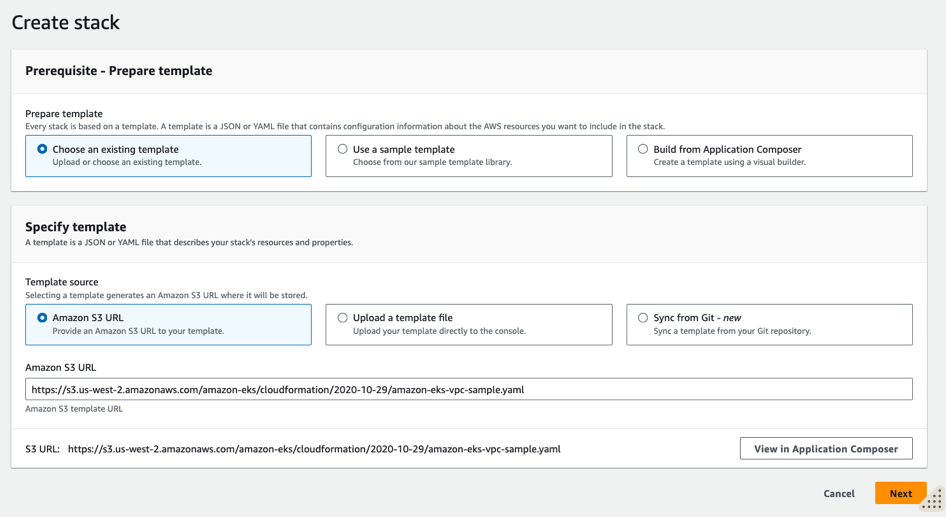
5. Paste the following URL into the text area under **Amazon S3 URL** and choose **Next**:

```
https://s3.us-west-2.amazonaws.com/amazon-eks/cloudformation/2020-10-29/amazon-eks-vpc-sample.yaml
```


6. On the **Specify Details** page, enter the stack name e.g. `eks-vpc-01` and update parameters if you want to change any, and then choose **Next** and create VPC stack.  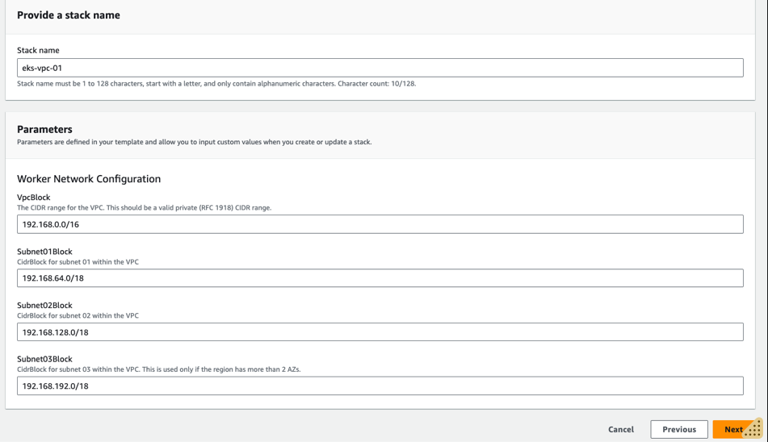
7. Proceed to **Review and create**  and submit the stack. It takes a few minutes to have the status change from  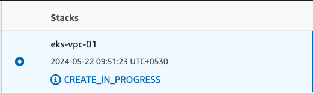 to

once VPC is created, you could verify everything from VPC console.  Also note down the VpcId and SubnetIds from the **Outputs**.

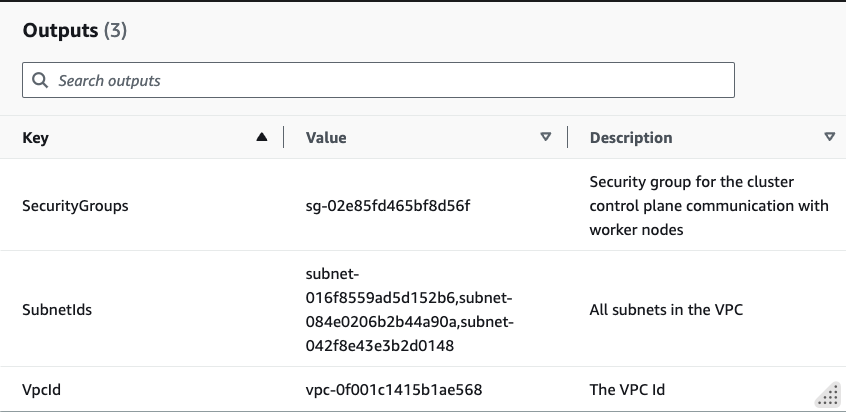

## Configure IAM Role for EKS 


### Step 1: Create the IAM Role 

1. **Open the IAM Console**: Go to the [IAM console](https://console.aws.amazon.com/iam/).

2. **Create a Role**:
   * Click on `Roles` and then `Create role`.
   * Choose `EKS` as the service that will use this role.
   * Select the `EKS - Cluster` use case.
   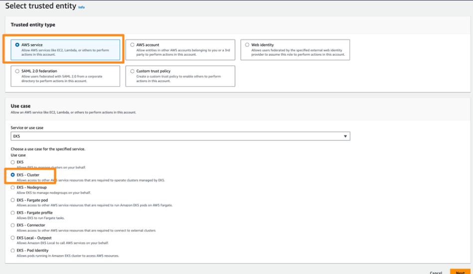
3. From **Add Permissions** page you will see the following policy already attached:
   * `AmazonEKSClusterPolicy` 
   * Select **Next**


4. From **Name, review and create page** , provide a Role name e.g. `EKSClusterServiceRole` and proceed to **Create role**.  
   

5. From IAM Console -> Roles search for `EKSClusterServiceRole` and select it. 

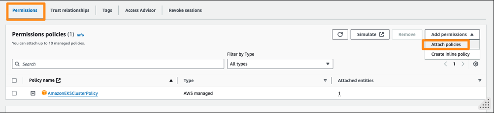
6. From Permissions tab, Add Permissions dropdown,	
   * Choose Attach policies.
   * Search for AmazonEKSVPCResourceController and attach it to the role.


7. **Set the Trust Relationship**: Ensure the trust relationship for the role allows EKS to assume the role. The trust policy should look like this:

```
{
  "Version": "2012-10-17",
  "Statement": [
    {
      "Effect": "Allow",
      "Principal": {
        "Service": "eks.amazonaws.com"
      },
      "Action": "sts:AssumeRole"
    }
  ]
}
```
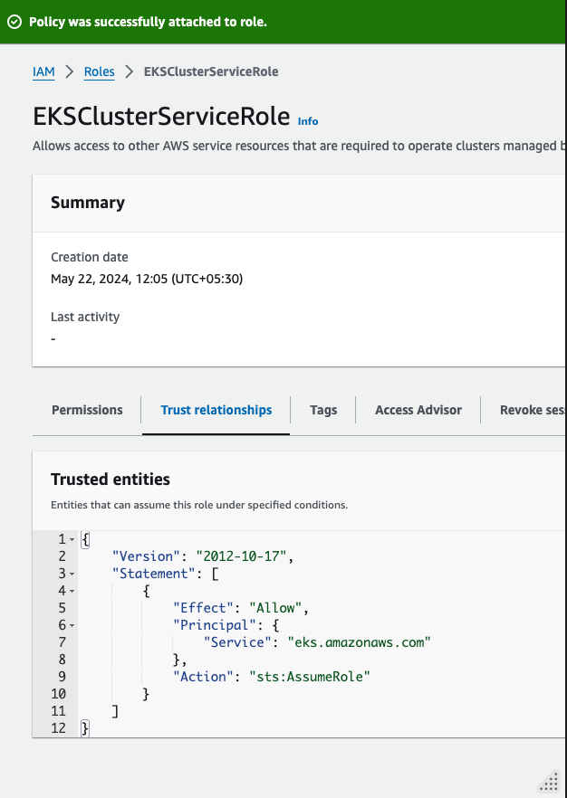
This should already be there. Verify it from the **Trust relationships** tab.  
⠀ 
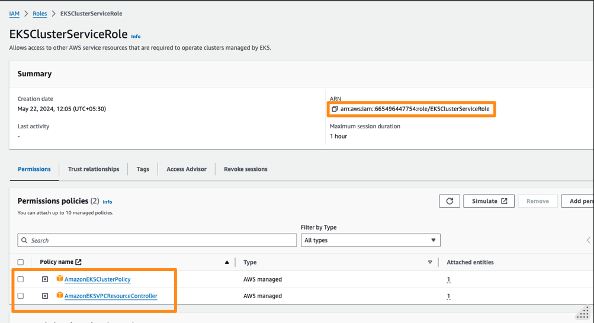

Note down the role ARN e.g. `arn:aws:iam::665496447754:role/EKSClusterServiceRole` which you would add to cluster configuration later.  Also note the new policy being added to the role. 

## Launch EKS Cluster with eksctl

Start with `eksctl`

```
eksctl info
```

Create cluster configurarion as follows. You could refer to [Config File Schema](https://eksctl.io/usage/schema/) to explore  more options. 

File:  `cluster.yaml`

```
apiVersion: eksctl.io/v1alpha5
kind: ClusterConfig

metadata:
  name: eks-cluster-01
  region: ap-southeast-1

vpc:
  id: "vpc-aaaa"
  subnets:
    public:
      apsoutheast1a:
        id: subnet-xxxx
      apsoutheast1b:
        id: subnet-yyyy
      apsoutheast1c:
        id: subnet-zzzz

managedNodeGroups:
  - name: ng-1-workers
    labels: { role: workers }
    instanceType: t2.micro
    desiredCapacity: 2
    maxPodsPerNode: 100
    minSize: 1
    maxSize: 4
    ssh: 
      allow: true 
      publicKeyName: xxxx
    tags:
      k8s.io/cluster-autoscaler/enabled: "true"
      k8s.io/cluster-autoscaler/eks-cluster-01: "owned"

iam:
  withOIDC: true
  serviceRoleARN: arn:aws:iam::xxxxxxxxx:role/EKSClusterServiceRole
```
⠀
Edit this file and  replace  the following with actual values 
* vpc id 
* subnets 
* public key name (listed ssh key on ec2 that you would like to ssh in with)
* ServiceRoleARN 


```
eksctl create cluster -f cluster.yaml
```

[sample output]
```
2024-05-22 14:53:47 [✔]  all EKS cluster resources for "eks-cluster-01" have been created
2024-05-22 14:53:48 [ℹ]  nodegroup "ng-1-workers" has 1 node(s)
2024-05-22 14:53:48 [ℹ]  node "ip-192-168-240-31.ap-southeast-1.compute.internal" is ready
2024-05-22 14:53:48 [ℹ]  waiting for at least 1 node(s) to become ready in "ng-1-workers"
2024-05-22 14:53:48 [ℹ]  nodegroup "ng-1-workers" has 1 node(s)
2024-05-22 14:53:48 [ℹ]  node "ip-192-168-240-31.ap-southeast-1.compute.internal" is ready
2024-05-22 14:53:48 [✔]  created 1 nodegroup(s) in cluster "eks-cluster-01"
2024-05-22 14:53:48 [✔]  created 0 managed nodegroup(s) in cluster "eks-cluster-01"
2024-05-22 14:53:49 [ℹ]  kubectl command should work with "/Users/gshah/.kube/config", try 'kubectl get nodes'
2024-05-22 14:53:49 [✔]  EKS cluster "eks-cluster-01" in "ap-southeast-1" region is ready
```

validate 

```
eksctl get cluster
eksctl get nodegroup --cluster eks-cluster-01

kubectl get nodes
kubectl config get-contexts

```

check the max number of pods on each node 
```
kubectl get nodes -o jsonpath='{.items[*].status.capacity.pods}'
kubectl get nodes -o jsonpath='{.items[*].status.allocatable.pods}'
```

Also observe the following resources created 
* EKS Cluster 
* Node Group ( EKS Cluster => Compute)
* EC2 Instances
* VPC, Subnets etc. 


### Setup Visualizer 

```
cd ~
git clone  https://github.com/schoolofdevops/kube-ops-view
kubectl apply -f kube-ops-view/deploy/
```

To check whether visualiser has come up, use the following commands,
```
kubectl get pods,services

```

[sample output ]

```
➜  ~ kubectl get pods,services
NAME                                 READY   STATUS    RESTARTS   AGE
pod/kube-ops-view-75fddd9cc4-dg9cr   1/1     Running   0          92s

NAME                    TYPE        CLUSTER-IP     EXTERNAL-IP   PORT(S)        AGE
service/kube-ops-view   NodePort    10.100.38.21   <none>        80:32000/TCP   92s
```


To access the visualizer and other apps exposed with  nodePort, create a new security group and attach it to the instances created with 

* From EC2 => Network & Security => Security Groups => Create Security Group 
  * Provide security group name e.g. `NodePort`
  * Select VPC created for EKS 
  * Add Inbound Rule (do not touch outbound)
    * Custom TCP 
    * Port range : 30000-32767
    * Source : Anywhere IPv4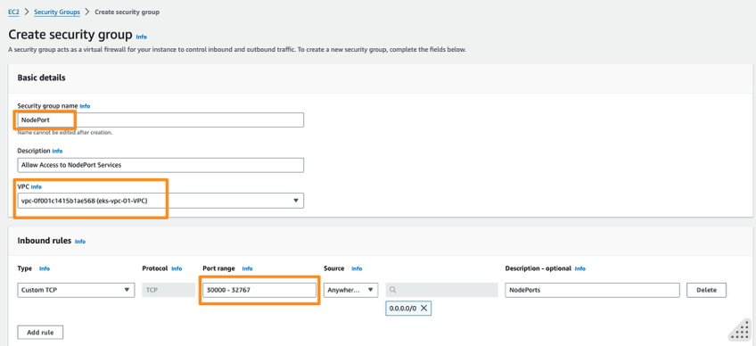
    * Proceed to create security group and note down the id once created e.g. `sg-033ad52b6dcc79277`
      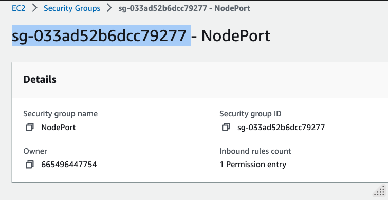
    * Add this security group to all nodes (ec2 instances) in the cluster from EC2 => Actions => Security => Change security groups  
    * Search and Add security group, **Save**. 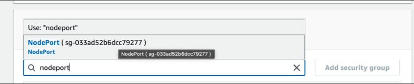


Now select the External IP of any of the nodes 

e.g.
```
kubectl get nodes -o wide
```

and access the visualizer on port 32000 e.g. `http://xxxx:32000/#scale=2.0`

e.g. 
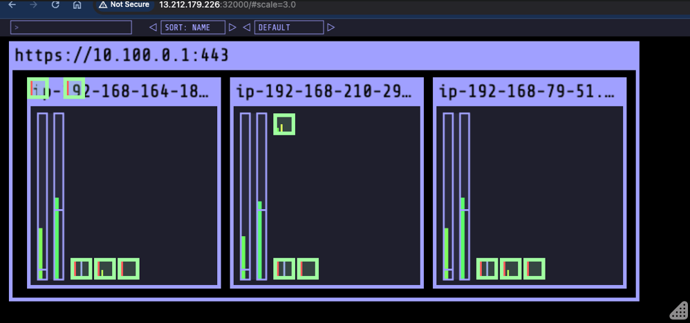

## Reference

* Creating Cluster with `eksctl`  [Creating and managing clusters](https://eksctl.io/usage/creating-and-managing-clusters/#)
* Config File Schema: [Config File Schema](https://eksctl.io/usage/schema/)


