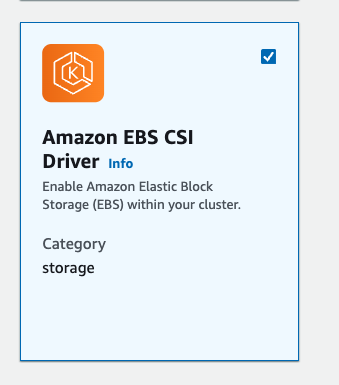
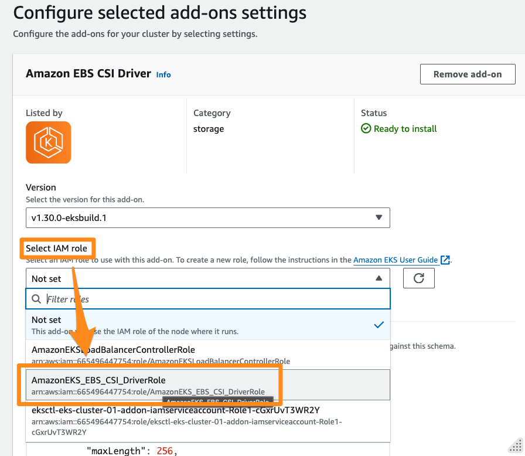
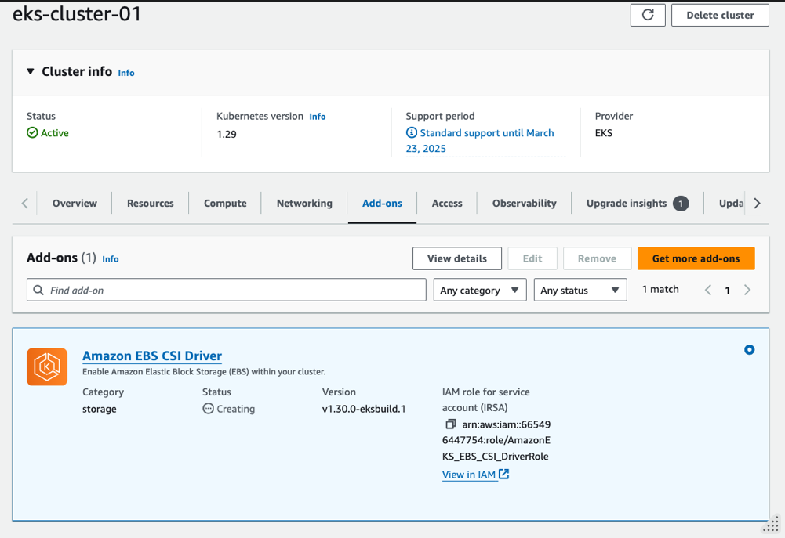
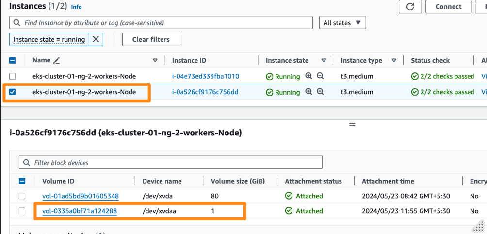

# Lab 05 - Persistent Storage with EBS


In this lab you are going to re deploy the database, this time with persistent storage, using EBS volumes offered by AWS.  Following diagram depicts this dynamic provisining workflow: 

```
        User
         |
         |
         v
+---------------------+
|                     |
|   Persistent Volume |
|         Claim       |
|       (PVC)         |
|                     |
+---------+-----------+
          |
          |   Provision PV
          |
+---------v-----------+
|                     |
|      CSI Driver     |
|     (AWS EBS)       |
|                     |
+---------+-----------+
          |
          |   Provision PV
          |
+---------v-----------+
|                     |
|   Persistent Volume |
|         (PV)        |
|                     |
+---------------------+
          ^
          |
+---------+-----------+
|                     |
|     Storage Class    |
|       (gp2)          |
|                     |
+---------------------+

```


1. **User**: The user (developer/you) creates a PVC (PersistentVolumeClaim) to request storage resources for their application. The PVC specifies the desired characteristics of the storage, such as size and access mode.
⠀
2. **Storage Class (gp2)**: The StorageClass defines the properties for dynamically provisioning PVs. It includes parameters such as volume type, size, and the provisioner (CSI driver) responsible for fulfilling PVC requests.
⠀
3. **CSI Driver (AWS EBS)**: When the user creates the PVC, the Kubernetes control plane interprets the request and uses the StorageClass (gp2) to determine which provisioner (CSI driver) is responsible for provisioning the PV.
⠀
4. **Persistent Volume (PV)**: The CSI driver provisions a PV in response to the PVC creation request, based on the specifications defined in the PVC and the associated StorageClass (gp2).

⠀
In summary, the StorageClass defines the policies and provisioner used for dynamically provisioning PVs. When a user creates a PVC, the Kubernetes control plane uses the specified StorageClass to determine how to provision the PV, ultimately triggering the CSI driver to fulfill the PVC request.

Lets see this in action now. 

## Add Amazon EBS CSI Driver 

Create a IAM Role for CSI Driver using eksctl as : 

```
eksctl create iamserviceaccount \
    --name ebs-csi-controller-sa \
    --namespace kube-system \
    --cluster eks-cluster-01 \
    --role-name AmazonEKS_EBS_CSI_DriverRole \
    --role-only \
    --attach-policy-arn arn:aws:iam::aws:policy/service-role/AmazonEBSCSIDriverPolicy \
    --approve
```

validate: 

```
eksctl get iamserviceaccount --cluster eks-cluster-01
```

From EKS Console, 
* Select cluster 
* From Add-ons select Get more add-ons 


* Select Amazon EBS CSI Drive and go Next 



* Select `AmazonEKS_EBS_CSI_DriverRole` created above. 
* Next 

* From Review and add screen proceed with **Create**.  


Validate the add-on is available from EKS Cluster. 



validate the CSI Components are created with 

```

 kubectl get pods -n kube-system -l "app.kubernetes.io/component=csi-driver"

```


[sample output]
```
NAME                                 READY   STATUS    RESTARTS   AGE
ebs-csi-controller-c95fcc9fb-qjk9h   6/6     Running   0          116s
ebs-csi-controller-c95fcc9fb-rd64g   6/6     Running   0          116s
ebs-csi-node-57n2m                   3/3     Running   0          116s
ebs-csi-node-dmp49                   3/3     Running   0          116s
```

## Recreating DB with EBS Volume 

List  the  storage class available 

```
kubectl get sc 
```

[sample output]
```
NAME            PROVISIONER             RECLAIMPOLICY   VOLUMEBINDINGMODE      ALLOWVOLUMEEXPANSION   AGE
gp2 (default)   kubernetes.io/aws-ebs   Delete          WaitForFirstConsumer   false                  16h
```

This is the default storage class created by EKS.  When you invoke this storage class with a PVC, the CSI driver will call the AWS APIs to create a actual EBS Volume and configure it as a PV. 

To watch this in action, start monitoring  the following in a separate console:

```
watch kubectl get pods,pvc,pv,sc
```

Now redeploy the database, this time with a PVC configuration added as , 

```
kubectl delete -f db-deploy.yaml

kubectl apply -f db-deploy-pvc.yaml
```


At this time, you shall see the db pod in pending state 

e.g. 
```
NAME                          READY   STATUS    RESTARTS   AGE
pod/db-58b4db7665-rh6mv       0/1     Pending   0          39s
```

Describe the pod as: 
```
kubectl describe pod -l "role=db"
```
 
to see the issue in the events as: 
```
Events:
  Type     Reason            Age                 From               Message
  ----     ------            ----                ----               -------
  Warning  FailedScheduling  93s (x2 over 108s)  default-scheduler  0/2 nodes are available: persistentvolumeclaim "db-pvc" not found. preemption: 0/2 nodes are available: 2 Preemption is not helpful for scheduling.
```

This is because of the PVC missing. Now create a claim spec as 

File : `db-pvc.yaml`

```
kind: PersistentVolumeClaim
apiVersion: v1
metadata:
  name: db-pvc
spec:
  accessModes:
    - ReadWriteOnce
  volumeMode: Filesystem
  resources:
    requests:
      storage: 1Gi
  storageClassName: gp2
```
  

and apply 

```
kubectl apply -f db-pvc.yaml
```


at this time, you should see the PV created and bound with pvc  

```
NAME                           STATUS   VOLUME                                     CAPACITY   ACCESS MODES   STORAGECLASS   VOL
UMEATTRIBUTESCLASS   AGE
persistentvolumeclaim/db-pvc   Bound    pvc-94165721-83f9-4110-b37c-4e3c9eb0c951   1Gi        RWO            gp2            <un
set>                 4m52s

NAME                                                        CAPACITY   ACCESS MODES   RECLAIM POLICY   STATUS   CLAIM
    STORAGECLASS   VOLUMEATTRIBUTESCLASS   REASON   AGE
persistentvolume/pvc-94165721-83f9-4110-b37c-4e3c9eb0c951   1Gi        RWO            Delete           Bound    instavote/db-pv
c   gp2            <unset>                          4m47s

```

Your pod at this time progresses further from pending state, however goes in a `CrashLoopBackOff` state.

```
NAME                          READY   STATUS             RESTARTS      AGE
pod/db-58b4db7665-rh6mv       0/1     CrashLoopBackOff   6 (37s ago)   11m
```

To find why, check the logs 

```
kubectl logs -l "role=db"
```

[sample output]
```
initdb: directory "/var/lib/postgresql/data" exists but is not empty
It contains a lost+found directory, perhaps due to it being a mount point.
Using a mount point directly as the data directory is not recommended.
Create a subdirectory under the mount point.
The database cluster will be initialized with locale "en_US.utf8".
The default database encoding has accordingly been set to "UTF8".
The default text search configuration will be set to "english".

Data page checksums are disabled.

```

This is happening because the EBS volume created comes with lost+found directory, which needs to be cleaned up before starting the database. To do that, you could add a init container to existing deployment as 

File : `db-deploy-pvc.yaml`

```
....

    spec:
      initContainers:
      - name: init-pg-data
        image: busybox:latest
        command: ['sh', '-c', 'rm -rf /var/lib/postgresql/data/*']
        volumeMounts:
        - name: db-vol
          mountPath: /var/lib/postgresql/data
      containers:
      - image: postgres:9.4
        imagePullPolicy: Always
        name: db
        env:
          - name: POSTGRES_HOST_AUTH_METHOD
            value: trust

```

You need to add the `initContainer` block inside the spec, at the same level as existing `container` block. 

apply the changes

```
kubectl apply -f db-deploy-pvc.yaml
```
 
and you should now see the pod running, this time with a EBS volume 

```
NAME                          READY   STATUS    RESTARTS   AGE
pod/db-7b7fd4bcc7-z7zdr       1/1     Running   0          47s
```

You should also see the EBS volume been provisionined and attached on the same EC2 instance that is running the db pod. 



## Summary 
In this lab you learnt how to provision persistent storage, mount it on a pod and how to do this dynamically using the EBS as storage backend, `gp2`storage class creted by EKS and by adding a CSI Driver ( Provisioner) for EBS. 


