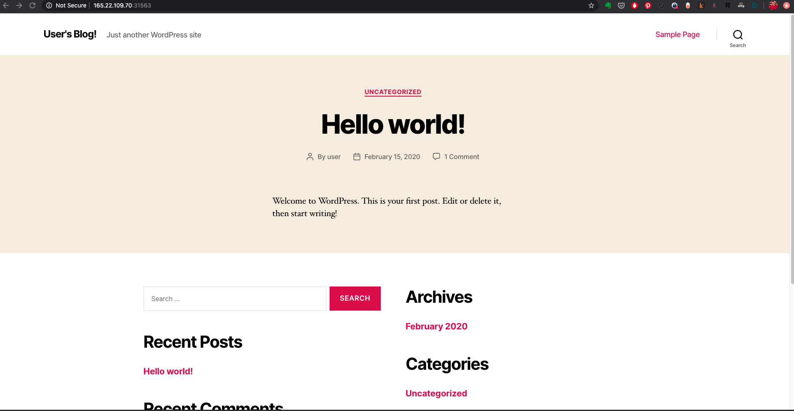

# Lab K205 - Monitoring setup with HELM

In this lab, you are going to install and configure helm, and in turns, use it to configure a monitoring system for kubernetes using prometheus and grafana stack.

## Installing  Helm (version 3)

To install helm version 3, you can follow following instructions.

```
curl https://raw.githubusercontent.com/helm/helm/master/scripts/get-helm-3 | bash

```


Verify the installtion is successful,
```
helm --help
helm version
```

## Setup a repository and install Wordpress


```
helm repo add stable https://kubernetes-charts.storage.googleapis.com/

helm repo list
```

Try installing wordpress with helm

```
helm search repo wordpress

helm install --name blog  stable/wordpress

kubectl get all -l "release=blog"
```

You could observe all the components deployed with the helm chart for wordpress. If both wordpress and mariadb pods are running, you should be able to access wordpress by using the nodePort. A Sample page looks like follows,  



Once you are done testing the wordpress application, to uninstall it, use the following sequence of commands.

```
helm list
helm uninstall blog
kubectl get all -l "release=blog"
```


## Install Prometheus with Helm

You will now setup prometheus and grafana monitoring stacks with helm, with a few customizations.


Before proceeding, you could review the [Official Prometheus Helm Chart](https://github.com/helm/charts/tree/master/stable/prometheus)  from the repository.

Search and download a chart for prometheus

```
cd ~
helm search repo prometheus
helm fetch --untar stable/prometheus
cd prometheus
```

To provide custom configurations, copy over the custom values file from **k8s-code** repot.


```
cp ../k8s-code/helper/helm/values/prometheus-customvalues.yaml .
```

Review **prometheus-customvalues.yaml** and then launch prometheus stack as,

```
helm install prometheus --values prometheus-customvalues.yaml  . --dry-run
helm install prometheus --values prometheus-customvalues.yaml  .

helm list
helm status prometheus

kubectl get all -l "release=prometheus"
```

You should be able to access prometheus UI by using either the *nodePort* service or a *ingress* rule.


#### Deploying Grafana with HELM

You could refer to the [Official Grafana Helm Chart repository](https://github.com/helm/charts/tree/master/stable/grafana) before proceeding.

Search and download a chart for prometheus

```
cd ~
helm search repo grafana
helm fetch --untar stable/grafana
cd grafana
```

To provide custom configurations, copy over the custom values file from **k8s-code** repot.


```
cp ../k8s-code/helper/helm/values/grafana-customvalues.yaml .
```

Review **grafana-customvalues.yaml** and then launch grafana as,

```
helm install grafana --values grafana-customvalues.yaml  . --dry-run
helm install grafana --values grafana-customvalues.yaml  .

helm list
helm status grafana

kubectl get all -l "release=grafana"
```

You should be able to access grafana UI by using either the *nodePort* service or a *ingress* rule.


credentials for grafana

  * user: admin
  * pass: password

You could update it along with other values in *grafana-customvalues.yaml* or create a separate file to override the values.


If you update values and would like to apply to existing helm release, use a command simiar to following,

```
helm upgrade -f grafana-customvalues.yaml grafana .
```


## Summary

In this lab, we not only learnt about HELM, a kubernetes package manager, but  also have setup a sophisticated health monitoring system with prometheus and grafana.
