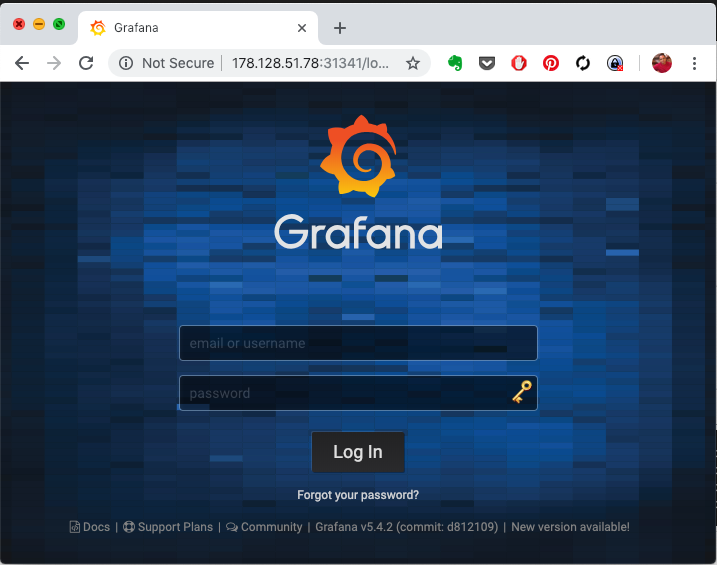

# Lab K205 - Monitoring setup with HELM 

In this lab, you are going to install and configure helm, and in turns, use it to configure a monitoring system for kubernetes using prometheus and grafana stack.

## Installing  Helm

To install helm you can follow following instructions.

```
curl https://raw.githubusercontent.com/kubernetes/helm/master/scripts/get > get_helm.sh
chmod 700 get_helm.sh
./get_helm.sh
```

Verify the installtion is successful,
```
helm --help
```

Lets now setup  RBAC configurations required for Tiller, a component of helm that runs inside the kubernetes cluster.

`file: tiller-rbac.yaml`

```
apiVersion: v1
kind: ServiceAccount
metadata:
  name: tiller
  namespace: kube-system
---
apiVersion: rbac.authorization.k8s.io/v1beta1
kind: ClusterRoleBinding
metadata:
  name: tiller
roleRef:
  apiGroup: rbac.authorization.k8s.io
  kind: ClusterRole
  name: cluster-admin
subjects:
  - kind: ServiceAccount
    name: tiller
    namespace: kube-system
```

Apply the ClusterRole and ClusterRoleBinding.
```
kubectl apply -f tiller-rbac.yaml

```

This is where we actually initialize Tiller in our Kubernetes cluster.
```
helm init --service-account tiller
```

## Setting up Monitoring Stack with HELM

You will now setup prometheus and grafana monitoring stacks with helm, with a few customisations.

#### Install Prometheus with Helm


Before proceeding, you could review the [Official Prometheus Helm Chart](https://github.com/helm/charts/tree/master/stable/prometheus)  from the repository.

Search and download a chart for prometheus

```
helm search prometheus
helm fetch --untar stable/prometheus
cd prometheus
```

To provide custom configurations, copy over the custom values file from **k8s-code** repot.


```
cp ../k8s-code/helper/helm/values/prometheus-customvalues.yaml .
```

Review **prometheus-customvalues.yaml** and then launch prometheus stack as,

```
helm install --name prometheus --values prometheus-customvalues.yaml  . --dry-run
helm install --name prometheus --values prometheus-customvalues.yaml  .

helm list
helm status prometheus
```

You should be able to access prometheus UI by using either the *nodePort* service or a *ingress* rule.


#### Deploying Grafana with HELM

You could refer to the [Official Grafana Helm Chart repository](https://github.com/helm/charts/tree/master/stable/grafana) before proceeding.

Search and download a chart for prometheus

```
helm search grafana
helm fetch --untar stable/grafana
cd grafana
```

To provide custom configurations, copy over the custom values file from **k8s-code** repot.


```
cp ../k8s-code/helper/helm/values/grafana-customvalues.yaml .
```

Review **grafana-customvalues.yaml** and then launch grafana as,

```
helm install --name grafana --values grafana-customvalues.yaml  . --dry-run
helm install --name grafana --values grafana-customvalues.yaml  .

sed -i 's/extensions\/v1beta1/apps\/v1/g' templates/*
sed -i 's/apps\/v1/extensions\/v1beta1/g' templates/*ingress*

helm list
helm status grafana
```

You should be able to access grafana UI by using either the *nodePort* service or a *ingress* rule.




credentials for grafana

  * user: admin
  * pass: password

You could update it along with other values in *grafana-customvalues.yaml* or create a separate file to override the values.


If you update values and would like to apply to existing helm release, use a command simiar to following,

```
helm upgrade -f grafana-customvalues.yaml grafana .
```


##### Summary

In this lab, we not only learnt about HELM, a kubernetes package manager, but  also have setup a sophisticated health monitoring system with prometheus and grafana.
